<!-- Snapshot of the living doc "Formwork — User Manual": https://claude.ai/code/artifact/419e765d-009a-414f-9da4-d81b2dd75894
     The living doc is the master; edit it there, not here. This file is re-exported
     whenever the doc is updated (see .claude/skills/update-docs/SKILL.md). Screenshots are
     in docs/manual-images/ and show invented demonstration data, not real students. -->

# Formwork — User Manual

Oct 1, 2026 · @Chris TERRY

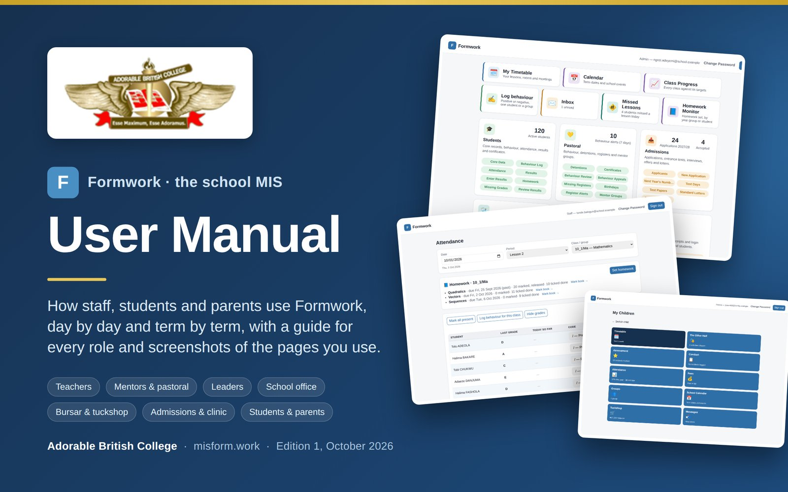

## Contents

New to Formwork? Read [How each person uses Formwork](#how-each-person-uses-formwork) for your role first, then the chapters it points you to. Everyone should read [Safeguarding and keeping students safe](#safeguarding-and-keeping-students-safe). Click any section name below to go straight to it.

| Part | Section | What it covers | Most useful for |
| --- | --- | --- | --- |
| Start here | [About this manual](#about-this-manual) | How the manual is organised; the screenshots use invented data | Everyone |
| Start here | [How each person uses Formwork](#how-each-person-uses-formwork) | The school year at a glance, and what each role does each day, week and term | Everyone |
| Start here | [Using Formwork to raise achievement](#using-formwork-to-raise-achievement) | The improvement cycle, warning signs, who acts on what, worked examples, limits of the data | Teachers, mentors, HoDs, SMT |
| Start here | [Safeguarding and keeping students safe](#safeguarding-and-keeping-students-safe) | What Formwork is and isn't for, finding a missing student, patterns to raise, what not to write, personal data | Everyone |
| Everyday tasks | [1. Getting started](#1-getting-started) | Signing in, the dashboard, roles, using a phone | Everyone |
| Everyday tasks | [2. Students](#2-students) | Finding a student, the profile, editing records, adding students, parents and leavers | All staff; school office |
| Everyday tasks | [3. Timetables and registers](#3-timetables-and-registers) | My Timetable, taking a register, Registers Not Done, Missed Lessons, the missed-lesson pop-up, the automatic missed-lesson negative, planned absences | Teachers, office, pastoral |
| Everyday tasks | [4. Homework](#4-homework) | Setting, marking, the class mark book, student view, Homework Monitor, lesson worksheets, card sorts and classwork marks (Maths trial) | Teachers, HoDs, SMT |
| Everyday tasks | [5. Assessment, results and targets](#5-assessment-results-and-targets) | Result sets, entering scores, Class Progress, boundaries, targets, Grade History, reading ages | Teachers, HoDs, assessment staff |
| Everyday tasks | [6. Reports and documents](#6-reports-and-documents) | Report periods, subject and pastoral comments, checking, generating and uploading | Teachers, mentors, checkers, admins |
| Care and conduct | [7. Behaviour, pastoral care and the clinic](#7-behaviour-pastoral-care-and-the-clinic) | Logging behaviour, review for parents, detentions, appeals, certificates, reward store, the Worry Box and wellbeing check-ins, boarding, clinic, staff records | All staff; pastoral; nurse; DSL; HR |
| Care and conduct | [8. The Other Half and student groups](#8-the-other-half-and-student-groups) | Activity registers, the programme, student choices, groups, building a group from a rule | All staff; SMT; pastoral |
| Care and conduct | [9. Calendar, messages and email](#9-calendar-messages-and-email) | The calendar, sending messages, the inbox, where replies go | SMT, office, pastoral |
| School business | [10. Fees and bills](#10-fees-and-bills) | Payments, charging, fee items, discounts, debtors, price approval, the SMT dashboard | Bursar, SMT, principal, college secretary |
| School business | [11. Tuckshop](#11-tuckshop) | Ordering windows, order sheets, handing out, items, top-ups and balances | Tuckshop, bursar |
| School business | [12. Admissions](#12-admissions) | Applicants, stages, test days, interviews, letters, next year's numbers | Admissions, bursar, SMT |
| Families | [13. The student and parent portals](#13-the-student-and-parent-portals) | What students and parents see and do, and the rules that protect them | Everyone who talks to families |
| Running the system | [14. Administration](#14-administration) | Permissions, roles, lookups, timetable setup, next year, tiles, Change History, backups, imports | Admins, HR, SMT |
| Reference | [Appendix](#appendix) | A. Roles, B. Rules at a glance, C. Glossary, D. Getting help | Everyone |

### Find a task

| I want to… | Go to |
| --- | --- |
| See what my role does day to day | [Teachers](#teachers) · [Mentors and pastoral staff](#mentors-and-pastoral-staff) · [Leaders](#leaders-heads-of-department-assessment-staff-and-smt) · [Office, HR and administrators](#office-hr-and-administrators) · [Specialist roles](#specialist-roles) · [Students and parents](#students-and-parents) |
| Take a register | [Taking a register](#taking-a-register-attendance) |
| Find a student who is missing from a lesson | [Finding a missing student](#finding-a-missing-student) · [The missed-lesson pop-up](#the-missed-lesson-pop-up) |
| Record a student who will be away for several days | [Planned absences](#planned-absences-attendanceplanned-absences) |
| Raise a worry about a student | [Safeguarding and keeping students safe](#safeguarding-and-keeping-students-safe) · [Who to tell](#who-to-tell) |
| Spot students falling behind | [Signs to look for](#signs-to-look-for-and-where-to-see-them) · [Worked examples](#worked-examples) |
| Log a positive or negative behaviour point | [Logging behaviour](#logging-behaviour-behaviour) |
| Set or mark homework | [Setting homework](#setting-homework) · [Marking](#entering-marks-for-a-homework) |
| Put a worksheet on a Maths lesson | [Lesson worksheets](#lesson-worksheets-maths-trial) |
| Enter test or exam marks | [Entering results](#entering-results-resultsenter) |
| Appeal a mark, or decide a student's appeal | [Mark appeals](#mark-appeals-grade-appeals) |
| Give feedback on a lesson, or see what students said | [Lesson feedback](#lesson-feedback) |
| Accept a student's reward order, or change rewards and prices | [Reward Store](#reward-store-rewards) |
| Record or track reading ages | [Reading ages](#reading-ages-reading-ages) |
| Write or check report comments | [Reports and documents](#6-reports-and-documents) |
| Update a student's or parent's details | [Editing a record](#editing-a-record) · [Parents and leavers](#parents-and-leavers) |
| Add a new student | [Adding a student](#adding-a-student-school-office-only) |
| Send a message to parents | [Sending a message](#sending-a-message-commscompose) |
| Record a fee payment | [Recording a payment](#recording-a-payment-bursarpayments) |
| Change a fee price | [Price approval](#price-approval-bursarfee-approvals) |
| Hand out tuckshop orders | [Handing out](#handing-out-tuckshophand-out) |
| Move an applicant to the next stage | [Stages](#stages) |
| Give someone access to a page | [Who can open which page](#who-can-open-which-page-adminpermissions) |
| See who changed something | [Change History](#change-history-adminchange-history-smt-and-admins) · [Grade History](#grade-history-assessmentsgrade-history) |
| Help a parent who can't sign in | [Questions staff are often asked](#students-and-parents) |

## About this manual

This manual explains how to use every part of Formwork, the school's MIS at [misform.work](https://misform.work), as it stands on 7 October 2026. It is written for the people who use it every day: teachers, mentors, houseparents, the school office, the bursar, the tuckshop, admissions, SMT and administrators, and it ends with what students and parents see.

**How it is organised.** It starts with How each person uses Formwork: a guide for each role (teachers, mentors, leaders, the office, specialist roles, students and parents) to what they do each day, week and term. Two short sections follow it for everyone: Using Formwork to raise achievement, and Safeguarding and keeping students safe. After that, each chapter covers one area of the school's work. It says who can use the pages, walks through the common tasks step by step, and lists the rules the system enforces so you know why something is refused. Where a page is only open to some roles, the chapter says so at the top.

**About the screenshots.** Every screenshot was taken from a copy of Formwork running on invented demonstration data. The students, staff and parents shown are not real, and no real pupil information appears in this manual. Your screen will show your own school's data and only the tiles your roles open, so it may look slightly different.

**Rules you can rely on.** Many rules are enforced by the database itself, not just by the page. If Formwork refuses something, such as a late register for a future date or a price change without two approvals, it is working as intended. The [Functional Specification](https://claude.ai/code/artifact/659cca3b-399b-425f-bb5f-8b23577d5714) lists every rule in full, and the [Product Requirements](https://claude.ai/code/artifact/d7ffd5d9-797b-4db0-b4b9-01f122498f7b) describe where the product is going.

**Two things to remember**

- Seeing a page does not mean you can change everything on it. Page access is set at /admin/permissions; what you can actually read or change is decided by the database.
- All dates and times are Lagos time (WAT), and all money is in naira (₦).

## How each person uses Formwork

This part is organised by person, not by page. Find your role below to see what you do in Formwork each day, each week and each term, in the order you would do it. Each step names the page, and the chapters that follow explain those pages in full. Most staff hold more than one role, so read each section that applies to you.

| If you are… | Read |
| --- | --- |
| A teacher | Teachers |
| A mentor (form tutor), houseparent, pastoral lead or the attendance officer | Mentors and pastoral staff |
| A Head of Department, assessment manager or member of SMT | Leaders |
| In the school office, HR, or an administrator | Office, HR and administrators |
| The bursar, principal or college secretary (for fees), tuckshop staff, admissions or the nurse | Specialist roles |
| A student or parent, or answering their questions | Students and parents |

### The school year at a glance

The same cycle repeats every term. Knowing it explains why each person's tasks fall when they do.

| When | What happens in Formwork | Who |
| --- | --- | --- |
| Before term | Bell times and the Nova-T timetable checked; Other Half programme set up and choices opened; fee items and prices approved; term invoices charged | Admins, SMT, OH coordinator, bursar, principal and college secretary |
| First week | Students choose Other Half activities at Evening Prep; office checks new students' records and parent logins; clinic runs the resumption check | Students, school office, nurse |
| Every school day | Registers every lesson; missed-lesson alerts; behaviour logged; homework set and marked; sick bay | Teachers, office, attendance officer, pastoral, nurse |
| Every week | Short tests entered against the week's result set; tuckshop orders (Wednesday and Saturday); Friday detention | Teachers, students, tuckshop, pastoral |
| Mid-term | Teacher Assessment week results; Class Progress reviewed; intervention groups built; parents' evening messages | Teachers, Heads of Department, SMT |
| End of term | End-of-term exams entered; report period set up; comments written, checked and published; fees for next term prepared | Teachers, mentors, checkers, admins, bursar |
| Through the year | Admissions: enquiries, test days, interviews, offers and deposits for next year | Admissions, bursar, SMT |
| Summer | Next year's mentor structure and timetable planned at Next Year Setup; leavers marked as left | SMT, admins, school office |

### Before you start

- Sign in at misform.work with your school Google account (chapter 1). If a tile you need is missing, ask an administrator to check your roles.
- Formwork works on a phone, so you can take a register or log behaviour from the classroom or boarding house.
- Times are Lagos time. If Formwork refuses something, it is usually a deliberate rule; the chapter for that page explains it.

### Teachers

A teacher's work in Formwork happens mostly in the lesson: take the register, log behaviour, set or check homework. Results and report comments follow the school's weekly and termly cycle.

**Every lesson**

1. Open **My Timetable** on the dashboard and click the lesson. The register opens with the class, period and date already chosen.
2. Everyone starts as present. Change the code for anyone absent or late, adding minutes late. Press **Save** within the first 15 minutes; after that the lesson appears on Registers Not Done, and at 15-minute checks it becomes a register alert for HR and the office.
3. If a student who was in an earlier lesson is missing, mark them N (no reason yet). The office gets a pop-up straight away and goes to find them. Don't wait to report it some other way. At the end of the lesson Formwork also gives them an automatic −5 "Missing a lesson activity" event and its detention, so mark N or O only when they really aren't there, and correct a wrong mark at once: that withdraws the event.
4. To praise or sanction during the lesson, press **Log behaviour for this class** on the register, pick the student(s) and the category, and save. A −5 event needs a written explanation of what happened, naming no other student, and a tick to confirm it really is a single serious incident; read the Stage 5 guidance shown first (chapter 7).
5. For every teaching class, the **Homework** panel on the register shows what is due. Use **Set homework** there to set the next piece while you're with the class.

**Every day**

- Check the banner on My Timetable for any register you forgot. Taking it late still clears it from the list.
- Mark homework that came in: open your class's mark book (the **Mark books** links at the top of your timetable, or /homework), press **Marks** beside the homework, enter marks (or Not handed in) and press **Release marks** when you want students to see them.
- Read your **Inbox** for messages from SMT and the office.
- If you get a mark appeal email, check the student's paper and decide it at Mark Appeals (chapter 5). Decide promptly: nobody else can, and it holds one of the student's credits.

**Every week**

- Enter the short test: 2 Type In Marks on the Assessment card, choose your class and the week's result set, and type each percentage. The grade appears as you type. Use **Find missing grades by class** to check nobody is left without a mark.
- Glance at **Class Progress** to see who is falling below target.
- Look at **Lesson Feedback** (Students card) for what your classes said about their lessons. A class shows figures once 3 students have answered; names are never shown.

**Each term**

1. **Teacher Assessment week and end-of-term exams**: enter marks against those result sets in the same way as a short test. Exams are one result set per year group ("Y10 Term 1 Exam").
2. **Report comments**: when SMT open the report period, go to **Subject Comments**, choose the period and each class in turn. For every student, set Effort, Presentation and Homework (Homework is pre-filled from the term's homework marks), and write two or three sentences. **Generate draft** offers a starting point from the student's data; always read and edit it.
3. **Save Draft** as you go and **Submit** by the comments-due date. If a checker sends a comment back, it reappears as a draft with their note: fix it and submit again.
4. **Other Half**: if you run an activity, take its register at the OH period from **My Other Half**, exactly like a lesson.

**Good habits**

- Register first, every lesson: a missed register sends the office chasing students who are actually in your room.
- Keep homework titles short (10 characters, such as "Ex 4B") and put the detail in the instructions.
- Never type another student's name in a behaviour explanation: if the event is released to parents, Formwork will refuse it.
- Use **Show last grades** on the register only when the class can't see your screen.

### Mentors and pastoral staff

Pastoral work in Formwork is about noticing early: who is absent, who is collecting negative points, who has a detention, who needs a word. These roles share most pages; the differences are noted below.

**Mentors (form tutors)**

1. **Every morning** take your mentor group's Registration (M) register from My Timetable. It is the first mark of the day, so a student absent here and present later is flagged as a late arrival rather than a missing student.
2. **Weekly**, open each mentee's profile (Students → search) and look at the Behaviour, Attendance and Results tiles. Talk to anyone with a run of negative points, absences or grades below target.
3. **Each term** write the mentor comment: **Pastoral Comments**, choose the period and "Mentor". Each student shows their points, best and weakest subjects and the effort grades their teachers gave, so the comment can draw it together in three or four sentences. Submit by the due date.

**Houseparents and the head of boarding**

- Student and behaviour pages open on your own house. Use **Behaviour alerts** each evening to see who in the house has had a −3 or worse in the last 7 days.
- Take the Evening Prep (EP) register for your house when it is your duty.
- Decide appeals on events in your house (/appeals): read the student's reason, add a note, and **Uphold** or **Reject**.
- Write the houseparent comment each term at **Pastoral Comments**, choosing "Houseparent".

**Pastoral leads**

1. **Daily**: check **Behaviour alerts** and **Missing Registers**, and follow up serious events. You can edit an event's category or comment if it was logged wrongly; detentions are recalculated.
2. **Thursday**: open **Detentions**. The list for Friday is built automatically (a −5 event, or −10 in the week). Students get a reminder at 7:30pm.
3. **Friday**: after detention, mark each student **Attended** or **Missed**.
4. **When a pattern appears**: use **Build a group from a rule** (for example, "−6 points or worse since the start of term" or "attendance below 90%"), check the list, and save it as an intervention group. Message the group, or the students' parents, from the group page.

**The attendance officer (and the school office)**

1. Keep Formwork open during the school day. When a student who was seen earlier is marked absent without a reason, a full-screen alert appears on whatever page you have open, with where the student should be and where they were last seen.
2. Go and find the student, then press **Seen: dealing with it** with a short note. This clears the alert from every screen. If the teacher corrects the mark, it clears by itself.
3. During the day, keep **Missed Lessons** open as a list of every student who has missed a lesson today.
4. At the end of the day, check **Register Alerts** and follow up staff whose registers were late.
5. When a parent says their child will be away for some days, enter it once at **Planned Absences** (chapter 3). Every register for those days is filled in for the teachers.

### Leaders: Heads of Department, assessment staff and SMT

Leaders use Formwork to see what is happening across classes and the school, and to run the termly cycle. Most of their pages read data that teachers and the office enter.

**Heads of Department**

1. **Weekly**: open **Class Progress** from the top row. It shows your department's classes worst first, each class's average grade against its students' average target. Pick a result set to compare a particular test.
2. Use **Marks Missing** after each test to chase marks that haven't been entered.
3. Look at your department's homework on /homework: the drop-down lists every class in your subjects, and you can open any class's mark book.
4. You can correct or delete a score in your department's subjects, and move students between classes at **Class Allocation** when sets change.
5. **Each term**, read your department's comments before the deadline if you are a checker.
6. You are copied on every mark appeal in your department, by email and in your inbox, and get its outcome in your inbox. Follow them at Mark Appeals; the class teacher decides.

**Assessment manager**

- **Before each term**: make sure every subject's **Grade Boundaries** are right for each year group, and import targets (/target-grades/import) and CAT4/NGRT scores. Check **Target coverage** for students without a target.
- **After tests and exams**: use Marks Missing and **Top 10**; correct scores where needed. Every change is kept in **Grade History**.
- **End of term**: generate the Termly Grade Report, Term Test Scores and transcripts at **Generate Reports**, previewing one student first.

**SMT**

**Daily**

- **Missed Lessons** and **Registers Not Done**: who is out of lessons, and which registers haven't been taken.
- **Behaviour Review**: check Stage 5 events, with or without pictures, before parents see them: send, decline, or return to the teacher.
- **Inbox**: automatic behaviour alerts (a −5 event or a week at −8) arrive here and by email.

**Weekly**

- **Homework Monitor**: choose a year group to see every class's homework this week, and which classes set nothing. Choose a student to see their week exactly as they do.
- **Class Progress** across the whole school.
- **Fees dashboard**: collected and outstanding by year group.

**Each term**

1. **Calendar** (before term): add terms, events and result sets (tick "result set" for each test and exam), and the report-period event.
2. **Report Periods**: set dates and year groups, and assign **Checkers**.
3. **Check Reports**: run the AI check, then approve or send back comments.
4. **Publish fees** for the term to parents from the SMT fees dashboard once invoices are correct.
5. **Send Message** for anything families or staff need to know. Check the recipient count first; it tells you how many parents have no login.

**Once a year**: set the new places for next year at **Next Year's Numbers**, and plan the mentor structure and timetable at **Next Year Setup**.

**Audit**: Change History and Grade History show who changed what. Use them when a register, fee, behaviour event or grade is questioned.

### Office, HR and administrators

The office keeps student and parent records right and is first to hear about missing students. HR keeps staff records and roles. Administrators keep the system itself set up.

**School office**

*Every day*

1. Keep Formwork open: the missed-lesson pop-up appears for you as well as the attendance officer (see Mentors and pastoral staff).
2. Check **Register Alerts** and resolve each once the teacher has been contacted.
3. The principal's PA only: release serious (−5) behaviour events without pictures to parents at **Behaviour Review**, after checking the text names no other student.
4. Enter absences you know about in advance (illness, appointments, holidays the principal has agreed) at **Planned Absences**, so teachers find the code already in their registers.

*When a family's details change*

- Open the student (Students → search) and **Edit** Core Data: address, house, room, restaurant, form. Every change is logged.
- Add or change parents from the student's **Parents / Guardians** tile, choosing the relationship (Mother, Father, Other) for that child. Create a parent's login there if they have none. If a new parent's email is already on record, Formwork shows who has it and offers **Link this parent instead**: use it, so their existing login sees this child too.
- When a student leaves, set their status to left with a leaving date. They are taken out of classes, their login is locked and their parents stop seeing them.

*When a new student joins*

1. **+ Add a new student** (/students/new): names, date of birth, gender, year and form. Only the school office can do this.
2. Add parents, house, room and restaurant on their profile; ask an admin or HoD to put them in classes at Class Allocation.
3. Send the parents' welcome letter from **Parent Logins** (/parents/welcome-emails).

*Messages*: send notices to parents, a year group or a student group from **Send Message**, and check **Sent Messages** for read receipts. Use **View as Parent** to see exactly what a parent sees when they ring with a question.

**HR**

- Keep each person's **Staff Record** up to date: appointment, police clearance (the filter shows any missing or due), training, warnings, absence and lateness.
- Give new staff their roles at **Staff & Roles**, with the house or department where needed. Roles decide what each person sees; check with SMT before giving powerful roles.
- Review **Register Alerts** each week for staff who repeatedly take registers late.

**Administrators**

*Before each term*

1. Check **Bell Times** for each weekday.
2. Import the Nova-T timetable at **Import Nova-T**. Read the preview carefully before applying; it shows every class, teacher, room and lesson that will change.
3. Import any meeting schedule, then check a few teachers' timetables.
4. Make sure **Permissions** give each role the pages it needs, and adjust **Arrange Tiles** if the school wants a different order.

*Before anything risky* (a bulk import, the year-end changes): **Run a Backup**, which also freezes changes while it runs.

*Each summer*: work with SMT through **Next Year Setup**: mentor groups first, then next year's Nova-T file imported into the plan. Never import next year's file on the normal import page, because it would replace this year's timetable.

### Specialist roles

**Bursar**

*Before each term*

1. If a price needs to change, propose it at **Fee Approvals** with a reason, and ask the principal and the college secretary to approve. Nothing changes until both have.
2. Charge the term: at **Charge Checklist**, pick each fee item and the term, select the students (filter by year, or **Select all showing**) and charge. Locked items fill in the approved price for each year group. Check the batch on **Audit**, where it can be undone if it was wrong.
3. Apply discounts at **Discounts** (sibling, staff child, scholarship).
4. Tell SMT when invoices are ready so they can publish the term to parents.

*Every day*

- Record each payment as it arrives: **Record a Payment**, find the student, enter amount, method, reference and date. The invoice status updates by itself. Download the PDF if the family wants a copy.
- If part of a payment is meant for the tuckshop, add it at **Add Paid Top-Up** after recording it.
- Record admission form fees and deposits for applicants at **Admission Payments**.

*Every week*: work through the **Debtors List** (highest balance first, with parent phone and email) and export it for follow-up.

**Principal and college secretary (fee approvals)**

When a price change is proposed, open **Fee Approvals**. Read the change and the reason, then **Approve** or **Reject** (with a reason). The new price only applies once both of you have approved; being an admin doesn't count.

**Tuckshop staff**

1. **Before each tuckshop day**: when ordering closes (Tuesday 9am for Wednesday, Thursday 11pm for Saturday), print the **Order Sheets** for each restaurant and buy stock from the item totals.
2. **On the day**: open **Hand Out Orders**, choose the restaurant, and tap each student as you hand over their order. If something has run out, press **Edit** and record what they actually got.
3. **When a restaurant is finished**, press **Save and lock**. Only the tuckshop owner can unlock it.
4. **Counter sales** at any time: **Sell Items**. Close ordering for holidays or stock-takes at **Ordering On/Off**, and keep prices and food/drink ticks right at **Items & Prices**.
5. Top up balances at the start of term at **Top Up Balance** (target balance, for a year or the whole school).

**Admissions**

1. **Enquiry**: record each family at **New Application**, child and main contact.
2. **Form fee paid** (recorded by the bursar): book the child onto a **Test Day**; the test-date letter goes to the family.
3. **Test day**: print the candidate sheet; afterwards enter English, Maths and CAT4 on the test-day page. Formwork works out the average and whether it passes.
4. **Decide**: invite to interview, waiting list or unsuccessful. Each decision produces the matching standard letter, emailed to the main contact.
5. **Interview**: record it on the applicant's page, then offer, waiting list or unsuccessful.
6. **Acceptance**: mark the family's acceptance; the bursar records the deposit.
7. Keep **Next Year's Numbers** in view to know how many places are left.

**Nurse**

- **Every day**: record each sick-bay visit at **Sick Bay Log**, including temperature, treatment and any medication with its dose, and tick when parents are told. **Sick Bay Today** shows follow-ups still open.
- **Start of term**: run the **Resumption Check** for boarders.
- **Each term**: a **Height & Weight** round by group, and **Immunisations** due or overdue.
- Medical records are visible only to you and the DSL; administrators, teachers and parents can't see them. A visit the DSL has marked as safeguarding shows its medication and treatment but not its symptoms.

**Designated Safeguarding Lead (DSL)**

- You can see and edit every medical record and sick-bay visit, but not delete them.
- When a visit is a safeguarding matter, tick **Safeguarding** as you record it, or press **Mark as safeguarding** on it in the Sick Bay Log. Its symptoms are then yours alone; the nurses still see the medicine given (chapter 7, The clinic).
- With the principal, you read the **Worry Box** and **Wellbeing** check-ins and see the **School Rating** (chapter 7, The Worry Box, wellbeing check-ins and school rating). Open urgent worries first.
- Every afternoon at 4.15 pm you're emailed the worries about a member of staff that aren't closed, with the student's name. Only the principal can give or remove the DSL role.

**Guidance staff**

- You read and answer the **Worry Box** with the DSL and the principal, from its tile on your dashboard (chapter 7). You don't see wellbeing check-ins or the school rating.
- If an urgent worry has waited 24 hours without anyone opening it, you get one inbox message and one email saying how many. Open them in the Worry Box; that is the answer.
- Replies from the admin manager to the daily Facilities list come to you, so you can close the worries that have been fixed.
- Only the principal can give or remove the Guidance role.

### Students and parents

**Students**

- **Each morning**: check **Timetable** for today's lessons and rooms, and **Homework** for what is due (red is overdue, amber due today).
- **After doing homework**: tick **Done** as a reminder for yourself. It isn't a hand-in; teachers still mark it. Grades appear once your teacher releases them.
- **At the start of term, in Evening Prep (19:00–21:00)**: choose your Other Half activity for each weekday. Choices close on the date shown. If a day says "Placed by the school", you can't change it.
- **Twice a week**: order from the **Tuckshop** while the window is open (Monday 5pm to Tuesday 9am for Wednesday; Wednesday 7pm to Thursday 11pm for Saturday). Up to 2 of any item and 2 food items a day; you pay when it's handed out.
- **When the Reward Store is open**: spend your merit points on a reward from the **Reward Store** tile. Your merit total doesn't go down; only your points to spend do.
- **When you get a behaviour point you think is unfair**: open **Behaviour** and appeal it once, explaining why. Pastoral staff decide. If a test mark doesn't match your marked paper, appeal it within 5 days under Assessment, Appeal a mark; your teacher checks the paper.
- **After a lesson, by the end of the next day**: tap **Give feedback** on it on your **Timetable**. Choose green, amber or red for how well you understood it and answer every question. Your teacher sees the class's answers together, never your name.
- **When something worries you**: use the **Worry Box** tile. Only the Designated Safeguarding Lead, the Principal and the guidance staff read it. If you are in danger, tell any member of staff straight away. When a **wellbeing check-in** pops up, answer it honestly; and when **Rate the School** appears, tell us what you think (your name isn't shown with it).
- **At the end of term**: download your report and transcripts from **Assessment**.

**Parents**

- **First sign-in**: use the email the school has and the password in your welcome letter (your oldest child's date of birth as DDMMYYYY), then choose your own password.
- **Any time**: choose your child, then check **Attendance** (today lesson by lesson), **Conduct**, **Assessment** (grades against targets and reports) and **Timetable**.
- **Reading Age**: once your child has two reading tests, this tile shows each reading age against their actual age on the day, with a chart.
- **Each term**: when the school publishes fees, **Fees** shows the invoice, what has been paid and what is due, with a PDF.
- **Once**: on **School Calendar**, press **Subscribe** so term dates and events appear in your phone's calendar and update by themselves.
- **Messages** from the school arrive in your **Inbox** and by email.

**Questions staff are often asked**

| Question | Answer |
| --- | --- |
| "I can't sign in." | Staff and students: use the school Google account. Parents: the email the school holds. The office can create or reset a login |
| "Why can't my child see their homework grade?" | The teacher hasn't released the marks yet |
| "Why can't I see a behaviour incident I was told about?" | Negative events reach parents only after the office or SMT have reviewed them; minor ones (−1 to −4) are never shown |
| "Why can't my child change their Other Half activity?" | Choices can only be made during Evening Prep while choices are open, and some placements are locked by the school |
| "My balance is negative." | Tuckshop orders are charged when handed out and there is no balance check. A top-up adds to the fee invoice |
| "Why can't I see fees?" | SMT haven't published that term's fees yet |
| "My child has left and I can't see them." | Parents only see children still at the school; contact the office for old records |

## Using Formwork to raise achievement

Formwork records every test score against the student's target, every register mark, every behaviour point and every homework mark. Used together and regularly, they show which students, classes and subjects are slipping early enough to do something about it. This section shows how to turn that information into action. Thresholds and who must act are the school's decisions; where this section suggests a starting value, treat it as a suggestion.

### The improvement cycle

The same four steps repeat after every assessment point: weekly short tests, Teacher Assessment week and end-of-term exams.

| Step | What to do | Where in Formwork | When |
| --- | --- | --- | --- |
| 1. Assess | Enter every score against the right result set, and close the gaps | Type In Marks; Marks Missing | Within a few days of the test |
| 2. Review | Find students, classes and subjects below target, and look for the reasons (attendance, homework, behaviour) | Class Progress, the student profile, the homework mark book | The week after |
| 3. Act | Choose an action for each concern and tell the people who need to know | Student groups, Other Half placement, messages, mentor conversations, report comments | Straight after the review |
| 4. Check | At the next assessment point, see whether the students acted on have moved | Class Progress for the new result set; the group's mark sheet | Next test |

The cycle only works if the data is complete. A class with missing marks drops out of Class Progress comparisons, and a student without a target can't be compared at all, so step 1 matters as much as the rest.

### Signs to look for, and where to see them

| Sign | Where it shows | A starting point to consider |
| --- | --- | --- |
| A student below target in several subjects | Class Progress; the student profile's Results and Target Grades tiles; **Build a group from a rule** → Below target | Below target in 3 or more subjects |
| One subject or class falling behind | **Class Progress**: classes sorted worst first, with counts above / on / below target | A class where most students are below target |
| A student below target in one subject | **Build a group from a rule** → A subject (below a grade, or below target) | Below target since the start of term |
| A low or falling exam average | **Build a group from a rule** → Term exam average; **Student vs Avg** (student against the cohort) | Below 50% average |
| Homework not being done | The homework **mark book** (Not handed in count, average); the Homework Monitor for classes setting nothing | Two or more not handed in this term |
| Poor attendance | Student profile, Attendance tile; **Build a group from a rule** → Attendance | Below 90% present or late |
| Missing lessons in school | **Missed Lessons**; the missed-lesson pop-up | Any repeated pattern |
| Behaviour getting in the way of learning | **Behaviour alerts**; **Build a group from a rule** → Negative behaviour | −10 or worse in a half-term |
| Effort or presentation weak across subjects | Pastoral Comments shows each teacher's Effort, Presentation and Homework judgements side by side | Needs Improvement in several subjects |
| Strong students who could go further | **Top 10**; **Build a group from a rule** → Positive behaviour or Term exam average (at or above) | Top 10 per year, or average above 80% |

Look at signs together, not one at a time. A student below target whose attendance has dropped and who has stopped handing in homework needs a different conversation from one who is below target in a single subject.

### What each person does with it

| Who | Looks at | Acts by |
| --- | --- | --- |
| Teacher | Their classes on Class Progress; **Show last grades** on the register; the homework mark book | Re-teaching topics a class got wrong; talking to individual students; chasing homework; telling the mentor about a student slipping in several ways; writing specific next steps in report comments |
| Mentor | Each mentee's profile: Results against targets, Attendance, Behaviour; the subject judgements in Pastoral Comments | A regular one-to-one with students below target; agreeing one or two targets; contacting home through the office or SMT when needed |
| Head of Department | Class Progress for the department, by result set; Marks Missing; homework in the department's classes | Comparing classes in the same year; supporting a teacher whose class is behind; moving a student to a better-suited set at Class Allocation; a department intervention group |
| Pastoral lead and houseparent | Behaviour alerts, attendance, Missed Lessons, rule-built groups | Linking behaviour or attendance concerns to falling results; supervised study at Evening Prep; involving parents |
| SMT | Class Progress across the school; Homework Monitor; rule-built groups by year; Top 10 | Deciding where intervention goes; placing a group in an Other Half study activity and locking it; messaging a year group's parents; following up at the next result set |
| Parents | Grades against targets, attendance, released behaviour and reports in the parent portal | Supporting at home; raising questions at parents' evening |
| Students | Their grades against targets, homework (overdue, due, graded) and reports in the student portal | Keeping on top of homework; knowing which subjects need most work |

### Worked examples

**1. Year 11 students below target in several subjects (SMT or pastoral lead)**

1. After Teacher Assessment week, check Marks Missing and ask for any missing marks to be entered.
2. Go to **Student Groups → Build a group from a rule**, choose **Below target**, set "at least 3 subjects", count results since the start of term, and tick Year 11.
3. Press **Show students**. Read each reason and untick anyone who shouldn't be included. Save it as an intervention group, and name the staff who will run it.
4. On the group's page, place the group in an Other Half study activity (for example a supervised study session, if the school runs one) and lock it until a chosen date. Students and parents see "Placed by the school".
5. Press **Message this group** to write to the students' parents, explaining the support.
6. Use a mark sheet on the group to record any quizzes in the sessions.
7. After the end-of-term exam, check Class Progress for that result set and **Build again** to see who still matches.

**2. A class falling behind (Head of Department)**

1. Open **Class Progress**, pick the latest result set and filter to your department. Note any class with most students below target.
2. Open the class on Class Progress and choose each result set in turn, to see whether the gap is across one test or several.
3. Check the class's homework mark book: is homework being set and handed in?
4. Agree actions with the teacher, then compare the class again after the next result set.

**3. One student slipping (mentor)**

1. On the student's profile, look at Results and Target Grades together, then Attendance and Behaviour.
2. In the next report round, read the subject teachers' Effort, Presentation and Homework judgements on Pastoral Comments.
3. Talk to the student, agree one or two next steps, and tell the teachers concerned. Raise anything worrying beyond learning through the school's procedures (see Safeguarding and keeping students safe).

### Limits of the data

- Grades are compared only on the same scale: IGCSE (Years 7–11) with IGCSE, WAEC (Year 12, and Years 10–11 in WAEC-only subjects) with WAEC.
- A grade is worked out from the subject's boundaries when the score is entered. If boundaries change later, scores already saved keep their old grade.
- A decimal score such as 89.5 can fall between grade bands and be saved without a grade. Enter whole numbers where possible.
- A subject without its own target may borrow one from a related subject (for example Further Maths from Maths).
- Homework marks inform the report's Homework judgement only. They never change results, targets or transcripts.
- Class Progress leaves out classes with too few students who have both a grade and a target to compare.
- Data shows patterns, not reasons. Talk to the student and their teachers before deciding what to do.

## Safeguarding and keeping students safe

Formwork helps keep students safe by showing where they are, raising alerts when one goes missing, and keeping personal information to the people who need it. **It is not the place to record or report a safeguarding concern.** If you are worried about a child, follow the school's safeguarding procedure and tell the designated safeguarding lead straight away, even if you have also logged something in Formwork.

### What Formwork is and isn't for

| Formwork is for | Formwork is not for |
| --- | --- |
| Knowing where a student should be and whether they are there | Recording a disclosure, a child protection concern or a referral |
| Alerting the office the moment a student goes missing from a lesson | Replacing the safeguarding lead's own records |
| Showing patterns in attendance, behaviour, sick-bay visits and results | Deciding whether something is a safeguarding matter: that is the safeguarding lead's job |
| Recording conduct (behaviour events) and medical care (clinic) | Sharing sensitive information with colleagues who don't need it |

Formwork has no safeguarding or concern record for staff, so anything staff type into it is not a safeguarding report and nobody is alerted to it as one. The one exception is the students' own Worry Box and wellbeing check-in, which go straight to the DSL and the principal, worries also to the guidance staff (chapter 7). They don't replace telling the DSL what a student has told you.

### Who to tell

The school fills in these details.

| Role | Name | How to reach them |
| --- | --- | --- |
| Designated safeguarding lead | To be added by the school | To be added by the school |
| Deputy safeguarding lead | To be added by the school | To be added by the school |
| Out of hours, for boarders | To be added by the school | To be added by the school |
| Where the school's procedure is kept | To be added by the school |  |

### Finding a missing student

Formwork's quickest safety feature is the missed-lesson alert. It works only if registers are taken on time and correctly.

1. **Teachers** take every register within the first 15 minutes, and mark a student who should be there but isn't as N (no reason yet). Never leave a register untaken because "everyone is here".
2. **The alert.** Once a period has been running for 15 minutes, if a student who was marked present or late earlier today is now absent without a reason, a full-screen alert appears on the screens of the school office and the attendance officer. It shows the student's year, mentor group and house; the lesson, teacher and room they should be in; where they were last seen; and who marked them absent.
3. **Find the student.** Go to where they were last seen and where they should be. Check the sick bay (Sick Bay Today), the boarding house, and with their mentor.
4. **Record it.** Press **Seen: dealing with it** with a short note, such as "found in sick bay" or "with houseparent". This clears the alert from every screen and records who dealt with it and when. If the teacher corrects the mark, the alert clears by itself.
5. **If they can't be found**, follow the school's missing-child procedure immediately and tell the safeguarding lead and SMT.

Other places that help:

- **Missed Lessons** lists every student who has missed a lesson today, with their marks all day. Look back at earlier days for a pattern.
- **Registers Not Done** and **Register Alerts** show lessons where nobody has taken the register. A student can't be missed from a lesson that has no register.
- **Other Half Absentees** lists students absent from their afternoon activity, with "find these first" for those who were in school earlier.
- **Evening Prep registers** cover boarders in the evening.

### Patterns worth raising with the safeguarding lead

No single mark proves anything. These patterns, especially together, are worth passing on through the school's procedure.

| Pattern | Where you might notice it |
| --- | --- |
| Repeatedly missing lessons while in school, or vanishing at the same time each week | Missed Lessons (look back over several days); the pop-up |
| Attendance falling, or frequent unexplained absences | Student profile, Attendance tile; Attendance rule groups |
| Frequent sick-bay visits, or the same complaint again and again | Sick Bay Log (nurse) |
| A student often named as the target in serious behaviour events | The event's other students (target, witness, involved) on the Behaviour Log |
| A sudden change in behaviour or results | Behaviour alerts; Class Progress |
| Missing the Other Half or Evening Prep | Other Half Absentees; EP registers |
| Withdrawal or a change in effort noted by several teachers | Effort judgements in Pastoral Comments |

### What not to write in Formwork, and where

Many people can read most of Formwork, and some text reaches parents. Never record a disclosure, an allegation, details of abuse or a referral in any of these places:

| Place | Who can read it |
| --- | --- |
| Behaviour event comments and explanations | All staff; the student; parents once released |
| Report comments (subject and pastoral) | Teachers, checkers and SMT; students and parents once published |
| The student record, including the general "medical notes" field | Every member of staff |
| Messages and the inbox | The recipients, and parents by email |
| Student group names and descriptions | All staff; students and parents if the group is shown to them |
| Homework feedback | The student and their teachers |

Medical details belong in the clinic record, which only the nurse and the Designated Safeguarding Lead can see. Safeguarding information belongs with the safeguarding lead, in the school's own records.

Formwork already protects some of this. Parents never see which other students were linked to a behaviour event, and an explanation that names one is refused once parents can see the event. Pictures are allowed only on positive events. Negative events reach parents only after the office or SMT have checked them. Students and parents never see who else is in a group.

### Looking after personal information

- **Sign in only with your own account.** Never share a password. To see what a parent sees, use **View as Parent** instead of asking for their login.
- **Lock or sign out** of a shared or classroom computer, and don't leave the register on a projected screen with grades showing (**Show last grades** is off by default for this reason).
- **Downloads hold personal data.** CSV exports (debtors with parent phone numbers, class lists, mark sheets), printed timetables and backups belong only on school devices and in school storage, never on a personal phone, email or USB stick.
- **Photos** of students are stored on their record. Behaviour pictures are allowed only on positive events and are checked by SMT before parents see them.
- **When a student leaves**, the school office should mark them as left with a leaving date. Their login is locked and their parents stop seeing them. A leaving date that passes without anyone saving the record leaves the student active, so the office should mark leavers on their last day.
- **Contact details:** the parent records in Formwork are the school's record of who to contact. Keep them up to date when families tell the office of a change.

### The record of changes

- **Change History** keeps every change to student records, parent links, register marks (after the first save), behaviour events, roles and permissions permanently, with who made it and when. SMT and admins can read it.
- **Missed-lesson alerts** keep who pressed "Seen", when, and their note. There is no screen for this yet; it can be produced from the database if needed.
- **What Formwork doesn't record:** who looked at or downloaded a record. Formwork logs changes, not viewing.

### Known gaps to bear in mind

- Registers Not Done checks term dates, not holidays within a term, and a single mark for any student clears a lesson from the list.
- On the day itself, the missed-lesson pop-up relies on accurate registers. A student wrongly marked present won't trigger it.
- Formwork can't tell you who is allowed to collect a student or any court orders. Keep these in the school's own records, and make sure the office knows where to find them.

## 1. Getting started

Everyone signs in at misform.work. Staff and students use their school Google account; parents use email and password. What you see afterwards depends on who you are and which roles you hold.

### Signing in

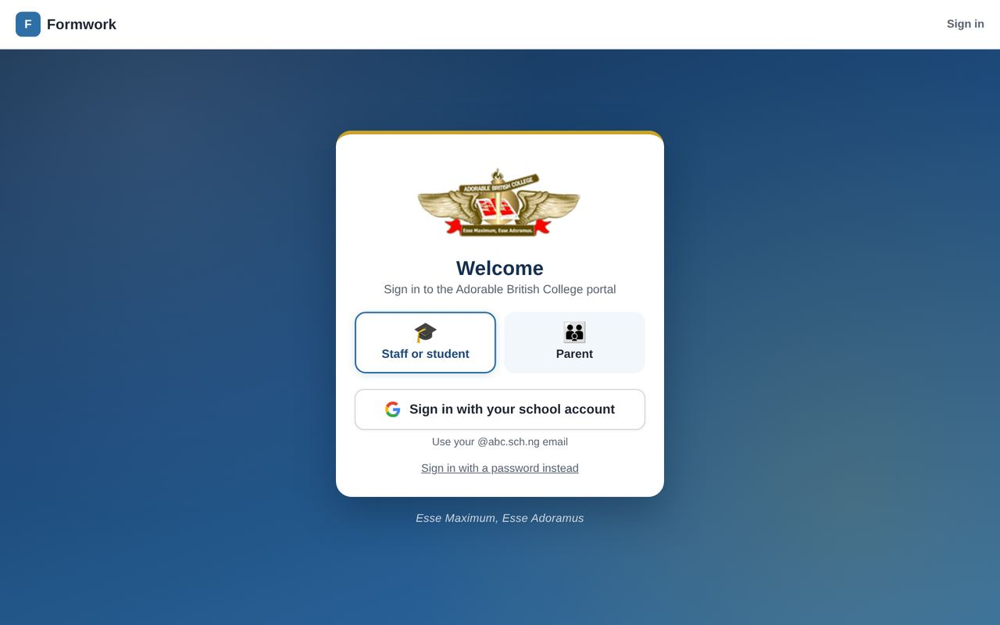

1. Choose **Staff or student** or **Parent**.
2. Staff and students: press **Sign in with your school account** and pick your @abc.sch.ng Google account. You can also use **Sign in with a password instead**.
3. Parents: enter the email address the school holds and your password. Your first password is in the welcome letter (your oldest child's date of birth as DDMMYYYY), and you must choose a new one at first sign-in.

**If sign-in is refused.** Google only links to a login Formwork already made. If you see "not set up in Formwork yet", ask the school office or an administrator; nobody can create their own account. A student who leaves is signed out at once and cannot sign in again unless they return. If Formwork suddenly sends you back to the sign-in page (for example after Sign out all other devices on another phone), just sign in again.

**Passwords.** Use **Change Password** at the top right at any time. A new password must be at least 8 characters. Staff and students who sign in with their school account have no Formwork password to forget. A parent who forgets theirs presses **Forgot your password?** on the sign-in page, enters the email the school holds and follows the link emailed to them; it can take a few minutes and may land in spam or junk. If nothing arrives within 15 minutes, the school office can resend their welcome letter. If you think someone else has used your account, press \*\*Sign out all other devices\*\* on Change Password: every other phone or browser is signed out (one may carry on for up to an hour). The principal's login can only be used with Google and emails a warning whenever it signs in on a new device.

### The staff dashboard

The home page has three layers. The order of the big tiles is set once for the whole school at /admin/tile-order.

| Row | Tiles | Who sees them |
| --- | --- | --- |
| Top row | My Timetable, Calendar, My Children, Class Progress | Everyone; My Children only for staff who are also parents; Class Progress for Heads of Department, SMT and admins |
| Second row | Log behaviour, Inbox (with unread count), Missed Lessons (with today's count), Homework Monitor | Log behaviour and Inbox for all staff; the others for those granted the page |
| Module cards | Students, Pastoral, Admissions, Clinic, Reports, Communication, Timetable, The Other Half, Assessment, Fees & Bills, Tuckshop, Staff & Access, Administration | Each card lists only the pages your roles open; a card with none is hidden |

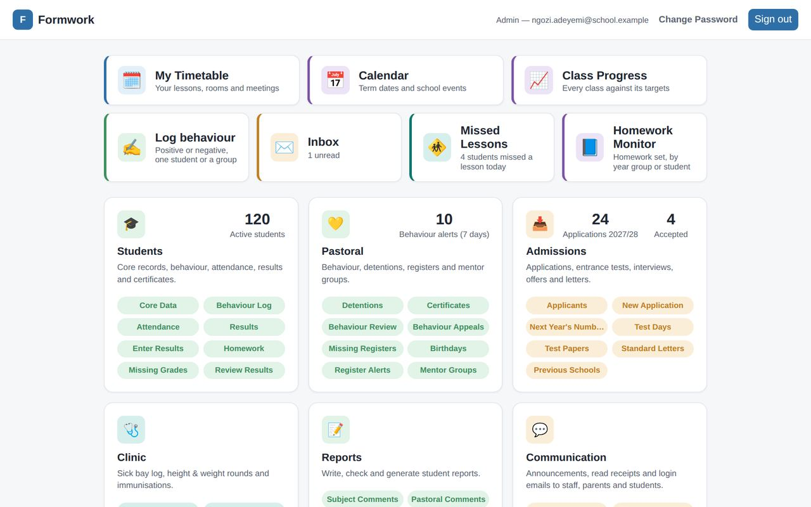

A teacher with the mentor and Head of Department roles sees far fewer cards:

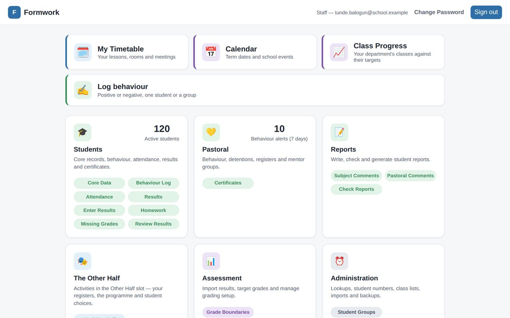

Hover over (or tab to) a link on a card to see a one-line description of the page. The numbers at the top of the Students, Staff & Access, Pastoral and Rewards cards (active students, staff, behaviour alerts in the last 7 days, reward orders waiting for you) open those pages, which aren't listed again as links: press Active students to find a student, Staff for Staff & Roles, and Orders waiting for reward orders. Registers have their own Attendance card, straight after Pastoral: Take a Register, Missing Registers, Register Alerts, Planned Absences and Student Marks.

### Roles and what they open

A member of staff can hold several roles. Each role opens pages (set by admins at /admin/permissions) and carries data permissions enforced by the database. The full list is in the appendix; the most common are:

- **teacher**: registers, results and homework for your classes, behaviour logging, subject report comments.
- **mentor**: your mentor group and its pastoral report comments.
- **head\_of\_department**: Class Progress for your department, deleting your department's scores, class allocation.
- **smt**: calendar, behaviour review, Change History, Grade History, publishing fees, messages, the Homework Monitor.
- **school\_office**: student and parent records, adding students, parent logins, register alerts, missed lessons.

Students and parents do not see this dashboard. Students get their own home page (chapter 13), and parents go straight to the parent portal.

### Working on a phone

Every page works on a phone. Tables scroll sideways where they are wide, and the tiles stack into one column.

## 2. Students

Every member of staff can read every student's record; what each role can change is granted field by field. Only the school office can add a new student.

### Finding a student (/students)

The Students page loads nothing until you ask, because the whole school with photos is slow.

1. Type two or more letters of a name: up to eight matching students appear as blue buttons under the search box. Choose one to open their profile.
2. Or set **Year group**, **Form class** and **Status** and press **Load students** to see a group as cards (or switch to **List**).

Each card shows the student's net behaviour points and their latest weekly average.

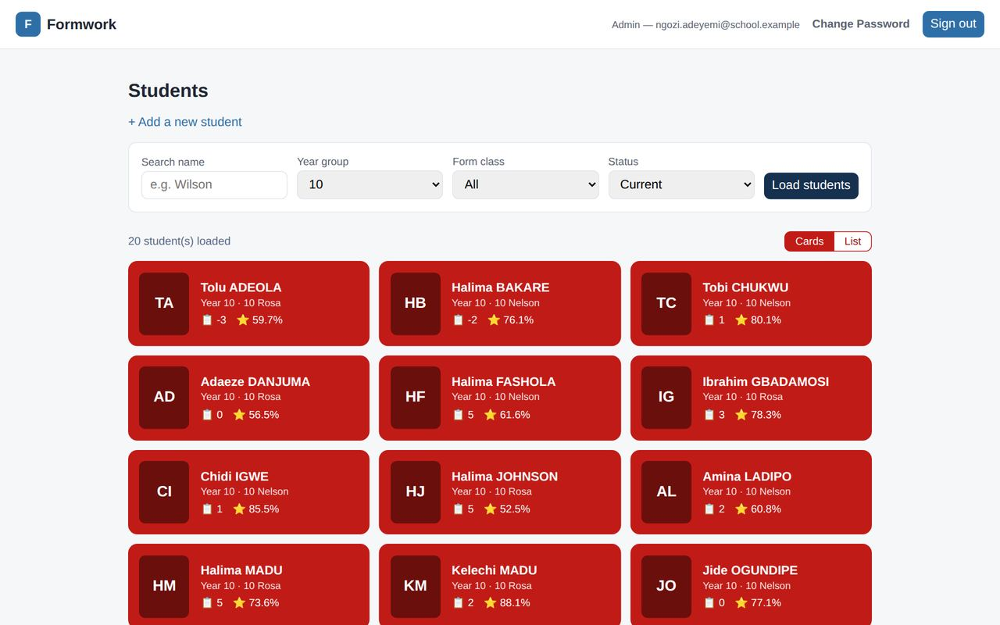

Houseparents see their own house by default; those with school-wide jobs get a **Whole school** switch. This is a display filter only.

### The student profile

A profile opens on a grid of tiles. Each tile opens one part of the record.

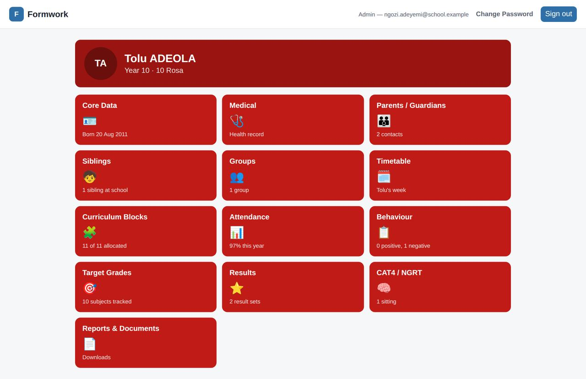

| Tile | What it holds |
| --- | --- |
| Core Data | Names, date of birth, year, form, house, room, restaurant, contact and identity fields. **Full view** shows every field; **Edit** changes the ones your role may edit |
| Medical | The clinic record (nurse and DSL only) |
| Parents / Guardians | Linked parents, their relationship to this child, phone and email; the office can create a parent login here |
| Siblings | Brothers and sisters found through shared parents (staff only) |
| Groups | Student groups the student belongs to |
| Timetable | The student's week, with their Other Half activity |
| Curriculum Blocks | Which class the student is in for each block |
| Attendance | Today, this week and this year: sessions, present, late, authorised and unauthorised absence, minutes late |
| Behaviour | Every event, who logged it, appeals and detentions |
| Target Grades / Results | Targets per subject and scores per result set |
| CAT4 / NGRT | Imported test scores |
| Reading Age | Every reading age, from the interview on, against the student's age, with a chart (see Reading ages in chapter 5) |
| Reports & Documents | Published reports, transcripts and score sheets, and the transcript download |

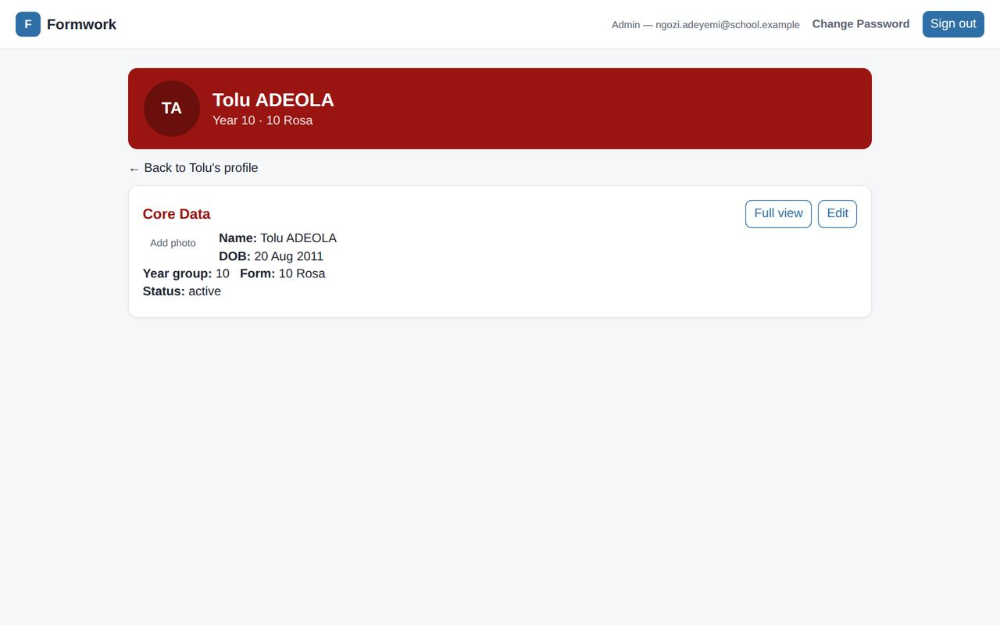

### Editing a record

Press **Edit** on Core Data. Only the fields your role is allowed to change are editable (set per role at /admin/permissions). The school office has all of them. A change to a field you weren't granted is refused by the database.

Rules worth knowing:

- Gender is required and is Male or Female.
- A student's form must be a real mentor group; their mentor group follows it.
- Names are tidied on save: spaces at the ends and double spaces are removed.
- Marking a student as anything other than active (for example, left) removes them from all their classes and blocks their login. Attendance, behaviour and results are kept.
- Every change to a student record is logged in Change History.

### Adding a student (school office only)

1. Go to **Students → + Add a new student** (/students/new). The UPN is generated automatically.
2. Fill in first and last name, date of birth, gender, year group and form. Admission date defaults to today; the six-digit admission number is issued automatically.
3. Save, then add parents, house and other details from the profile.

Holding admin is not enough to add a student; the school\_office role is needed. Bulk loads use /students/import.

### Parents and leavers

- The school office manages parent records at /parents and links them to students from the student's Parents tile. Each link records the relationship (Mother, Father, Other).
- When you add a new parent, the email is checked as you type. If a parent already has it, you see their name, phone and children, with **Link this parent instead**. Adding a second parent with the same email needs the **Add as a separate parent anyway** tick, for the rare case of two people sharing an email. A duplicate leaves the existing login without the new child, so the parent signs in to an empty portal.
- Parents only see children who are still active. A leaver's records drop out of the parent portal automatically, though the link is kept.
- Admins, SMT and the office can use **View as Parent** (/parents/view-as) to see exactly what a parent sees.

## 3. Timetables and registers

Registers are taken lesson by lesson. Any lesson whose register is not taken 15 minutes after it starts is flagged, and students who drop out of a lesson after being seen in school raise an alert.

### The school day

There are nine sessions: Registration (M), Lessons 1–6 (L1–L6), The Other Half (OH) and Evening Prep (EP). Bell times are set per weekday at /admin/bell-times (admins). Sunday has an Evening Prep time only, since prep runs Sunday to Friday; it is listed on Bell Times but not in "make these days the same". When one date runs on another day's times (for example a Monday on Friday's shorter times), book it on Bell Times under **Run one day on another day's times**: choose the date, the day whose times to use and a reason, then press **Run … on …'s times**. Every class's lessons that day move to those times, and the usual times come back automatically early the next morning; booking today takes effect at once. **Cancel** on the booking puts the usual times back straight away. The timetable itself comes from Nova-T and is imported by admins (chapter 14); a single lesson can have its own teacher or room, different from its class.

### My Timetable (/staff/timetable)

Your week: lessons, mentor registration, Other Half activities and meetings. Click a lesson to open its register. If you have overdue registers today, a banner appears above the timetable. Staff with the right access can pick another person from **Viewing timetable for**.

Above your own timetable, **Mark books** has a small link for each of your classes; each opens that class's mark book, with every homework and classwork mark (chapter 4).

The bar above the grid says which week you are looking at and its dates, and each day shows its date. Press **Next week →** to see the coming week, and **This week** to come back. Next week shows any cover you have been asked to do and marks school holidays. Its lessons are the timetable as it is today: if the timetable changes, next week updates once the new timetable has been imported. You can't open a register for a day that hasn't come yet. At the weekend, This week is the week just finished.

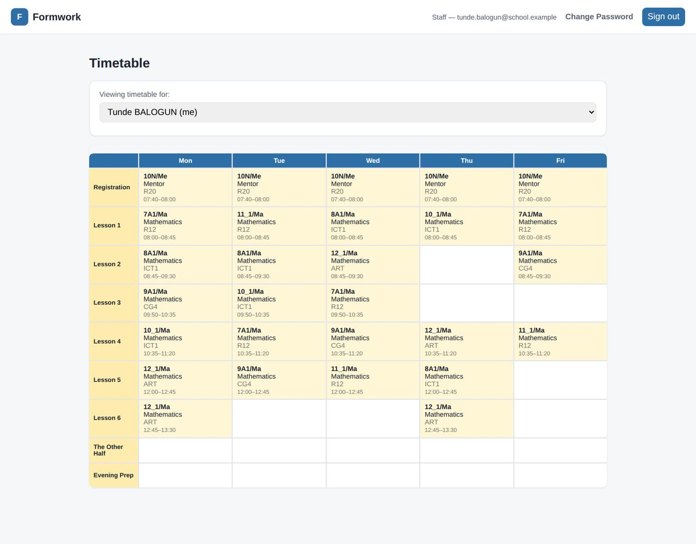

#### Finding when a group is free

Use **When is a group free?** at the top of the Timetable page to find a time when several people are all free, for example every Head of Department for a meeting.

1. Press **When is a group free?**.
2. Choose **Add everyone with a role…** (for example Head of Dept), then use **Add a person…** to add anyone else. Press × on a name to remove that person, or **Clear** to start again.
3. Read the week. A green period says **All free**. A yellow one says how many are free (for example "3 of 7 free") and names them when four or fewer are free. A grey period has nobody free.
4. Tap a period to see who is free and who is busy, and why: the class they teach, a meeting from Nova-T, or their Other Half activity this term.

The box above the grid lists every period when the whole group is free. Tick **Show only periods when everyone is free** to hide the rest. Anyone with no lessons on the timetable shows as free all week, and Formwork names them so you can check.

#### Cover for an absent teacher (SMT)

When a teacher is absent, a member of SMT gives each of their lessons to someone who is free then. Only SMT can arrange or cancel cover.

1. On the dashboard, open the **Timetable** card and press **Cover**. You can also press **Arrange cover** when viewing any teacher's timetable.
2. Under **Teacher who is absent**, choose the teacher, then choose the **Date**: today or later.
3. Each of their lessons that day is listed. Open its list and choose who covers it. Only staff who are free then are offered: no lesson, meeting or Other Half activity of their own, and not covering something else. The number beside each name is how many covers they have done this term, and the lowest comes first, so share the load. "(absent today?)" means someone is covering one of that person's own lessons that day.
4. Add a note if it helps (for example "Worksheets are on the desk"), then press **Add cover**. Staff with no lessons on the timetable, such as office staff, are only listed if you tick **Include staff with no lessons on the timetable**.

To undo a cover, press **Cancel cover** beside it. The teacher is told. Covers can't be deleted, and a past cover can't be cancelled.

**For the teacher covering.** You get an inbox message with the note and an apology. The lesson appears on your timetable for that day only, marked **COVER for** the absent teacher; tap it to take the register. A box above your timetable lists every cover still to come. The register is yours that day: you get the 10-minute reminder, and if it isn't taken the lesson shows on Registers Not Done under your name, marked "(cover)". The absent teacher's timetable shows **Covered by** your name.

### Taking a register (/attendance)

1. Open the register from your timetable, or choose **Date**, **Period** and **Class / group** on the Attendance page.
2. Everyone starts as Present. Change the **Code** for anyone who is late or absent. Use **Mark all present** to reset the list.
3. For a late mark, enter the minutes late (0–600). While the lesson is running the box suggests the minutes since it started.
4. Save. Saving again overwrites the earlier marks.

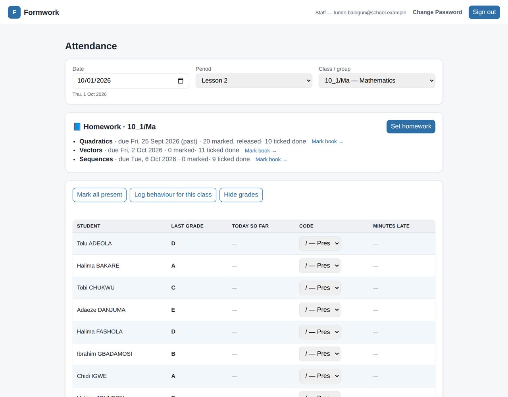

On the register:

- **Today so far** shows each student's other marks today as coloured badges (M, L1–L6, OH, EP).
- **Show last grades** reveals each student's most recent grade in the subject. It is hidden by default so it is not on the class's screen.
- **Log behaviour for this class** opens behaviour logging with the class already chosen.
- For every teaching class, the **Homework** panel shows what is due and links to the class's mark book and to the marks for each homework (chapter 4).

| Code | Meaning | Counts as |
| --- | --- | --- |
| / or \\ | Present | Present |
| L | Late (with minutes) | Late |
| I, M, C | Illness, medical appointment, other authorised | Authorised absence |
| N | No reason yet | Unauthorised absence |
| O | Unauthorised absence | Unauthorised absence |
| H, E, X | Authorised holiday, educational visit, excluded from school | Authorised absence |

**Rules.** Any member of staff can mark any register (the school's decision). You cannot save a register for a future date; past dates ask for confirmation. Taking a register is not logged, but every later change or deletion of a mark is kept permanently in Change History.

**Office C marks.** A C (other authorised absence) saved by the school office, the attendance officer, the principal or an admin shows read-only, marked "office". Only they can change it; saving the register leaves it as it is. If you think it is wrong, ask the office. A note under a mark, such as "With Mrs Adeyemi", is shown read-only too.

**If you haven't taken it after 10 minutes.** A flashing, full-screen reminder appears on whatever Formwork page you have open, listing each of your lessons today (Other Half included) with no register yet: the class, room, period and how long ago it started.

A lesson you have been asked to cover shows with "(cover)" after the class; the absent teacher doesn't get the reminder for it.

- **Take register now** opens that register for today. Saving it clears the reminder by itself.
- **Remind me in 5 minutes** hides it on your screen; it comes back if the register still isn't taken.
- An earlier lesson stays on the reminder until its register is taken, so take a missed one late rather than leave it.
- It never appears while you are on a register page, and not on a day with a holiday on the calendar.

The browser tab flashes too and, once you have clicked on the page, a beep sounds when a lesson is added. Five minutes later the lesson also shows on Registers Not Done for pastoral staff.

### Registers Not Done (/pastoral/registers-not-done)

Lists every lesson today that started more than 15 minutes ago and has no marks, with the lesson's own teacher. It stays listed for the rest of the day until the register is taken. Open to pastoral staff, houseparents, SMT and admins.

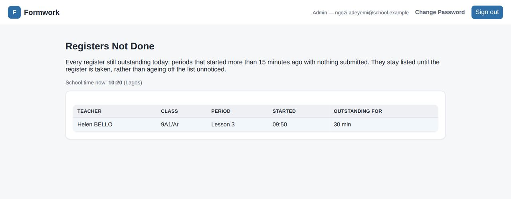

Every 15 minutes, outstanding registers are also copied into **Register Alerts** (/admin/register-alerts, on the Attendance card) for HR, the school office and admins. It opens on All staff: one line per person with their number of alerts, total minutes late and latest date. Click a name, or choose the person in the Staff drop-down, to see their alerts. An alert stays even if the register is taken later, until someone ticks **Resolved**.

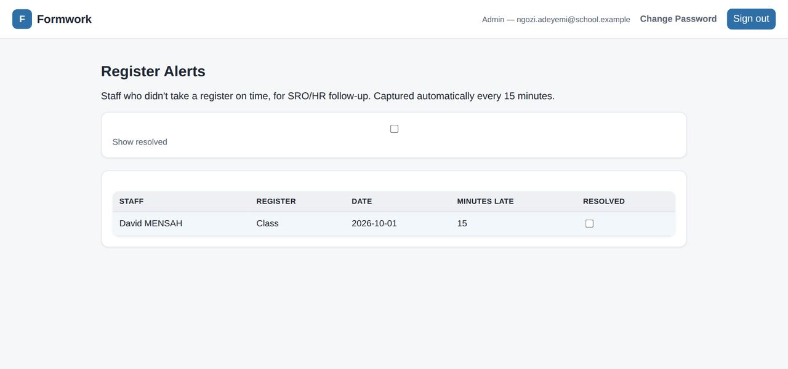

### Missed Lessons (/pastoral/missed-lessons)

Lists every student who was marked present or late at some point in the day but absent without a reason (codes N and O) in another lesson. For each missed lesson it shows where the student should have been, with whom, and who marked them absent. Authorised absences never count. Today's list refreshes every minute; choose another **Day** to look back.

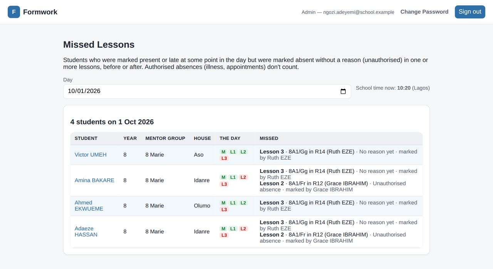

Open to SMT, pastoral staff, the school office, the attendance officer and admins. A tile on the dashboard's second row shows today's count.

### The missed-lesson pop-up

Staff whose role is granted **Missed-lesson pop-ups** (the school office and the attendance officer) get a full-screen alert on whatever Formwork page is open as soon as a student goes missing: a period started at least 15 minutes ago and a student seen earlier is marked absent without a reason.

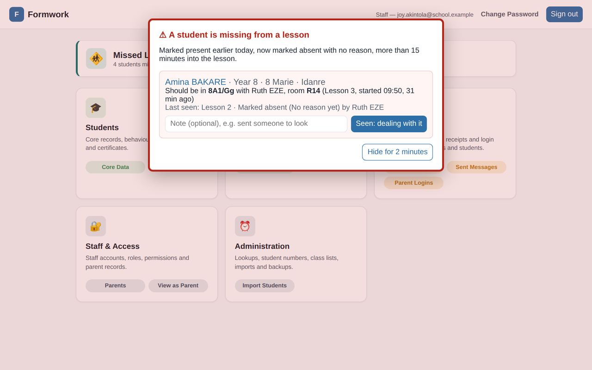

- **Seen: dealing with it** (with an optional note) clears the alert from every screen and records who saw it.
- **Hide for 2 minutes** hides it on your screen only; a new alert still appears at once.
- Correcting the mark (present, late or an authorised absence) clears the alert by itself.

The browser tab flashes and, once you have clicked on the page, a beep sounds for each new alert.

The pop-up also shows the student's registers today, period by period, with who marked each, and what other staff have answered (below).

**Do you know where this student is?** At the same moment, every other member of staff signed in gets a flashing pop-up with the student's name, photo, year, mentor group and house, and the lesson and room they should be in. The person who marked them absent doesn't get it.

- If the student is with you, send them, then press **I've sent them** (add where they were if it helps). It clears from every staff screen and the office sees your answer.
- If not, press **Not with me**. It clears from your screen only.
- It stays until the period ends, even after the office presses Seen, and clears at once if the mark is corrected.

**They're with me.** If the student is with you (a detention, a catch-up, a conversation), press **They're with me** and add a note if it helps. Their N or O becomes C under your name, with "With \<your name>" on the mark, the pop-up clears for everyone, the office's included, and no automatic negative follows. If the C is later changed, the note goes with it.

### The automatic missed-lesson negative

From 8 October 2026, a student who was in school that day (marked present or late at any period) and is marked N or O at a lesson, an Other Half activity or Evening Prep gets a **Missing a lesson activity** event (−5) for each period missed. It is recorded at the end of the lesson.

- Nobody logs it by hand. It shows with no teacher, and its text says which lesson, which code and who marked the student absent.
- At −5 it gives a detention and the behaviour alert, like any Stage 5, and waits for Behaviour Review before parents see it.
- Registration doesn't count, and authorised absences never do. A student away all day gets nothing.
- If the mark was wrong, correct it on the register (present, late or an authorised absence). The event is withdrawn and its detention cancelled if it hasn't happened yet.
- Only the day's registers are checked, so take registers on the day.

**A C before they turn up counts too.** From 9 October 2026, a student marked C for a lesson and then present or late at a later lesson that day gets the same −5. A C after their last lesson (sent home ill, left for an appointment) doesn't count. If they were away for a known reason, change the C to the matching code (M, I, E or H) and the event is withdrawn; whoever saved the C (or the attendance officer, for a planned absence) is asked to check. A C given by "They're with me" never counts.

**The teacher is asked to confirm.** Whoever marked the student absent gets an email and a Formwork inbox message: the student, the lesson or activity, the code, the −5 and the detention date, and "Was \<name> really not in your lesson?". If they weren't there, do nothing. If they were, or were away for a reason, correct the mark from the link in the message; the −5 and the detention are withdrawn at once. Replies go to the attendance officer.

### Planned absences (/attendance/planned-absences)

When a student will be away for several days or for some lessons, enter it once here instead of marking every register. Open to the school office, the attendance officer, pastoral staff, SMT and admins, from the Attendance card.

1. Type part of the student's name (and pick a year if needed), then click the student.
2. Choose the **First day** and **Last day** (for part of a day, also the From lesson on the first day and the To lesson on the last; leave them on Whole day otherwise: one day, Period 3 to Period 5, works), the **Code**, and a **Note** if it helps. The note is for staff only; parents never see it.
3. Press **Save planned absence**. The page says how many register marks it has filled in so far.

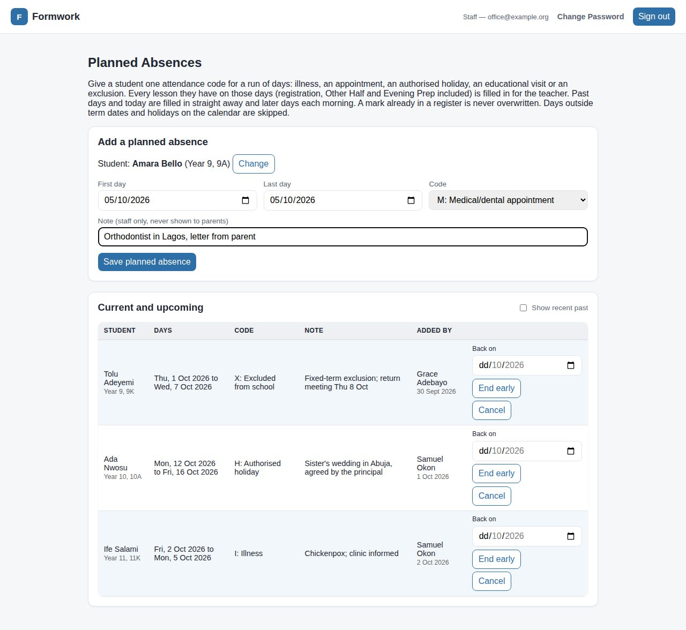

What it fills in:

- Every period the student has on each day: registration, lessons, their Other Half activity and Evening Prep.
- Past days and today straight away; later days at 05:30 each morning.
- Nothing outside term dates or on a day marked as a holiday on the calendar. Every weekday of a mid-term break is a holiday on the calendar, so an absence that runs across a break skips those days.
- It never overwrites a mark that is already in a register.

Only authorised codes can be planned: I (illness), M (medical or dental appointment), H (authorised holiday), E (educational visit) and C (other authorised absence). Exclusions (X) are recorded only on the **Exclusions** page (below).

**On the register.** The teacher sees the code already filled in, marked "planned", and saves the register as usual. Teachers can't change or remove it. If the student turns up after all, tell the school office or the attendance officer: they change it on the register or on Student Marks (below), and it then becomes an ordinary mark. A lesson where every student already has a mark (a whole class on a visit) counts as taken.

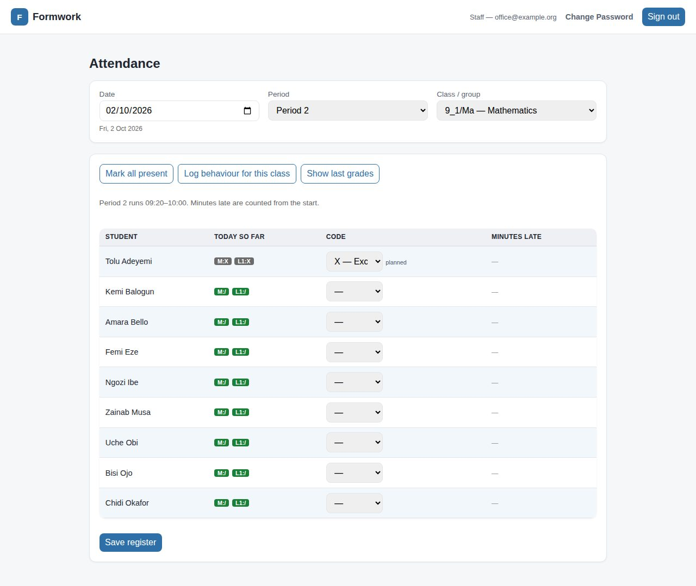

**Back early, or entered by mistake.** In the list, choose the **Back on** day and press **End early**: the marks from that day on are removed. **Cancel** removes the whole absence and all its marks. Back on can also take a lesson, for a student back part-way through a day. Marks the office has changed are left as they are.

**Wrong code.** The school office and the attendance officer can press **Change code** on an absence in the list and choose a **New code**; every mark it filled in changes with it.

A student can't have two planned absences over the same lessons; two on one day are fine if their lessons don't overlap. Every planned absence, and every mark removed by ending or cancelling one, is kept in Change History.

### Exclusions (/attendance/exclusions)

The principal and the college secretary record exclusions here, from the Attendance card; nobody else sees the page. An **internal exclusion** keeps the student out of lessons but in school. An **exclusion from school** sends them home, and only the principal can record one. Both are marked X (excluded from school) in the registers.

1. Type part of the student's name (and pick a year if needed), then click the student.
2. Choose **Internal exclusion** or **Exclusion from school**, then the **First day** and **Last day** (and, for part of a day, the From and To lessons).
3. Read **This half term**: the student's Friday detentions this half term and their internal exclusions so far. Tick any detentions not yet held that this exclusion replaces. They are cancelled and the student is told; the points behind them stay on the student's record. Nothing is cancelled unless you tick it.
4. Write the **Reason**. It goes to the parents exactly as written.
5. Press **Record exclusion and tell parents**.

What happens:

- Every register for those lessons is marked X, replacing any mark already taken. Later days are filled in at 05:30 each morning.
- Every parent linked to the student gets an email and a portal inbox message with the reason, the days and the lessons. Replies come to you and to principal@.
- The exclusion goes on the student's behaviour log as a 0-point event ("Internal exclusion" or "Exclusion from school"). It books no detention and isn't sent to parents again.
- Nobody else can enter, change or remove an X mark: not teachers, the office or admins.

The page never decides for you. As a guide, two Friday detentions may lead to an internal exclusion, and a third internal exclusion in a half term may lead to an exclusion from school.

**Back early, or entered by mistake.** In the list, choose the **Back on** day and press **End early**, or press **Cancel**. The parents are told either way. Cancelling also crosses out the behaviour log entry; detentions it cancelled stay cancelled.

### Student Marks (/attendance/student-marks)

For the school office and the attendance officer: put right one student's marks, lesson by lesson, without opening each register. For example, a student was at the dentist for two lessons last Tuesday and in sick bay for one on Thursday.

1. Find the student, choose the **First day** and **Last day** (up to 62 days, not after today) and press **Show lessons**.
2. Each day lists every lesson on their timetable (registration, the Other Half and Evening Prep included) with the **Mark now** and who gave it. A mark on a lesson no longer on their timetable is shown too.
3. Choose a code in **Change to** for any lesson, or **Remove the mark**. To give several lessons the same code, tick them, choose the code and press **Give ticked lessons this code**.
4. Press **Save changes**. **Undo changes** clears what you haven't saved.

A changed mark shows you as the person who gave it; a planned-absence mark changed here becomes an ordinary mark. Correcting an absent mark withdraws its automatic missed-lesson negative, as on a register. Every change is kept in Change History.

### Attendance summaries

Each student's profile shows today, this week and this academic year: sessions, present, late, authorised and unauthorised absence, and total minutes late. Parents see their own children's attendance in the parent portal, including today lesson by lesson; students do not see attendance.

### Printing

/admin/print-timetables prints every active student's timetable in a year group, eight to an A4 page. /admin/class-lists prints rosters by year, subject or class.

## 4. Homework

Teachers set homework for a class with a deadline and a grading system, and record a grade for each student. Homework is switched on for every teaching class in Years 7–12 (not mentor groups, Prep or Year 12's Personal Study). Grades feed the end-of-term written report only, never transcripts, result sets or targets.

### Who can do what

| Who | Sees what was set, with files | Sees grades |
| --- | --- | --- |
| The class's teachers (class teacher or teacher of any lesson), the Head of Department, admins | Yes, and can set, edit and mark | Yes |
| A student's current subject teacher, for that student's marks in the subject from any class | Yes | Yes |
| SMT | Yes | Yes |
| Other staff (mentors, pastoral, assessment managers) | Yes | No |
| Students | Their own classes' homework this school year | Their own, once the teacher releases marks |
| Parents | No | Only the Homework grade on a published written report |

### Your classes (/homework)

Your own classes appear as buttons under **My classes**. **Other classes** lists other switched-on classes in your subjects (view only) and any class you manage as Head of Department or admin. Choosing a class lists its homework: due date, title, grading system, how many are marked, whether marks are released and how many students ticked it done.

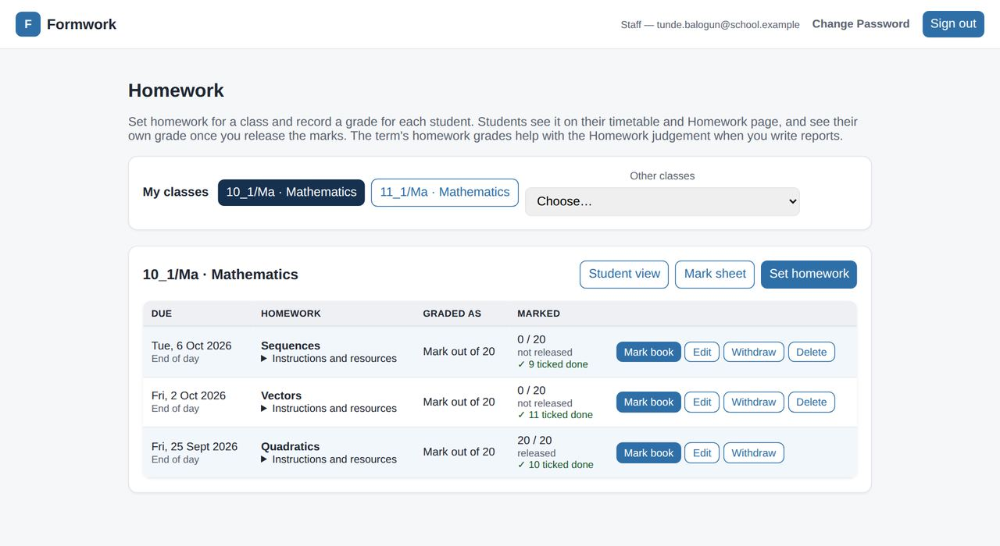

### Setting homework

Press **Set homework** in the Homework panel of the lesson's register: open it from your timetable, or from Take a Register on the Attendance card. Heads of Department can open another teacher's lesson from that teacher's timetable. The full Homework page (/homework) has no link on the dashboard; open it from All homework → or Mark book → in the register's Homework panel, or the Mark books links on your timetable, or type /homework.

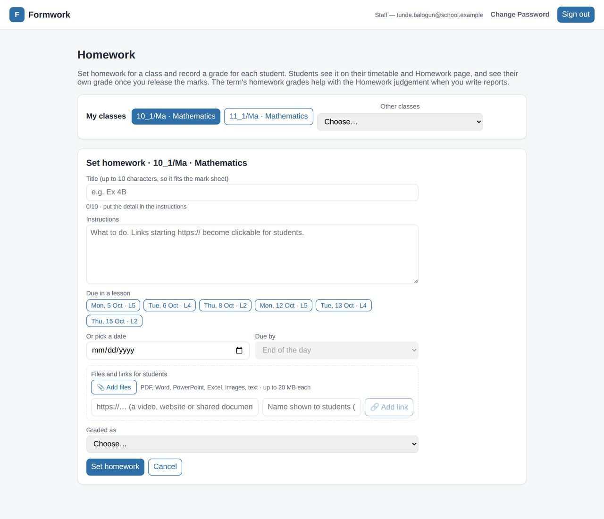

1. **Title**: at most 10 characters, so it fits the mark book (e.g. "Ex 4B"). Put the detail in the instructions.
2. **Instructions**: plain text. Links starting https:// become clickable for students.
3. **Due**: pick one of the class's coming lessons, or a date and "end of the day". Then choose Time it takes (30 minutes unless you change it). The homework is done in prep the evening before the deadline (Sunday for a Monday deadline), and the form shows that evening and the least time any student in the class has left. If any student would run out of prep time that evening, it won't save: shorten it or choose a later deadline. Homework due today can't be set, because its prep evening has passed.
4. **Files and links**: PDF, Word, PowerPoint, Excel, images, text or CSV up to 20 MB each, and https:// links. Files are private and open through a link that lasts ten minutes.
5. **Graded as**: Mark out of …, Percentage, A\*–U, 9–1, WAEC, Effort 1–4, Complete / Incomplete, or Not graded.
6. Press **Set homework**. Students see it straight away on their timetable and Homework page.

Once any grade is recorded, the grading system can't be changed and the homework can't be deleted, only withdrawn.

### Entering marks for a homework

Press **Mark**s beside a piece of homework (or Marks → in the register's Homework panel). Enter a mark (or grade), or choose **Not handed in** or **Excused**. For marks, the grade is worked out from the subject's grade boundaries for the year group and shown beside the number (11 out of 14 is 79%, a B). Students who ticked the work done show "ticked done" under their name.

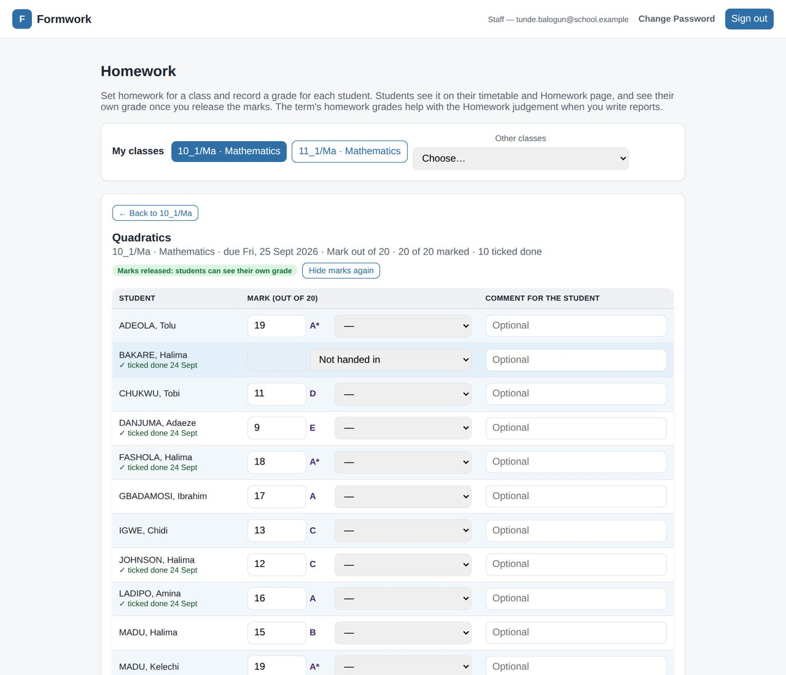

Students see nothing until you press **Release marks**; **Hide marks again** takes them back. A student who joined the class after the due date is left out unless they already have a mark. When you release, each student marked Not handed in automatically gets a "Homework not completed" negative (−2) in your name, as does a Not handed in entered after release. It goes to parents only after the office or SMT approve its writing. Changing the mark, hiding the marks again or withdrawing the homework withdraws it; Excused never counts.

### The class mark book

**The Mark book** shows a class's marks between two dates (this term by default): one column per homework, each student's average of number-marked homework with its grade, how many were marked and how many not handed in. **Download CSV** exports it.

To open a class's mark book, use the **Mark books** links at the top of your own timetable (one small link per class), **Mark book →** in the register's Homework panel, or **Mark book** on the class's homework page. Press a homework's title in it to enter that homework's marks.

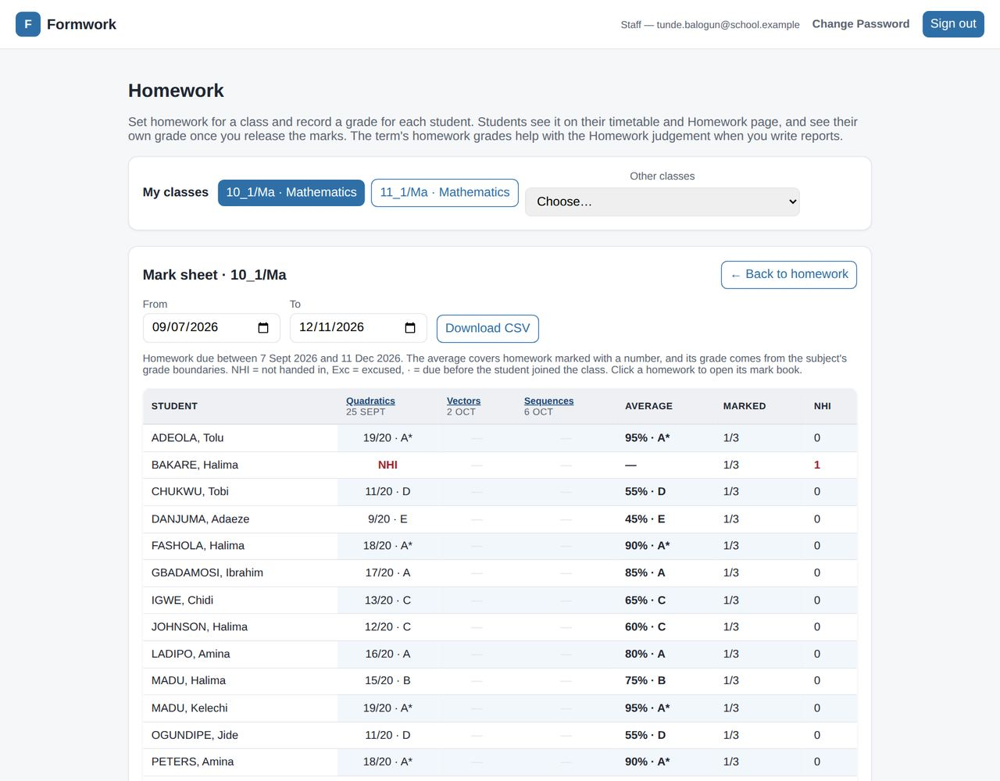

### Student view

**Student view** draws the class's week of homework exactly as its students see it, as a student who has ticked nothing and has no grades. Use it to check what students will see.

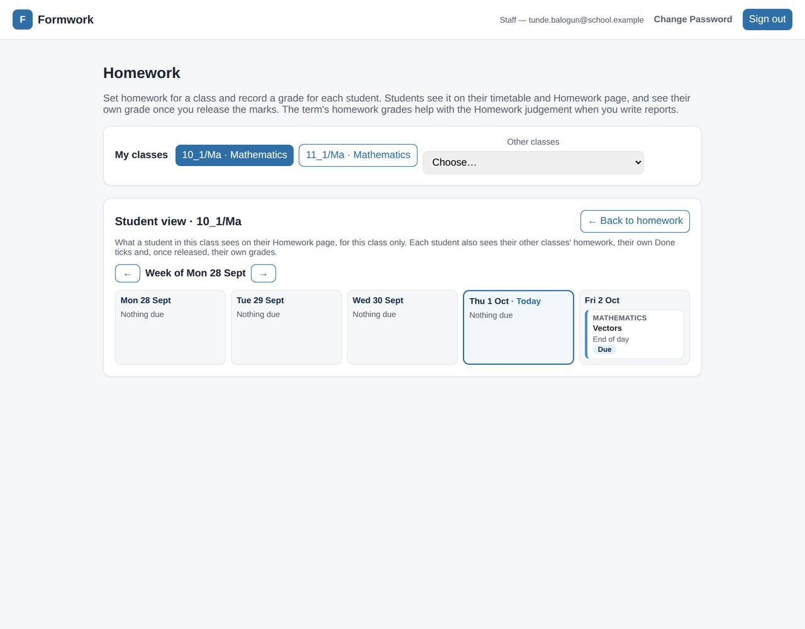

### How students see homework

Students see homework on their timetable (on the lesson it is due in) and on a Homework page laid out by day. Colour shows where each piece stands: red for overdue or not handed in, amber for due today, green for ticked done, purple for graded, blue for due later. A student can tick **Done** as their own note; it is not a hand-in. Once the teacher releases marks, a graded homework shows its grade on its own card, where it was; there is no separate list of graded work.

Each day on the Homework page also lists **To do**: the homework on that evening's prep (Saturday and Sunday under Weekend). To plan ahead, a student opens a homework and chooses **I'll do it on…** to move it to an earlier day, from today up to the day before its prep evening, or back again. Once it is graded it goes back to its prep evening and shows the grade. Only the student sees their plan; it doesn't change the evening teachers see or the prep time check.

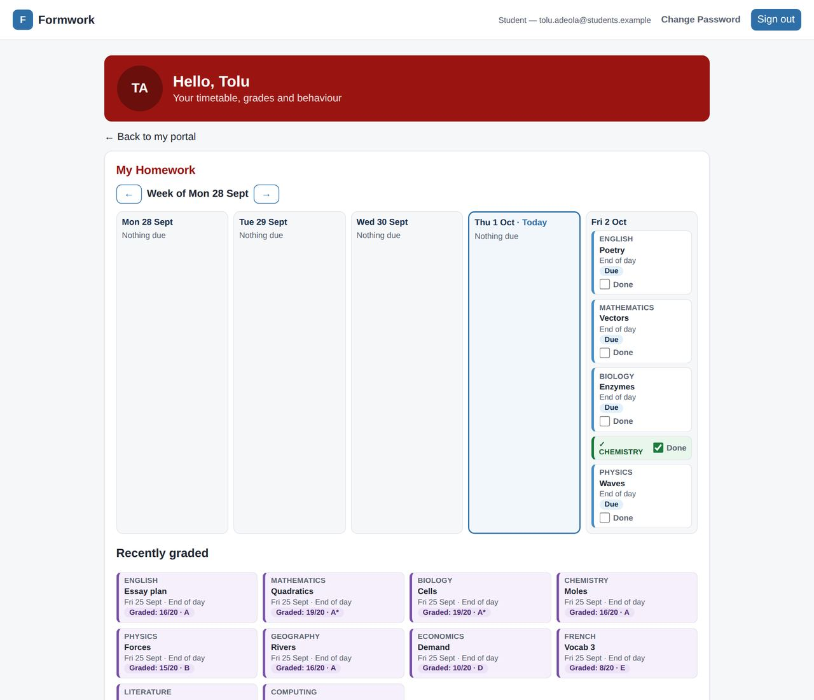

### Prep times (/pastoral/prep)

Homework is done in evening prep, so each year's prep time limits how much homework can go on one evening. **Prep Times**, on the Pastoral card, is for admins, SMT, pastoral staff and the head of boarding.

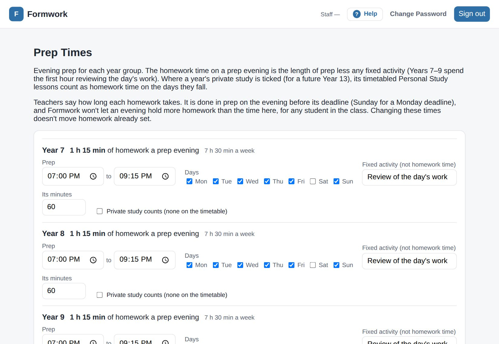

1. Each year group has one card: when prep starts and ends, the days it runs, and any fixed activity that isn't homework time, with its minutes. Years 7–9 spend their first hour reviewing the day's work.
2. **Private study counts** adds the year's timetabled Personal Study lessons to its homework time on the days they fall. It is meant for a future Year 13; no year has it ticked.
3. **Homework time** at the top of each card shows the minutes each prep evening gives, and the total for a week.
4. Change a value and press **Save** on that card.

As set on 4 October 2026: Years 7–9 7.00–9.15 pm less the hour's review (75 minutes), Years 10–12 7.00–9.45 pm (165 minutes), Sunday to Friday. Changes are kept in Change History. They don't move homework already set.

**Days with no homework** (for mock exams, trips and the like) are listed under the year cards. Tick the year groups, choose the first day (and the last, for more than one), say why, and press **Block**. On a blocked day nothing can be due for that year, and its evening has no homework time, so homework goes on the prep evening before; the homework form leaves those days out and says why. **Remove** takes a day off the list. Homework already set isn't moved. Year 12's mocks on Thursday 8 and Friday 9 October 2026 were the first.

### Homework Monitor (SMT)

The **Homework Monitor** tile (/homework/monitor) shows homework as students see it, for a chosen week:

- **For a year group**: every class's homework due that week on the students' cards, a subject filter, and a table of each subject's classes with which have nothing due.
- **For one student** (choose from **Show**): their timetable with homework on the lesson it's due in, their Homework cards, their own Done ticks and their released grades.

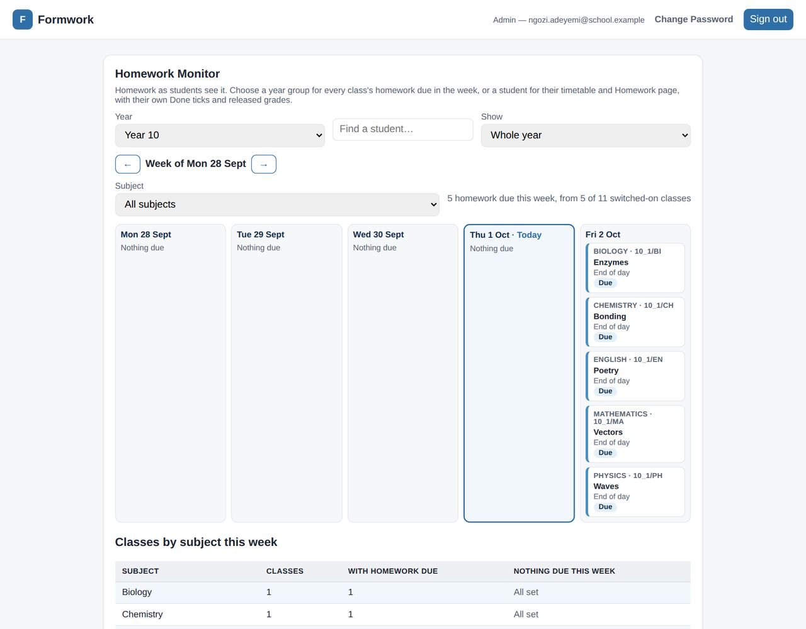

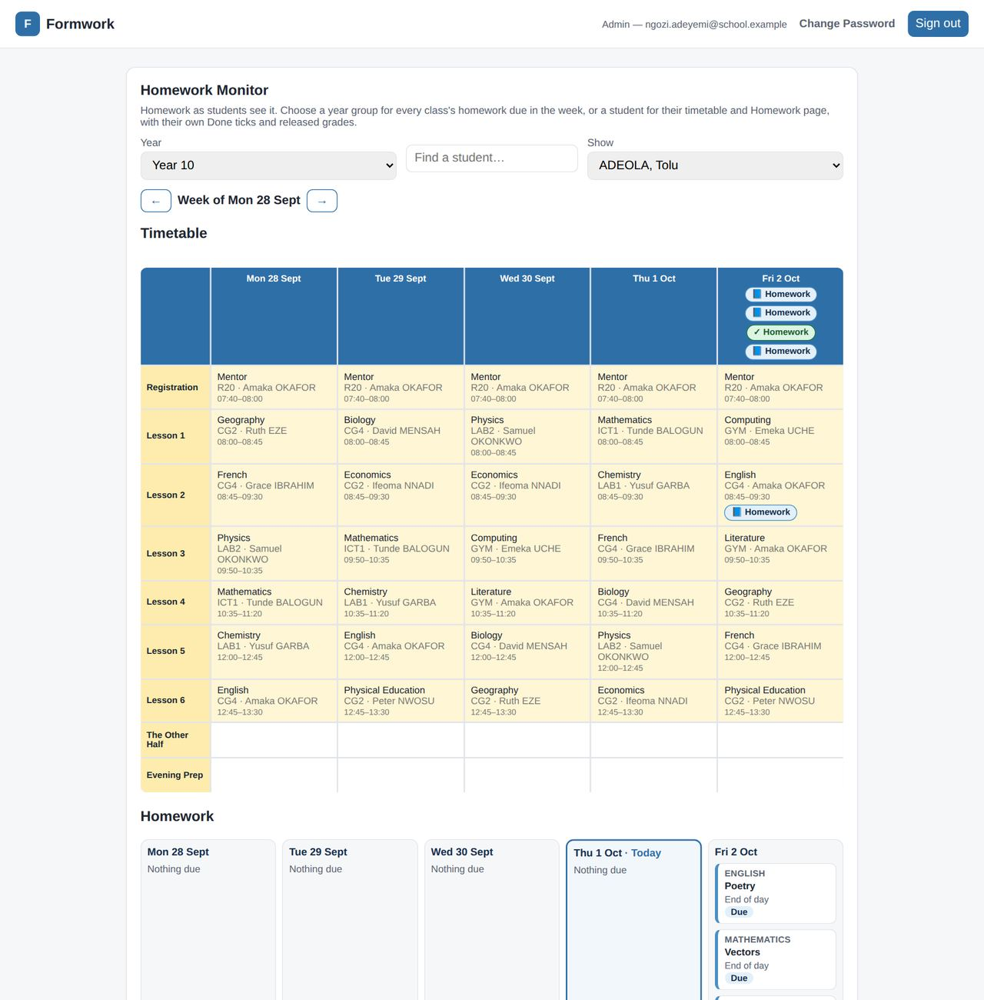

Nothing can be changed from the Monitor.

### Homework in reports

When writing the end-of-term report, teachers see each student's average of the term's number-marked homework (from any class), its grade, and counts of marked and not handed in. The Homework judgement is pre-filled from the average (80%+ Excellent, 60–79 Good, 40–59 Satisfactory, under 40 Needs Improvement) and can be changed. The printed report shows the grade only (for example "Homework: B"), never the percentage.

Not built yet: students handing work in online, and notifications when homework is set or marks are released.

### Lesson worksheets (Maths trial)

From 9 October 2026 Maths teachers can put a worksheet on a lesson. Students see it on their timetable but can open it only once their lesson has started, so nobody gets it in advance. The trial covers Mathematics, Further Maths and Additional Maths, and from 10 October 2026 Computing, Digital Literacy and ICT (Year 9's Digital Literacy is timetabled as ICT); other subjects will be added later. Teachers of those subjects use it the same way as Maths teachers below.

**Adding a worksheet (Maths teachers and Heads of Department)**

1. Open the register for one of your Maths classes (chapter 3). Above the register, the **Lesson worksheets** panel lists the class's lessons this week and next, each numbered within its week, for example "Lesson 2 of 4 this week · Tue 13 Oct · Period 3".
2. To give every class in the year the same worksheet, press **+ All Year 10 (lesson 2)** on that lesson and choose the file. Each Year 10 Maths class gets it at its own 2nd lesson that week.
3. To give it to this class only, press **+ \<class> only**.
4. You can choose several files at once. Each must be 3 MB or less, in the same file types as homework files. The file name becomes the title.

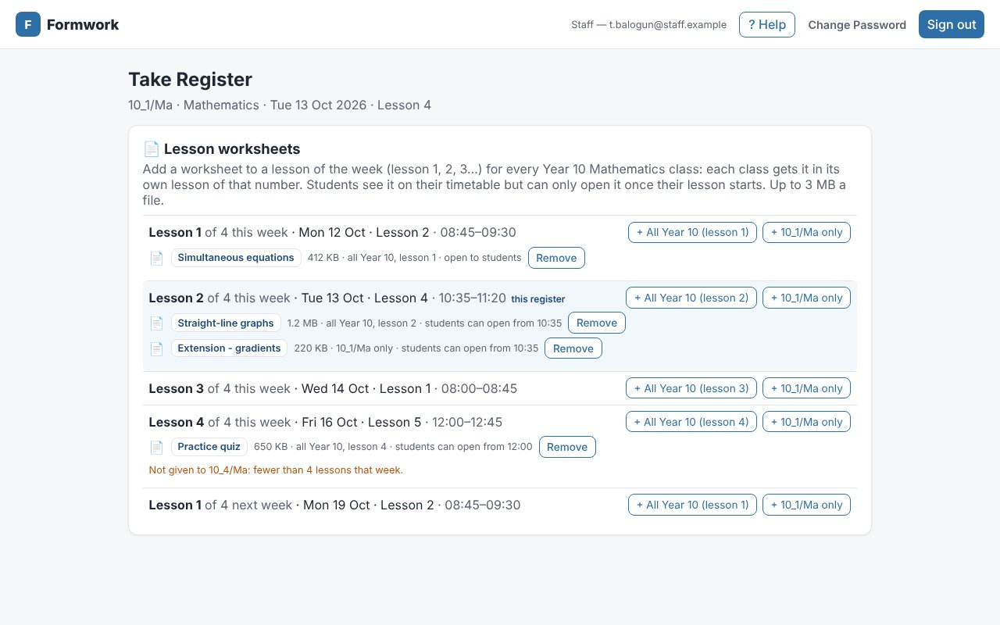

Each worksheet then shows its size, who has it ("all Year 10, lesson 2" or "10\_1/Ma only") and when students can open it. Press its title to open it yourself: staff can open any worksheet at any time, to print or for cover. To change one, press **Remove** and add the new file.

**Good to know**

- Lessons are counted Monday to Friday in time order, school days only: if Monday is a holiday, Wednesday's lesson is lesson 1. A double lesson counts as two.
- A class with fewer lessons that week doesn't get a worksheet meant for a later lesson; the panel says, for example, "Not given to 12S/Ma: fewer than 2 lessons that week".
- Maths classes in a year are timetabled together, so a year worksheet opens for all of them at the same moment.
- Students who join the class after the lesson don't get it. Parents never see worksheets.
- The panel only appears for staff who can add worksheets to that class: its teachers, the Head of Department and admins.

**What students see.** On their portal timetable the lesson shows "Worksheet · opens 10:40" with a padlock until the lesson starts. Then it becomes the worksheet's title, and pressing it opens the file; it stays open afterwards. The timetable checks every minute, so it unlocks without a reload.

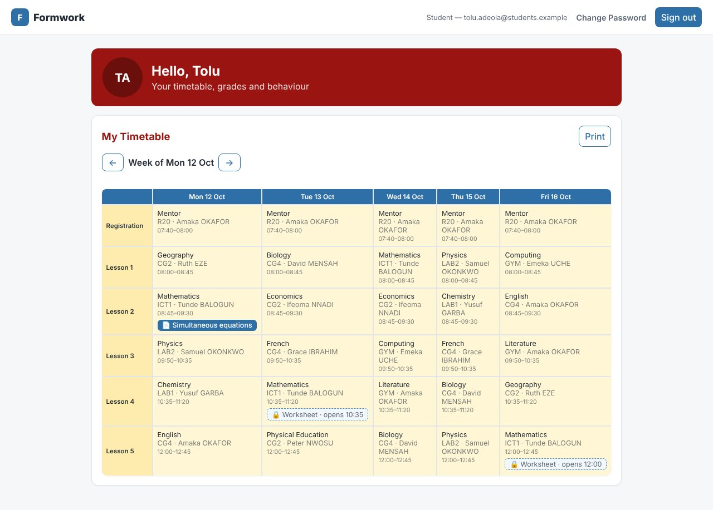

**What it is marked out of.** When you add an ordinary worksheet, Formwork asks what it is marked out of; leave it empty if it won't be marked. You can set or change it later with the **out of 24** (or **Set out of**) button beside the worksheet, or in the mark book. A card sort isn't asked: it marks itself.

**If the timetable changes.** A worksheet given to the whole year follows the timetable by itself: it always goes on that week's lesson of that number. A worksheet added to one class's lesson stays locked if a timetable import moves that lesson; the panel lists it under **Lesson moved**, so press **Remove** and add it again on the right lesson.

#### Card sorts on screen

The department's Word card sorts (the Lesson 2 card sorts, in the card sort format) become an on-screen activity. Add one exactly like a worksheet, usually with **+ All Year 10 (lesson 2)**. Formwork reads the cards, pictures and answer key from the file; if a card sort doesn't fit the format it is refused with the reasons, so the answers never reach students. The worksheet list shows it with a card icon, and **Preview** opens the student screen for you to try (Check is for students only).

In the lesson, students work in pairs on one laptop:

1. The student signed in opens the card sort from the lesson on their timetable and chooses their partner from the class, or **Working on my own**, then presses **Start**.
2. They drag each card under a header or into a set, or click a card and then click where it goes. **Help me start** places the cards from the sheet's Set 4 support box.
3. When every card is placed they press **Check (once only)**. Formwork marks it and shows the count, for example "6 of 8 sets right". Both students get that mark, and neither can do it again.

Students never see the answer key or the Word file; Formwork does the checking.

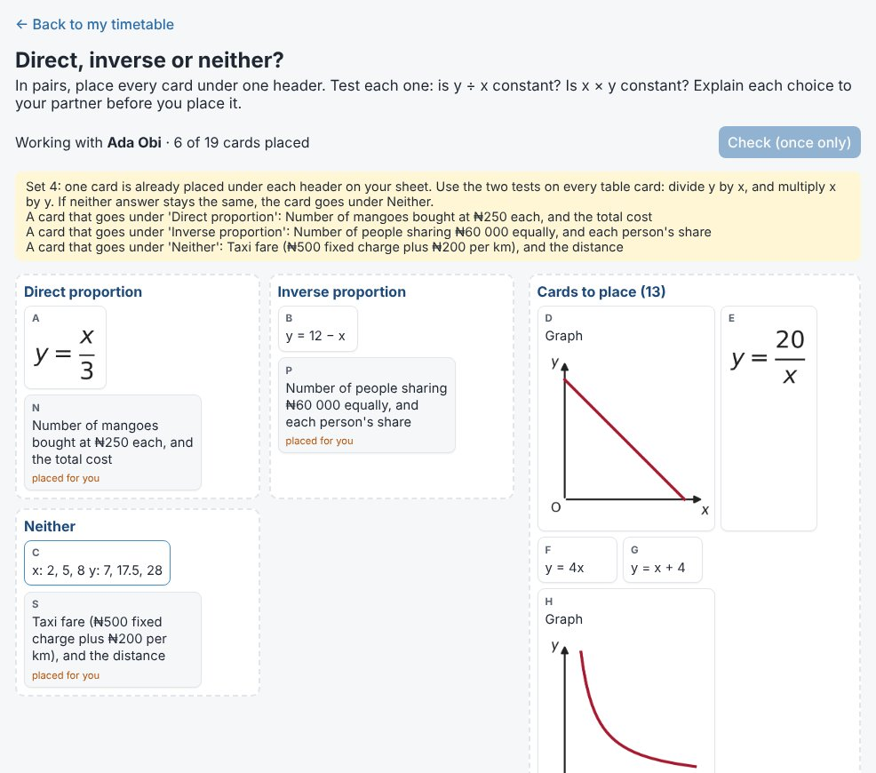

#### Classwork marks in the mark book

Every worksheet and card sort on a class's lessons appears in the class's mark book (the **Mark books** links on your timetable, or Homework → your class → **Mark book**) as a **Classwork** column, after the homework. Card sorts fill in by themselves; "(h)" means the pair used Help me start, and ↺ removes a pair's mark so they can do it again. For an ordinary worksheet, type each student's mark in its column once "out of" is set. Classwork marks never count towards the homework average or the report, and every change is kept in Grade History.

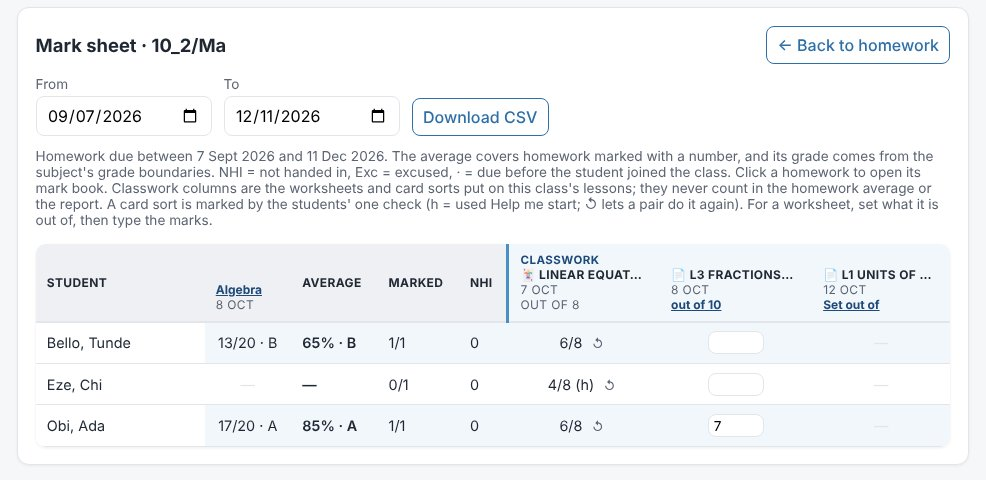

## 5. Assessment, results and targets

**Where the links are.** Every marks page is on the **Assessment** card, numbered in the order the work is done: **1 Adorable.net** (the weekly gradebook from the school's Moodle), **2 Type In Marks**, **3 Marks Missing**, **4 Student vs Avg**, **5 Marks Sheet**, **6 Top 10**, **7 Mark Appeals**, then Grade Boundaries, Subject Settings and Grade History. Baseline tests and targets are on the **Targets & Baselines** card: Import CAT4/NGRT, Reading Ages, Add Reading Test and Import Targets. The old Weekly Results page has no link: use Type In Marks. Until 8 October 2026 some of these were called Enter Results, Missing Grades, Results, Review Results, Result Set Sheet and Record Reading Tests.

**Importing from Adorable.net.** Choose the **result set** the marks belong to (this school year's sets, as on Type In Marks, with the same warning if its date is far from today) and the **result type** (Short Test, Teacher Assessment or Exam Grade), then choose the CSV file. Every mark in the file goes into that set. If the set is only for some year groups, students in other years are skipped and listed. If the set already has marks for any of the students and subjects in the file, the page says how many will be replaced and asks before saving.

**100% in a Big ReLP.** When you save a full mark in a Big ReLP (any result set called "Big ReLP"), the student gets a "100% in a Big ReLP Test" merit (+3) straight away, logged in your name, with the subject in the note. You don't need to log it yourself. If you correct the mark below full marks or delete it, the merit is withdrawn.

Teachers enter percentage scores for their own classes against result sets. Each score is graded from the subject's boundaries for the year group and compared with the student's target. Every grade change is logged permanently.

### Result sets

A result set is a calendar event with the "result set" box ticked (SMT and admins manage the calendar, chapter 9). Weekly short tests, Teacher Assessment weeks and end-of-term exams are all result sets. End-of-term exams are one set per year group per term ("Y10 Term 1 Exam"); Year 12 has Terms 1 and 2 only, as Term 3 is WAEC. Only the current school year's sets can be picked for entry.

**Special result sets** (the One Year category on the calendar) are for particular year groups only, such as Year 12 mocks. When you choose one on Type In Marks, only classes and students in those year groups are listed, and a mark can't be saved for anyone else. The marks are kept under the set's name, not in a week: on the Termly Grade Report the set takes the place of that week's column (for Year 12, "Wk3" becomes "Year 12 Mock 1"). They count on the written report and never appear on a transcript.

### Entering results (/results/enter)

1. Choose your **Class** and the **Result Set**, and check the **Result Type** (Short Test, Teacher Assessment or Exam Grade).
2. Type a percentage (0–100) for each student. The grade appears as you type, worked out from the boundaries for that subject and year group, and is saved with the score.
3. Scores save as you go. Students see a score straight away; parents see it only once it is the number of hours old set on Lookups (0 means at once), so a wrong number can be put right first. Correcting a score doesn't restart the wait. **Delete** removes a score (see below).

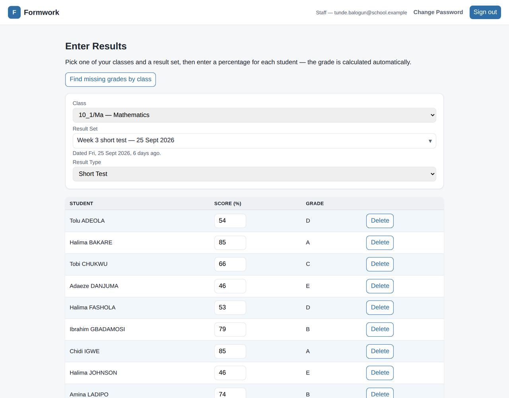

- A teacher can enter scores only for students in their own classes, in that class's subject. Assessment managers, assessment users and admins can enter any score.
- There is one score per student, per subject, per result set.
- Later changes to the boundaries do not regrade scores already saved.
- Deleting a score is allowed to the class teacher, the Head of Department for their department's subjects, and assessment managers and admins (also from the Results tab of a student's profile). Assessment users can't delete.

**Find missing grades by class** (/results/missing) lists, class by class, who has no mark in a chosen set. A subject is expected only if someone in that year group has a mark for it.

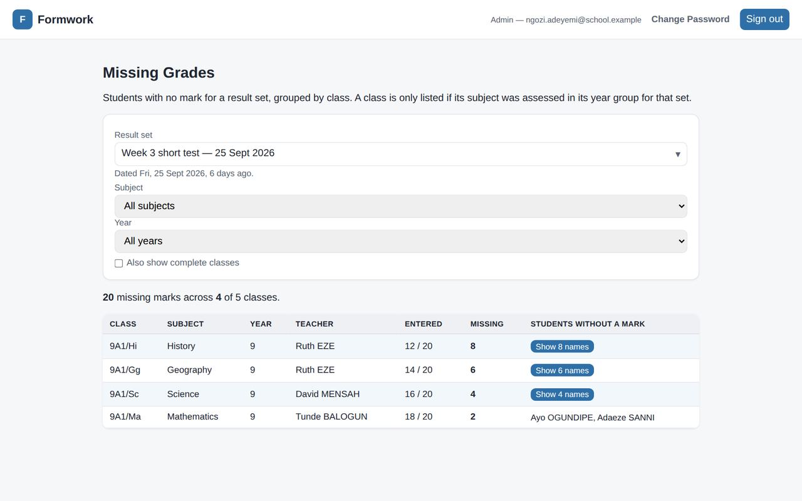

### Browsing results (/results)

Since 8 October 2026 this page has no link on the dashboard: use Class Progress or 4 Student vs Avg instead. It lists the 20 most recent results with each student's grade, target and a coloured **vs target** label: green above, amber on, red below. Grades are never compared across IGCSE and WAEC.

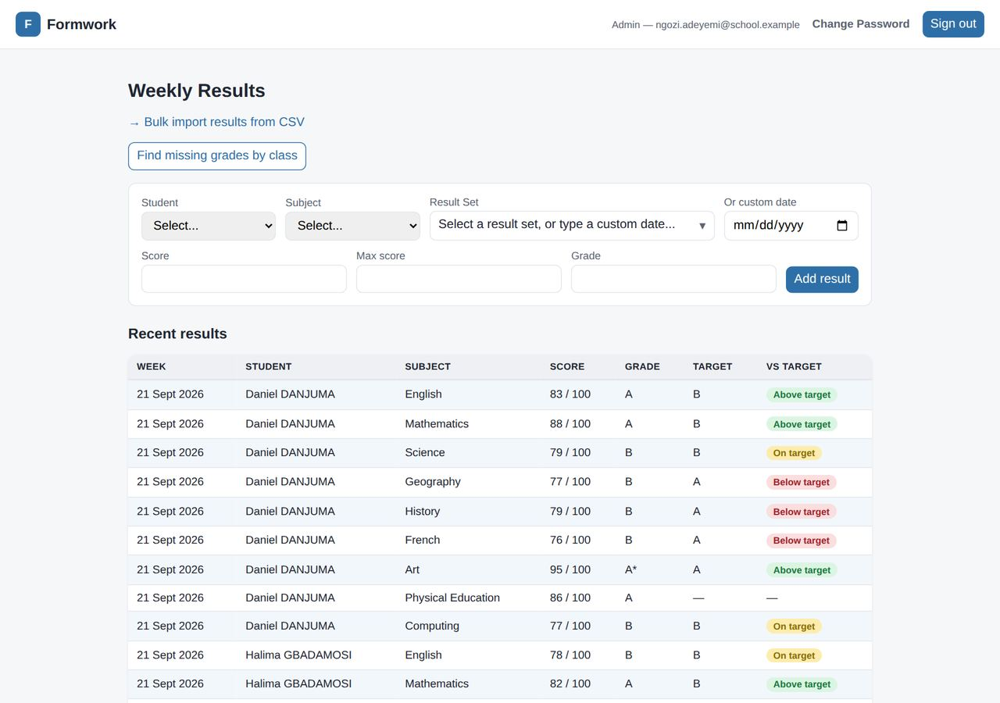

### Class Progress (/classes/progress)

Each class's average grade against the average target of the same students, sorted worst first, with counts above / on / below target. Pick a result set, or leave it on **Most recent result**. Heads of Department see their department's classes, SMT and admins every class, and a plain teacher only the classes they teach. It is a top-row dashboard tile for Heads of Department, SMT and admins.

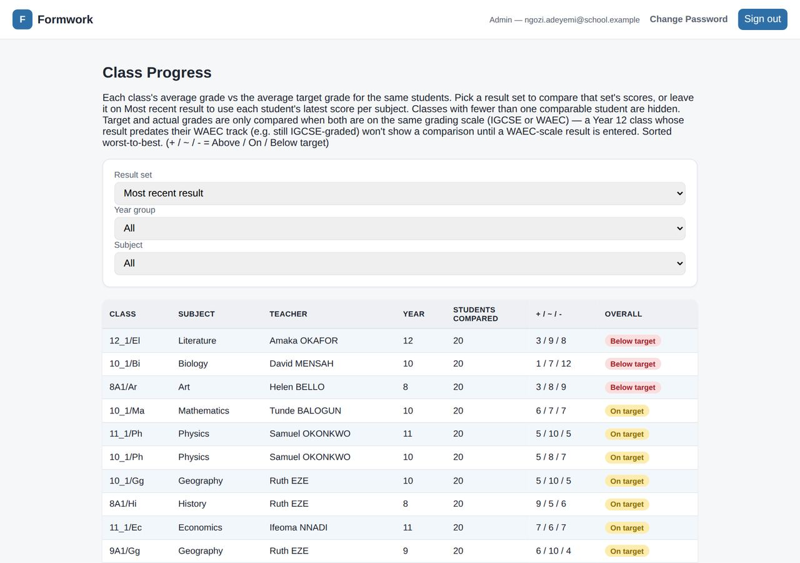

### Other analysis

- **Top 10** (/results/top-ten) ranks students in a result set by average percentage, per year or overall, and prints a page per year.
- **Marks Sheet** (/results/set-sheet) lists every current student's marks in a result set: a column per subject (percentages, or press Show for grades), how many subjects they have marks in and their average. Choose one year, each year on its own page, or all years together; order by surname or highest average; then **Print** or **Download CSV**.
- **Student vs Avg** (/results/subject-overview) charts one student's scores in each subject against the cohort average.
- **Target coverage** (/target-grades/coverage) lists students missing a target.

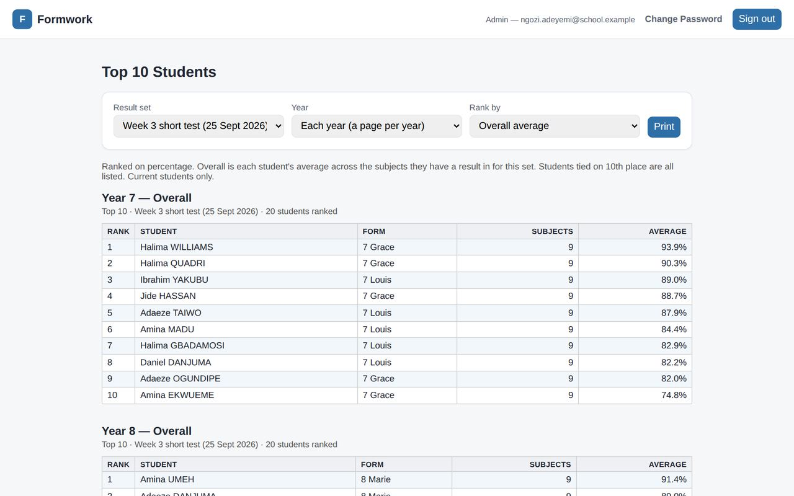

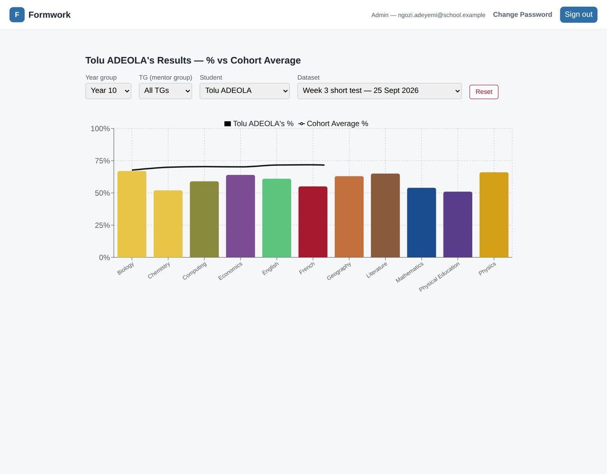

### Grade boundaries (/admin/grade-boundaries)

Grade cut-offs are set per subject and per year group (7–12). Years 7–11 use IGCSE (A\*–U); Year 12 uses WAEC (A1–F9). In Years 10–11 the WAEC-only subjects (chapter 14, Subjects and grading) use their Year 12 WAEC boundaries, so their marks get WAEC grades. Choose the subject and year, edit the minimum and maximum score for each grade, or **Remove** a band. Only assessment managers can edit boundaries (the principal, 3 Oct 2026); everyone else can view them. Changes are not logged.

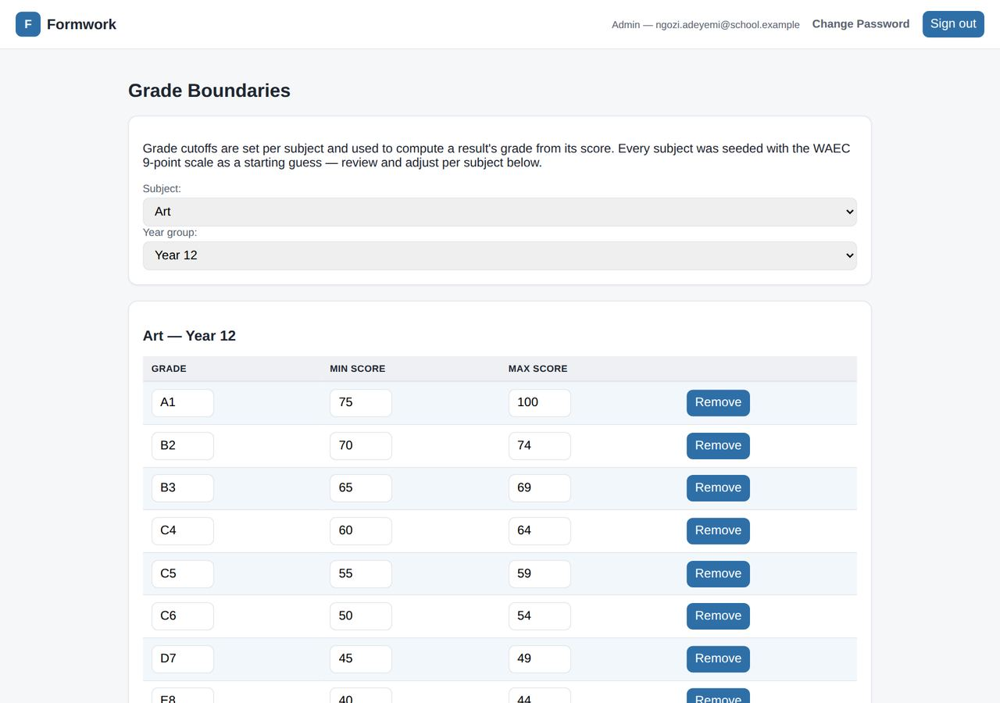

### Targets, CAT4 and NGRT

- One target grade per student per subject, on the IGCSE or WAEC scale, imported at /target-grades/import. Assessment managers and admins set and delete targets; assessment users set but can't delete.
- A subject with no target of its own can borrow one from a related subject (for example Further Maths from Maths), set in /admin/subject-settings.
- CAT4 and NGRT scores are imported from CoreSats at /assessments/import, matched by UPN. Staff and parents can read them; students can't.

### Grade History (/assessments/grade-history)

Every score, target and transcript grade entered, changed or deleted, with the old and new grade and who did it, taken from the sign-in, never from the page. Nobody can edit or delete the log. Filter by dates, student, person, grade type and action, and download as CSV. SMT, assessment managers and admins can read it; homework and group marks are hidden unless chosen, and only SMT and admins can see those.

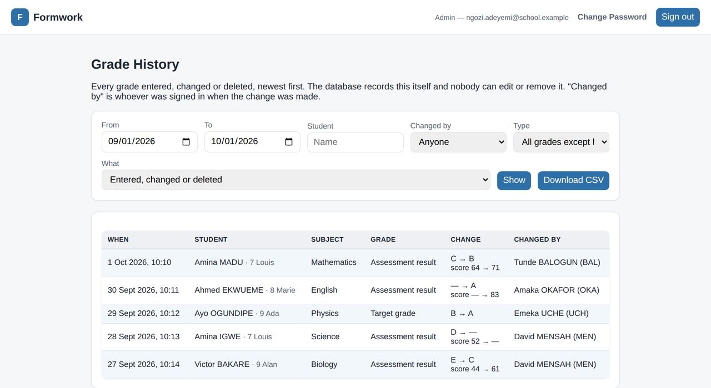

### Mark appeals (/grade-appeals)

A student who thinks a mark doesn't match their marked paper can appeal it, as they would an exam result. Their teacher checks the paper and either corrects the mark or says why it stands. Only the student's teacher for that subject decides (the principal, 4 Oct 2026).

**What the student does.** On the **Assessment** page of their portal, under **Appeal a mark**, they see their marks from the last 5 days. They press **Appeal**, give a reason and, if they like, the mark on their paper, then press **Send appeal**. Each student has 5 credits a school year: an appeal that is turned down uses one, and an upheld or withdrawn appeal gives it back. An appeal still waiting can be withdrawn with **Withdraw**. Parents can't appeal.

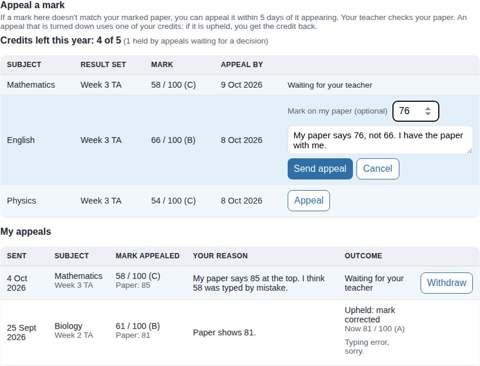

**Deciding an appeal (teachers).** You get a message in your inbox at once and, at 4.15 pm, one email listing your appeals still waiting, with your Head of Department copied in. Open **Mark Appeals** from the Assessment card.

1. Find the appeal under **Waiting for a decision**. It shows the mark, what the student says their paper shows, and their reason.
2. Check the student's paper.
3. If the mark was entered wrongly, type the **Correct score** and press **Uphold**. The grade is worked out from the boundaries, the mark is changed, and the change is kept in Grade History under your name. If you have already corrected it on Type In Marks, press **Uphold** without a score.
4. If the mark is right, write a note to the student and press **Turn down**. The note is required, and the student sees it.

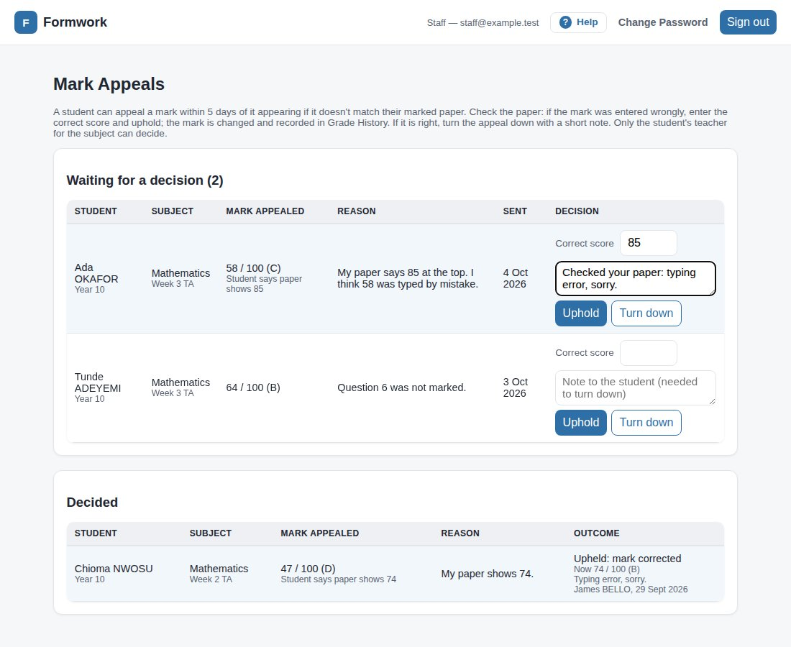

The student gets the outcome in their inbox, and so does the Head of Department, who can follow their department's appeals on the same page but can't decide them. SMT, assessment managers and admins see every appeal. Appeals are never deleted. Please decide promptly: a waiting appeal holds one of the student's credits, and nobody else can decide it if you are away. The 5 days and 5 credits are set on Lookups (chapter 14).

### Lesson feedback

Students tell the school how each lesson went: how well they understood it, and ten Yes or No questions about the lesson. Teachers see what their classes said, but never who said it.

**What the student does.** On their **Timetable**, every lesson that has finished today or yesterday has a **Give feedback** button, and the same lessons are listed in a box above the timetable. A lesson they have already answered shows **✓ Feedback given**.

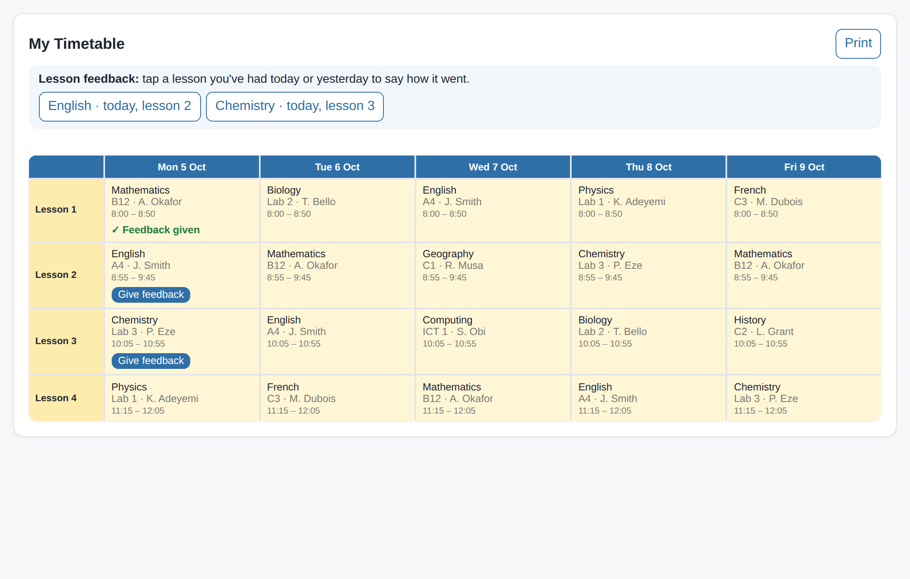

1. Tap **Give feedback** on the lesson.
2. Choose **Green** (understood it and could do the work alone), **Amber** (understood some of it) or **Red** (didn't understand it, need help).
3. Tap **Yes** or **No** for every question. **Send feedback** stays grey until all are answered.
4. Press **Send feedback**. It can't be changed afterwards.

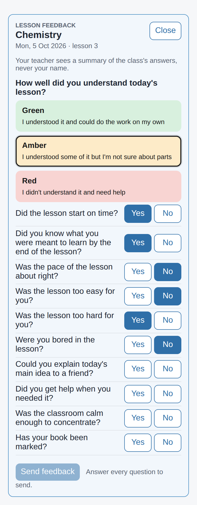

Feedback can be given from the end of the lesson until the end of the next day, once per lesson. Mentor, Prep, Personal Study and the Other Half aren't included, and a student marked absent for the lesson can't give feedback. There is no comment box.

**Seeing what your classes said.** Open **Lesson Feedback** on the Students card (teachers, Heads of Department, SMT and the Lesson Feedback Reviewer). Choose the dates, or press **This week**, **Last week** or **Last 4 weeks**. The table is grouped by department, then teacher, then class. Tap a department or teacher to open or close it; its row adds up the classes beneath it. A teacher sees their own classes already open; Heads of Department and SMT start with the department totals, and **Open all and Close all** do every section at once. Each row shows how many students responded, the green, amber and red split, and the share answering Yes to each question. The column headings stay at the top of the screen as you scroll down. The questions are numbered Q1 to Q10 and listed above the table. A figure is green where most students gave the good answer and red where most didn't; for "too easy", "too hard" and "bored", No is the good answer. Hover over a figure for the counts.

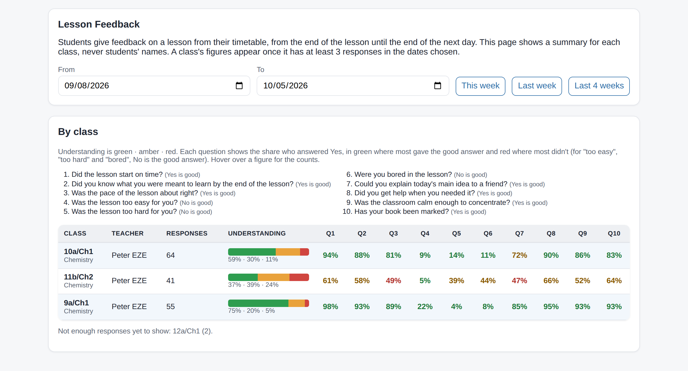

- A teacher sees the lessons they taught; a Head of Department sees their department's classes; SMT and the Lesson Feedback Reviewer see every class.
- A class's figures only appear once it has at least 3 responses in the dates chosen, so nobody can work out one student's answers. Classes with fewer are listed under their teacher with their count, and are left out of the teacher's and department's totals.
- SMT and the Lesson Feedback Reviewer also see the individual responses, in **Individual responses by subject** below the summary, set to show students who chose red; untick the box to see everyone. Each subject is closed until you tap it, and shows its number of responses and classes. Only SMT see the student's name and year; the reviewer sees the lesson, class, teacher and answers without them, enough to take a concern up with the Head of Department or SMT. The Lesson Feedback Reviewer role is given at Staff Roles.
- Parents see nothing, and no emails are sent.

**Changing the questions.** Anyone with Lookups opens **Lesson feedback questions** there to reword, reorder, add or retire a question and say whether Yes, No or neither is the good answer. Once students have answered a question its wording can't be changed: retire it and add a new one. Retired questions keep their past answers.

### Reading ages (/reading-ages)

Literacy is one of the school's improvement targets, so every student's reading age is tracked against their actual age from admission (the application and the interview) onwards. The **gap** is the reading age minus the student's age on the day of the test: **−1 y 2 m** means reading 14 months below their age, **+8 m** means 8 months above. Formwork works out the age and the gap from the date of birth and the test date; nobody types them.

Open **Reading Ages** from the Targets & Baselines card. Teachers, Heads of Department, mentors, pastoral staff, assessment managers and SMT can see it. Choose a **Year group** (and a **Form** if you want one).

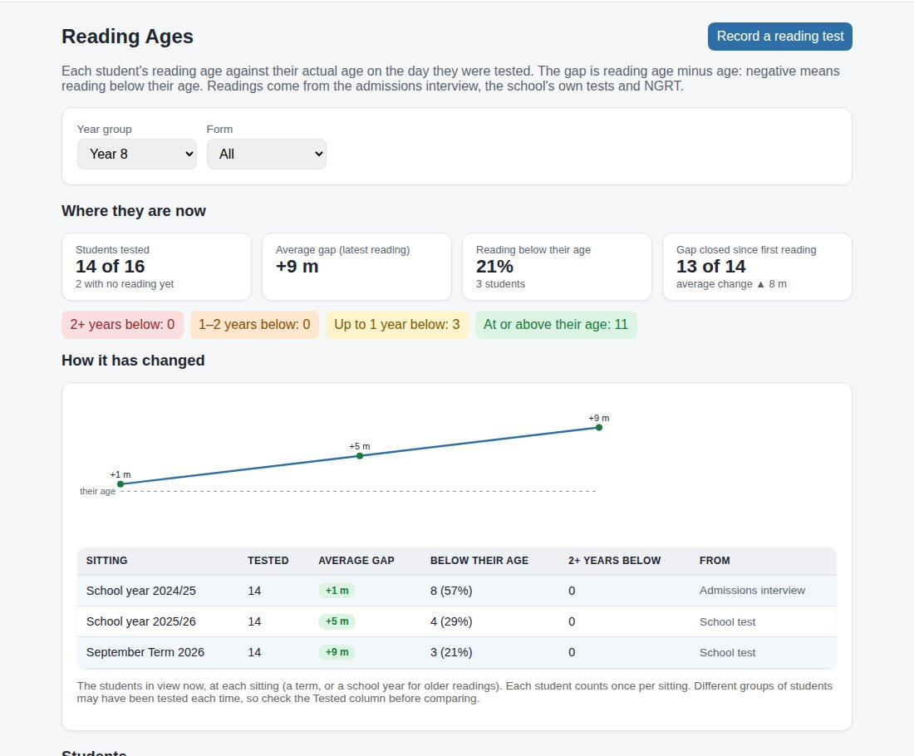

- **Where they are now**: how many have a reading, the average gap at their latest test, how many are reading below their age, and how many have closed the gap since their first reading. The coloured buttons count students in each band (2+ years below, 1–2 years below, up to a year below, at or above their age); press one to list just those students.
- **How it has changed**: the average gap at each sitting (a term, or a school year for older readings). Check the **Tested** column before comparing two sittings: different students may have sat each one.

**Students** lists everyone in view, furthest behind first, with their first and latest reading and the change in the gap (▲ closed, ▼ widened). Press a row to see that student's chart and every reading; **Download CSV** saves the list. The same chart is on the student's profile, under the **Reading Age** tile.

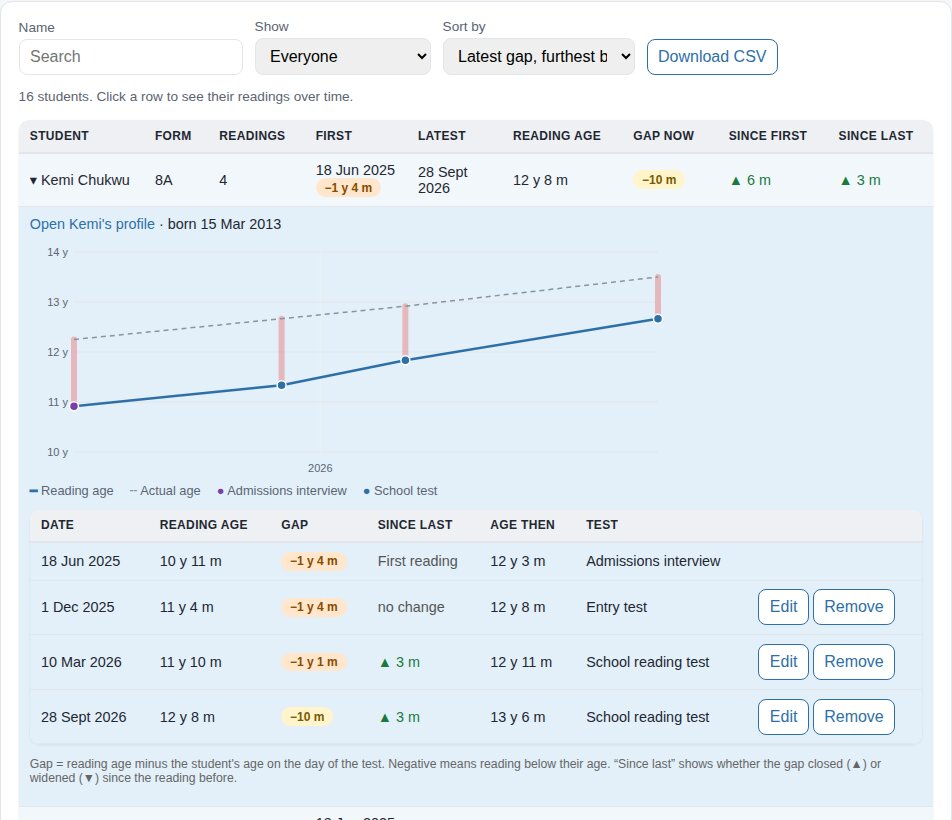

In the chart the blue line is the reading age and the dashed line is the student's actual age; the bar between them at each test is the gap (red below their age, green above). Purple dots are the admissions application and interview, blue dots the school's tests.

**Recording a test** (Record a reading test, /reading-ages/record; teachers, Heads of Department, assessment managers, SMT and the school office):

1. Type the **Test** name (for example *Entry test*) and the **Usual test date**, the day most students sat it.
2. Choose the **Year group** and **Form**, or find one student by name.
3. Type each reading age in years and months. Leave a student blank if they weren't tested.
4. If a student sat it on another day (absent, a catch-up), change the **Date tested** on their row; it turns yellow.
5. Check the **Gap** column, which fills in as you type, then press **Save**.

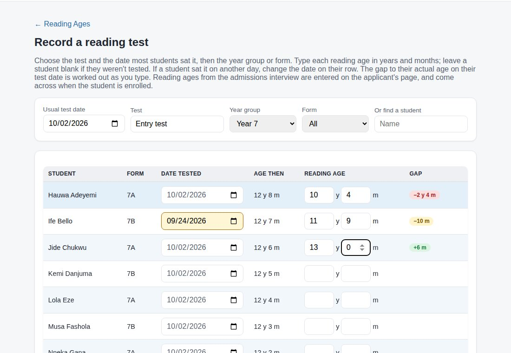

Once you save, the students you have just saved drop off the list, so you can see who is left; when everyone in the form is done the page says so. They stay hidden for that test and date until you close the tab, even if you refresh. Press **Show them** to bring them back to check or correct a reading. Press a student's name (shown in blue) to see their full name, including any middle name, and their Admitted/letter date, with a link to their profile; a name in plain black has nothing more to show.

You can come back to the same test and date to add more students; readings already saved are filled in. A test can't be dated after today. To correct or remove a saved reading, open the student in Reading Ages (or the Reading Age tile on their profile) and press **Edit** or **Remove**. The application and interview readings are corrected on the applicant's page, and NGRT scores in the CAT4 / NGRT section. Every school test added, changed or removed is kept in Change History.

**What parents see.** A parent sees their child's readings, with the chart, on the **Reading Age** tile in the parent portal, but only once the child has two readings from the school's tests or the interview. A single reading is not yet a trend, and old NGRT scores don't count towards the two. Students don't see reading ages.

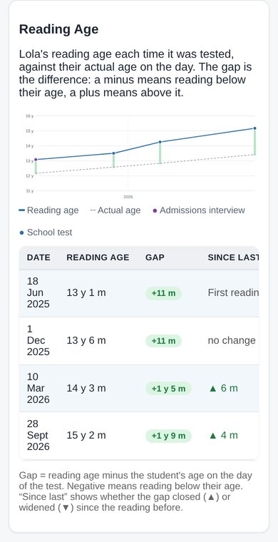

## 6. Reports and documents

Written reports are built only from checked comments. Each report round is a report period with due dates; comments go from draft to submitted to checked, and the finished PDFs are published to the student and parent portals.

### The reporting cycle

1. **Set up the period** (admins, SMT, assessment managers): /reports/periods.
2. **Teachers write subject comments** and **mentors, houseparents and SMT write pastoral comments**, saving drafts and submitting by the comments-due date.
3. **Checkers approve or send back** each comment by the checking-due date.
4. **Generate and publish** the reports (admins): /reports/generate.

### Report periods (/reports/periods)

Give the period a name and term, the **comments due** and **checking due** dates, the year groups covered and, optionally, a "joined on or after" date for checking new students. **Checkers** assigns the staff who check the period. Adding a report-period event on the calendar also creates the period.

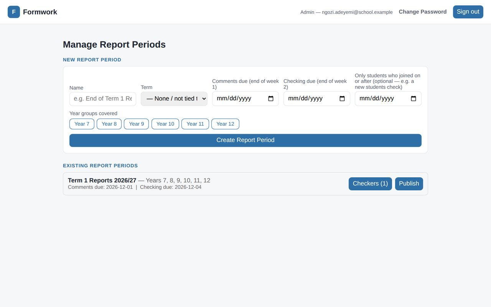

### Writing subject comments (/reports/write-subject-comments)

Choose the **Report Period** and one of your **Classes**. For each student you see the last weeks' grades coloured against target, the year's best, lowest and average, the trend, and this term's homework summary.

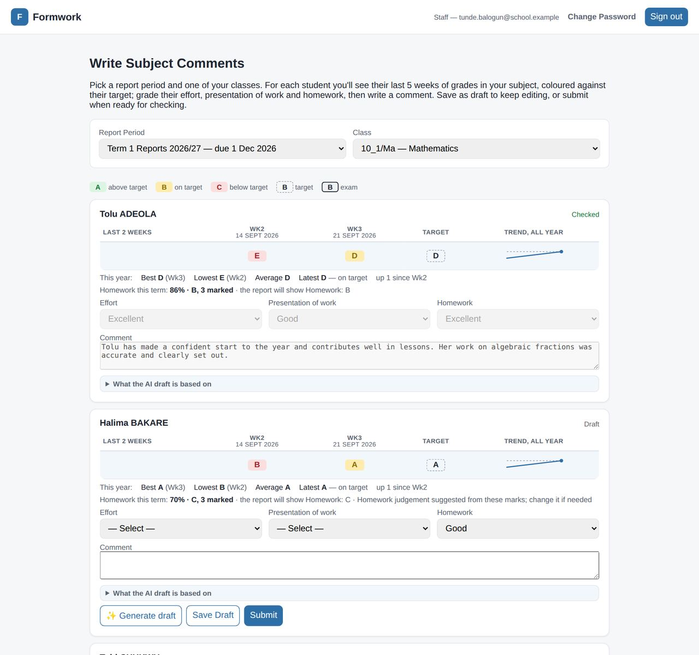

1. Set **Effort**, **Presentation of work** and **Homework** (Excellent, Good, Satisfactory, Needs Improvement). Homework is pre-filled from the term's homework average where there are marks; you can change it.
2. Write the comment, or press **Generate draft** to have the AI suggest 2–3 sentences using only the facts on the page. Always read and edit a draft.
3. **Save Draft** to keep editing, or **Submit** when ready. You can only edit a draft; once submitted it waits for the checker.

### Writing pastoral comments (/reports/write-pastoral-comments)

Choose the period and, if you hold more than one pastoral role, which comment you are writing (Mentor, Houseparent or SMT). Each student shows their behaviour points this year, their best and weakest subjects against target, and the effort, presentation and homework judgements subject teachers gave. Write 3–4 sentences or generate a draft, then save or submit.

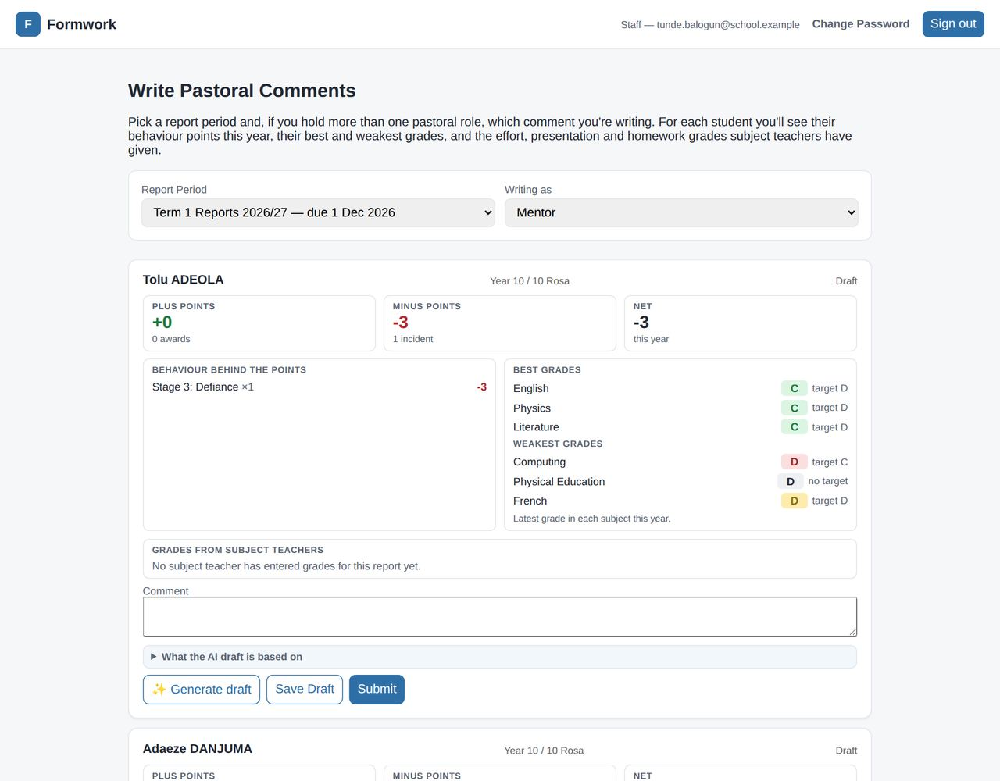

### Checking (/reports/check)

Choose the period to see comments submitted for checking. **Run AI check** flags spelling, tone and contradictions with the student's data (up to 60 at a time), so clean comments can be approved quickly. For each comment you can edit the text, **Approve** it, or write a note and **Send back** to the teacher.

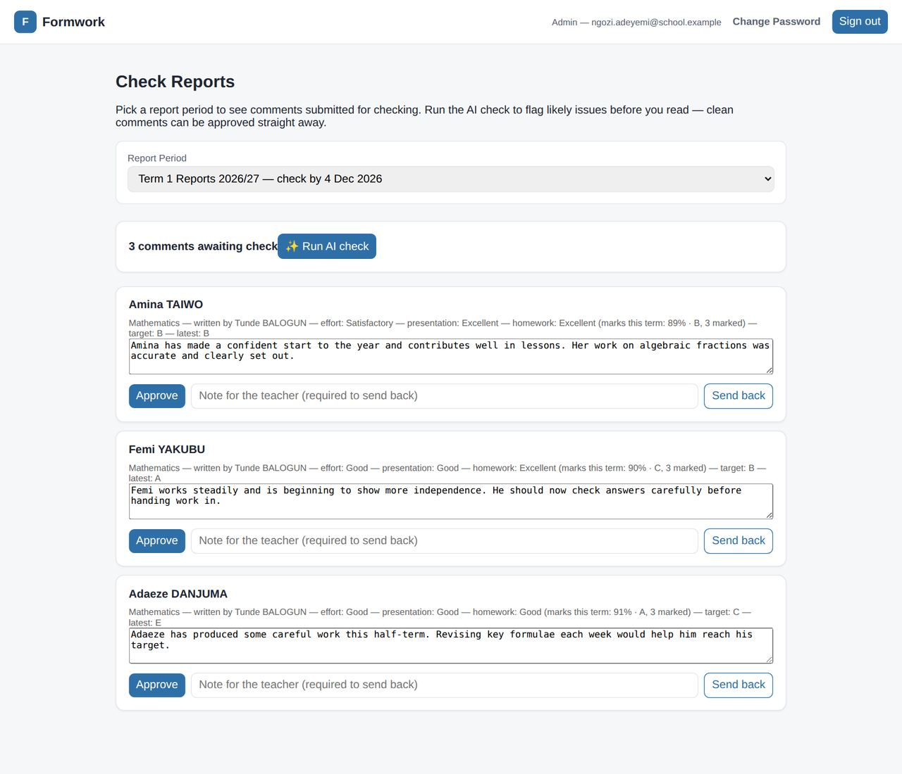

Checkers assigned to the period, SMT and admins can check. Only checked comments are printed.

### Generating reports (/reports/generate)

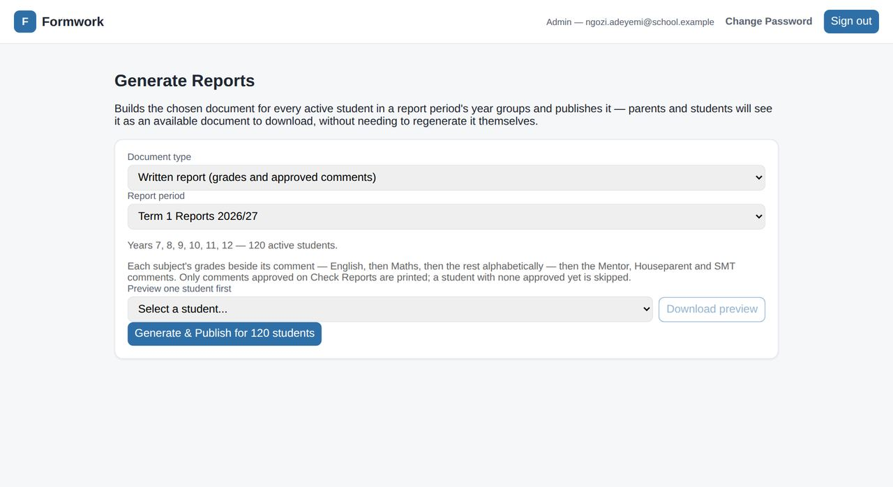

1. Choose the **Document type**: the written report, the Termly Grade Report, Term Test Scores, or a KS3 or KS4/5 transcript.
2. Choose the **Report period** (or term).
3. **Preview one student first** and **Download preview** to check the layout.
4. **Generate & Publish** builds the document for every active student in the period's year groups and publishes it. Students and parents can then download it; a new copy replaces the old one.

What goes in:

- **Written report**: checked comments only, English, then Maths, then the rest A–Z, then the Mentor, Houseparent and SMT comments. A student with no checked comments is skipped. The Homework line shows the grade only.
- **Termly Grade Report and Term Test Scores**: a subject appears only if it is on the grade report and tagged for the student's key stage; unassessed subjects show grey. A special result set (such as Year 12 mocks) appears in place of the week its date falls in, headed by its name. There is a column for each teaching week only (the half-term week gets none, so the September term runs Wk1–Wk10), the end-of-term exam week is headed Exam, and where a student has two marks in a subject in one week both show, oldest first ("B / A"). For Years 10–11 the subjects are in up to three sections: IGCSE and WAEC Subjects, then IGCSE Only Subjects (Chinese, Spanish), then WAEC Only Subjects below a thick line, in WAEC grades with a WAEC target. English and Mathematics come first in each section.
- **Transcripts**: KS3 (Years 7–9, IGCSE) and KS4/5 (Years 10–12, IGCSE and WAEC versions; Year 12 always WAEC), built from the end-of-term exam result sets. Special result sets such as mocks never appear on them.

### Uploading documents (/reports/documents)

Publish PDFs made outside Formwork (for example mock results) to a group of students. Give the title parents will see, choose students and year group, and choose the files. Name each file after its student ("Ada Okafor.pdf") or include the UPN, and Formwork matches it. Documents for leavers are staff-only.

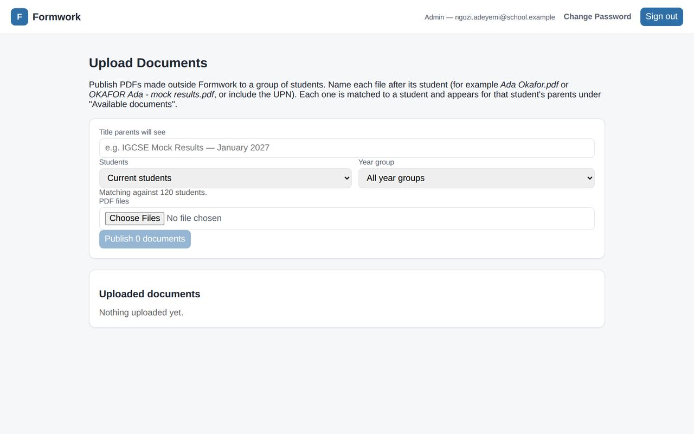

## 7. Behaviour, pastoral care and the clinic

Any member of staff can log behaviour. Points come only from the category, serious events need an explanation and a review before parents see them, and detentions are booked automatically.

### Logging behaviour (/behaviour)

Use the **Log behaviour** tile on the dashboard, or **Log behaviour for this class** on a register.

1. **Log for**: one student, or a group chosen by class, Other Half activity, student group, house, room, restaurant or year. Your own lessons, activities and mentor groups come first, then every other class and this term's other activities. Type in Find to narrow the names, and press Only this one to tick just the students found, so you can give one student in a class a merit without unticking the rest. One student has the same search.
2. Choose the **Date**, **Positive** or **Negative**, and the **Category**. Points come from the category (−1 to −5, +1 to +5); you can't type them. Some categories show a line underneath saying when to use them.
3. Add a comment. Anything you write, on a merit too, is checked by the school office or SMT before parents see the event; a merit with no comment goes home at once. For a serious event (−5 or worse: Stage 5, Bullying, Academic dishonesty) an **Explanation** is required: say what happened in your own words and don't name any other student. First, a box asks "Is this really a Stage 5?" and lists what the school counts as one. If the incident isn't on that list, choose a lower category: repeated minor behaviour reaches a detention through the weekly total anyway. To save a Stage 5 you must tick "I confirm this is a single serious incident"; the button stays greyed out until you do. The same box and tick appear if you edit an event up to Stage 5 later.
4. On a serious event you can **+ Add a witness, someone involved or a target**, found by name, year and house. These links are staff-only and carry no points.
5. Positive events can have one picture. Negative events can't.
6. Press **Log event**.

**If your Stage 5 comes back.** The reviewer can return a Stage 5 that doesn't look serious enough. You get a message in your inbox with their reason, and the note shows on the event. Its points stop counting straight away, and its detention is cancelled if it hasn't happened yet. Press **Edit** on the event: choose the right category if it isn't a Stage 5 (its points then count), or keep Stage 5 and improve the explanation, which brings back the −5 and its detention and sends it back for review. Every return is counted against the teacher who logged the event, and SMT can see the count.

**A Stage 5 during your lesson.** If you log a Stage 5 for a student you are teaching right now (your lesson, a lesson you are covering, or your Other Half activity), the school office gets a purple pop-up asking them to collect the student from your room, and Log behaviour tells you the office has been asked. The office presses **Going to collect**, which clears it from every office screen. A Stage 5 logged later, or for a student you aren't teaching at that moment, raises no pop-up. During prep, a Stage 5 logged by anyone sends the pop-up to the Head of Boarding instead, to collect the student from prep, and Log behaviour says so.

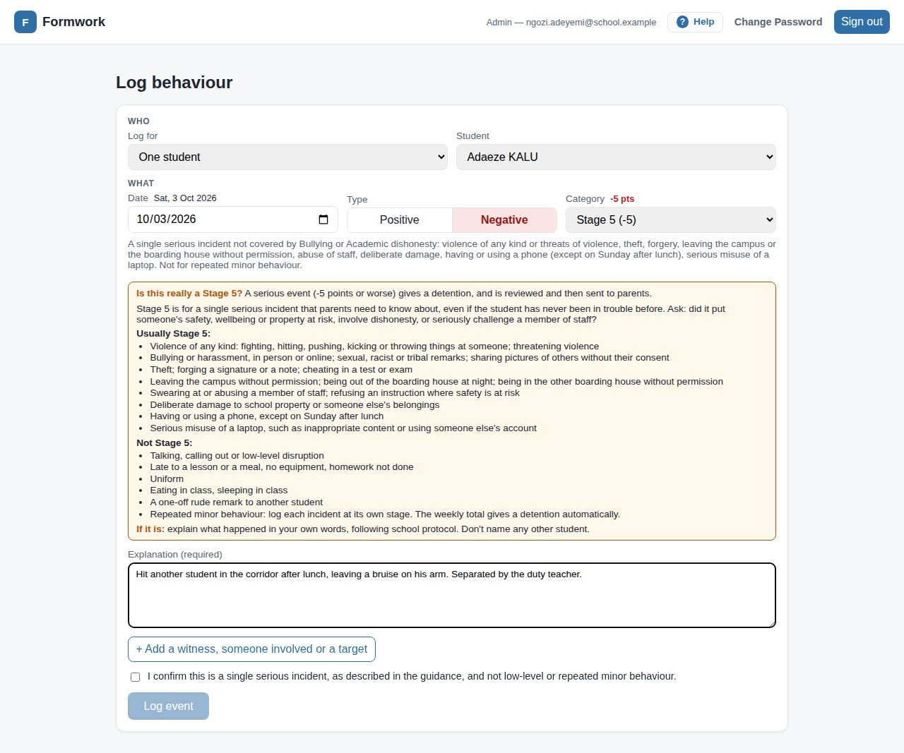

**Behaviour Log** (/behaviour/log) searches and filters past events by student, type, category and dates; **View / edit** opens an event. **Behaviour alerts** (/behaviour/alerts) lists events of −3 or worse in the last 7 days; houseparents see their own house.

**Printing a student's behaviour log.** On the student's profile, press **Print log** in the Behaviour section. Choose the dates (from 1 September by default). The log lists every event worth 2 or more points either way, plus exclusions, and gives the positive, negative and total points for every event in those dates, single points included. Cancelled events are left out.

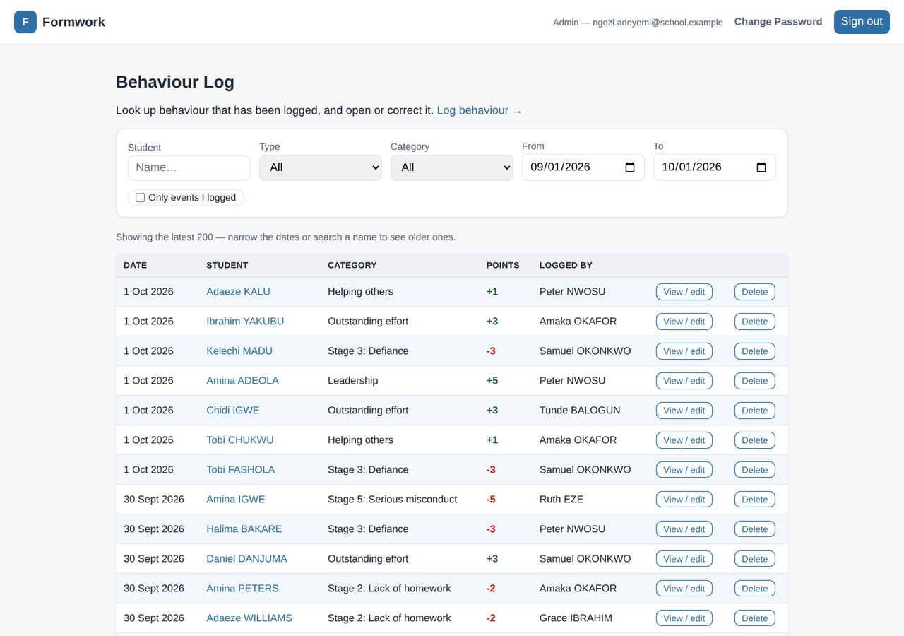

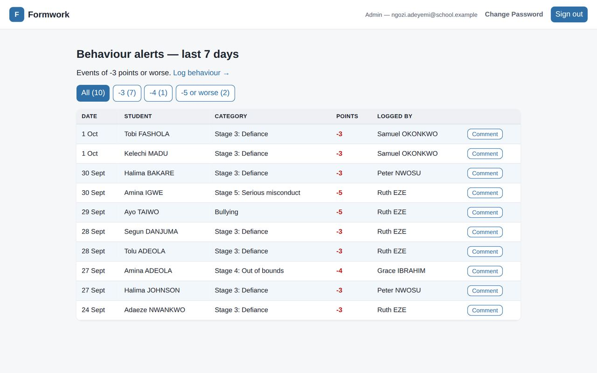

**Editing.** The teacher who logged an event, pastoral staff, houseparents, the head of boarding, SMT, the school office and admins can change its comment and category (a negative stays negative); detentions are recalculated. Only SMT can delete an event, a merit included; the Delete button is shown only to them. All changes are kept in Change History.

### What parents see: Behaviour Review (/behaviour/review)

- A merit goes home at once unless its writing is more than 12 words (the number is set on Lookups). A negative event with any writing, and a merit with long writing, waits for review, and parents see none of it, points included, until it is sent.
- −1 to −4 events without writing never go to parents; with writing they go once approved.
- Merits and Stage 1–4 events with writing are listed under **Writing to approve**. Read each comment, use Edit to correct one, tick the ones to send, tick the confirmation, then press **Send to parents** (or **Keep at school**, and parents never see them).
- Automatic "100% in a Big ReLP Test" merits are listed there too, with the subject in the note; they can be sent in one go with the rest.
- −5 events without a picture: the principal's PA or SMT (or an admin) checks the text and sends it.
- Events with a picture: SMT or an admin sends the text with the picture, the text alone, or declines.
- If an event's writing is changed later, it is hidden again until the new words are approved (for a merit, only if the new writing is long).

The reviewer ticks the confirmation that the text follows protocol, names no other student and is in good English, then presses **Send text** (or **Don't send yet**). An explanation that names a linked student is refused, with the word to reword. If an event isn't really a Stage 5, press "Not Stage 5: return to teacher", say why, and press "Return to" the teacher. They get your note in their inbox and see it on the event. Its points stop counting at once and its detention is cancelled if it hasn't happened yet (the student is told). The event moves to "Returned to the teacher", where it can't be sent: if they change the category it leaves the page, and if they keep Stage 5 and edit the explanation it comes back to "Waiting for review". Keep the note factual, e.g. "This is Disruption in class, −2." SMT see "Stage 5s returned, by teacher" lower down the page: how many each teacher has had returned, to see who needs more training.

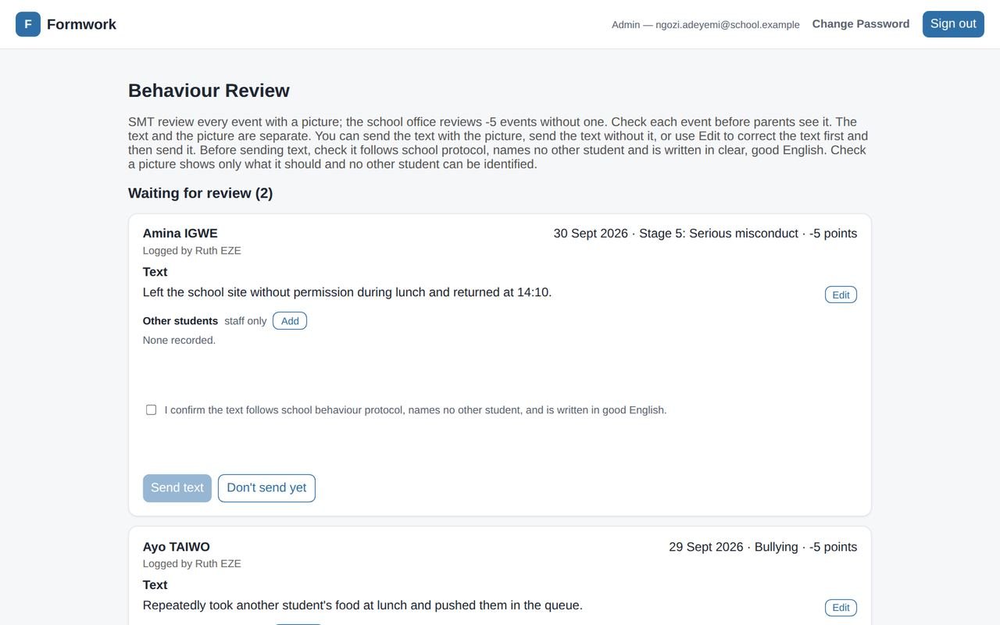

### Alerts and detentions

The rules below are the current settings; anyone with the Lookups page can change them (chapter 14).

| Rule | Current setting | What happens |
| --- | --- | --- |
| Single-event detention | −5 | Books a Friday detention and sends the behaviour alert email |
| Weekly detention | −10 in a Saturday–Friday week | Books one detention for that Friday (positive points don't offset) |
| Weekly alert | −8 in a week | Emails cs@, copied to SMT and sro@; replies go to guardian.counselling@ |
| Detention room and time | CG4, after lesson 7 | Shown on every detention notice |
| Stage 5 guidance | The school's list of what is and isn't a Stage 5 | Shown when staff choose a Stage 5 category, before they tick to confirm. Each behaviour category can also have a description, shown when it is picked |

**Alert emails come once a day.** Each alert still goes to the inbox at once, but the emails are gathered into one summary at 4.15 pm: student, year, category, points, date, why it alerted and the writing. An event withdrawn, returned or deleted before then is only counted, and alerts after 4.15 pm go in the next day's summary.

**Detentions** (/detention) lists this week's Friday detention with the events behind each one. Staff can't add or delete detentions by hand; they mark each as Scheduled, Attended or Missed, and can print the list. Only SMT can mark a detention Cancelled; the option is shown only to them. The student (not the parent) gets an email and inbox notice when it is booked and a reminder at 7:30pm on Thursday.

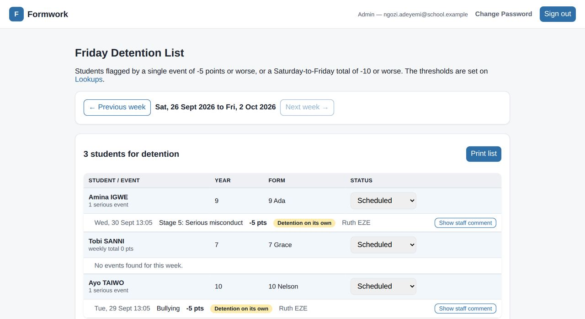

### Appeals (/appeals)

A student can appeal their own negative event once, from their portal; parents can't appeal. Pastoral staff, houseparents, the head of boarding, SMT and admins decide appeals with a note. **Uphold** voids the event (points to 0, the original kept), hides it from the portals, cancels its detention (and the weekly one if the week no longer reaches −10), and tells the student. **Reject** leaves it standing.

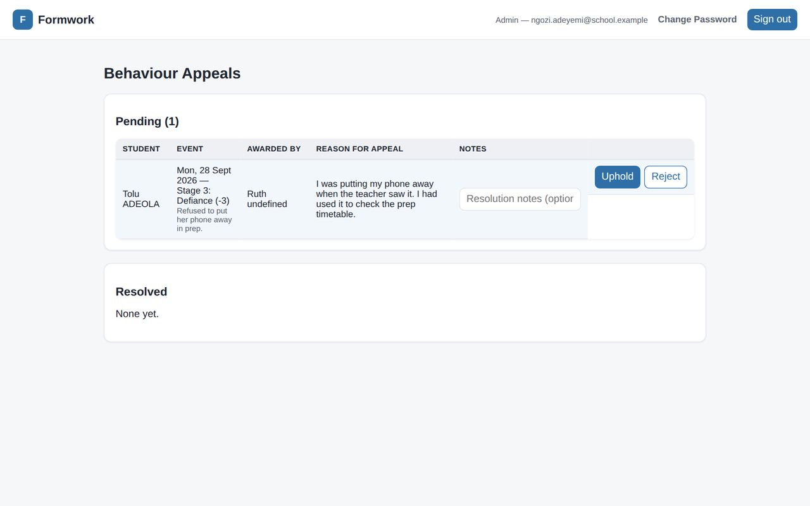

### Certificates (/certificates)

Certificates are awarded at cumulative points milestones (currently Bronze 100, Silver 200, Gold 500). The page lists students ready for each level: **Print certificate**, or **Mark awarded (no print)**. Each student gets each level once.

Certificates is on the **Rewards** card on your home page, with the Reward Store pages.

### Reward Store (/rewards)

Students spend merit points on rewards. Spending never lowers their merit total: certificates, Behaviour Totals and reports still count every merit. The store was closed on 5 October 2026 until the principal adds rewards; while it is closed, students don't see its tile.

**Points to spend** are the student's merits this school year (from 1 September) less what they have ordered. Negative points don't reduce them, and they start again each September. Points are taken when the student orders and come back if the order is declined or cancelled.

**What the student does.** On the **Reward Store** tile, they choose a reward and a day (up to 28 days ahead) and press order. They can cancel it until someone decides it, and they get an inbox message when it is accepted or declined.

**Accepting orders.** Open **Orders** by pressing the number of orders waiting at the top of the Rewards card.

1. Each order shows the student, the reward, the day and the student's points.
2. Press **Accept** or **Decline**. For Assistant for a day, choose the member of staff the student will help; they get an inbox message too.
3. On the day, press **Mark used**. An accepted order can still be cancelled, with a reason, and the points go back.
4. **Day list** prints who has which reward on a day, for example who is in mufti.

Who accepts each reward is set on the reward: to start with, Mufti day by pastoral or the head of boarding, Extra tuckshop visit by the tuckshop, and Assistant for a day by SMT. Admins can accept any order, but nobody can decide an order for their own child.

**Rewards & Prices** (SMT and pastoral): add a reward, set its price in points, how often a student can have it, which days it can be taken, and who accepts it; open or close the store; retire a reward. A price change applies only to later orders. Rewards are retired, never deleted, and every change and order is in Change History under rewards. Parents don't see orders yet.

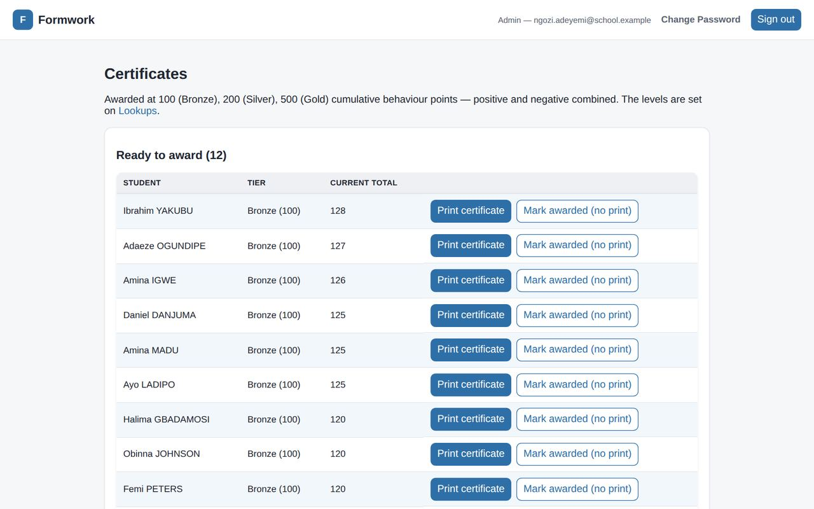

### Behaviour Totals (/pastoral/behaviour-totals)

**Behaviour Totals**, on the Pastoral card, adds up positive and negative points. Mentors, pastoral staff, the head of boarding and SMT can open it.

1. Choose the **Period**: a term (the current one to start with), the academic year, or **Choose dates…** for your own From and To.
2. **Mentors** see their own mentor group student by student: positives, negatives, net (positives minus negatives) and the number of events, with the group's totals and average.
3. **SMT, pastoral and the head of boarding** also see every mentor group with its mentor, number of students, positives, negatives, net and average per student. Filter by year for a year total, and open any group to see its students.
4. Click a student's name to open their profile straight on its Behaviour log.
5. **Download CSV** saves either table.

Withdrawn events don't count, and a Stage 5 returned to the teacher counts as 0 points. The average is the group's net points divided by all its active students, including those with no events.

### Boarding and mentors

- Houseparents' student and behaviour pages open on their own house; those with school-wide jobs get a **Whole school** switch.
- The head of boarding has houseparent powers across all houses and counts as pastoral for detentions, appeals and editing events.
- A mentor's students are those in their mentor group. Mentor groups are staffed at /staff/mentor-groups.
- **Birthdays** (/pastoral/birthdays) lists the next 7 days. Today's names are also shown to staff and students after sign-in, never to parents.

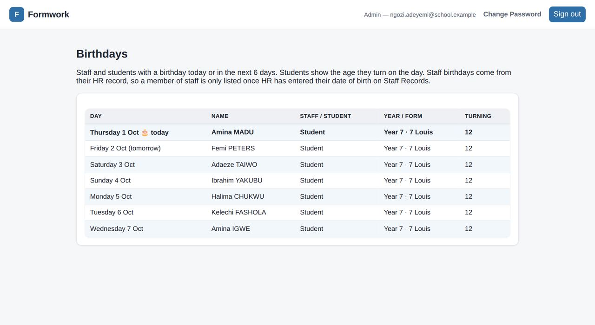

### The clinic (nurse and DSL only)

The clinic holds each student's medical profile and consents, conditions, growth and BMI, sick-bay visits, immunisations and termly resumption screenings. Only the nurse and the Designated Safeguarding Lead (DSL, cs@) can see any of it; administrators, the principal role, teachers, pastoral staff, students and parents have no access. The nurse can add, edit and delete; the DSL can add and edit but not delete. Who can see medical records is padlocked on Permissions: it changes only by a change to the system agreed with the principal. Administrators still see the Clinic tile, but opening its pages shows "Access not allowed", and a student's profile has no Medical tab for them.

- **Sick Bay Today** (/clinic): today's visits, follow-ups outstanding, parents not yet told and jabs overdue.
- **Sick Bay Log** (/clinic/visits): record a visit (reason, temperature, treatment, medication and dose, outcome, parent told, follow-up). A visit marked as safeguarding shows a red Safeguarding chip (below).
- **Height & Weight** (/clinic/measurements), **Resumption Check** (/clinic/screenings) and **Immunisations** (/clinic/immunisations).

**Safeguarding entries (DSL only).** When the DSL records a visit at Sick Bay Log, or on a student's medical card, a tick box reads **Safeguarding: only the DSL can see the presenting complaint and observations**. On any visit already in the log, the DSL can press **Mark as safeguarding** (and confirm), including on a visit a nurse recorded. Once marked:

- The DSL sees the visit in full, with a red **Safeguarding · symptoms DSL only** chip.
- Everyone else, the nurses included, sees "Safeguarding: details held by the DSL" in place of the complaint, and no observations.
- Medication and dose, treatment, temperature, visit type, outcome, parent told and follow-up stay visible to the nurses, so they know what a student has been given. Write symptoms in the complaint or observations, not under Treatment, or the nurses will see them.
- Only the DSL can remove the mark (**Remove safeguarding mark**), which puts the complaint and observations back for the nurses. Who marked it and when are recorded.

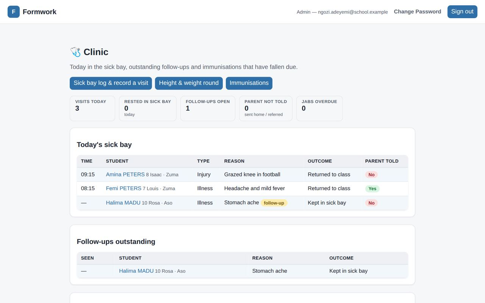

### Staff records (HR)

/staff/records holds each staff member's profile, appointment, police clearance, training, warnings, and absence and lateness. HR and SMT can read; only HR and admins can edit. A filter shows staff whose police clearance is missing, expired or due.

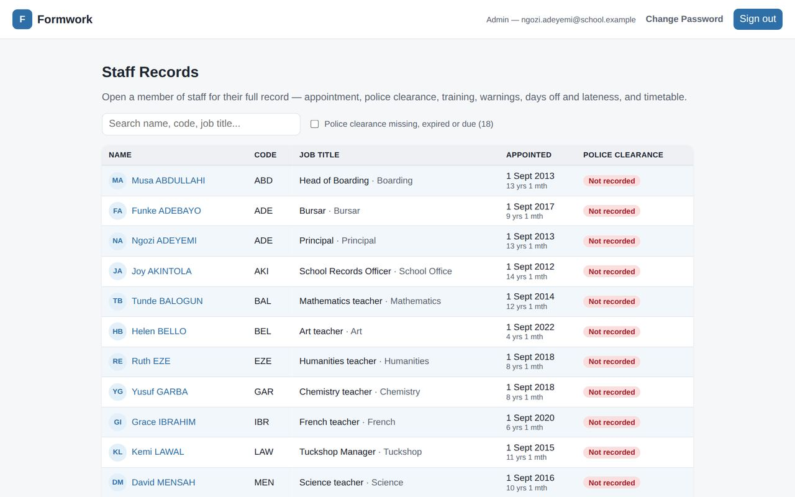

### The Worry Box, wellbeing check-ins and school rating

Students can tell the school what worries them, answer a short wellbeing check-in about every two months, and rate the school about once a term. Only the Designated Safeguarding Lead (cs@), the principal and the guidance staff (Osione ILOEJE) see worries with the student's name, and only the DSL and the principal see check-ins. Admins, SMT, pastoral staff and teachers can't, and parents see none of it. Everyone else: if a student tells you something worrying, follow the school's safeguarding procedure as usual; the Worry Box doesn't replace that.

**What students see.** Three things on the student portal:

- **Worry Box** tile: choose Facilities (equipment, rooms, food or facilities) or Something else, and then what it's about (bullying or friendships, a member of staff, feelings, home or family, the boarding house, something else), write it, and tick **urgent** if they don't feel safe or need to talk to someone soon. Up to 5 a day. They see what they've sent, whether it's been read, and any reply.
- **Wellbeing check-in**: while a check-in is open, a pop-up with 15 questions (about 3 minutes) on how they're feeling, sleeping, eating, coping with work and pressure, being away from home, the boarding house, friends and feeling safe, plus an optional comment. **Not now** hides it until the next morning, but from the check-in's must-answer day it can't be put off.
- **Rate the School** tile: while a rating is open, they rate 10 areas of school life from 1 to 5, once, and can add one thing the school does well and one it could do better. Their name isn't shown with their answers.

**For the DSL and the principal.** Three tiles on your dashboard: **Worry Box**, **Wellbeing** and **School Rating**. Formwork sends no email or inbox message when a worry arrives or a check-in needs a look, so open these tiles yourselves every day. Guidance staff have the Worry Box tile only. The only emails are the three described under Automatic emails below.

**Worry Box** (/worry-box)

1. Open the **Worry Box** tile. New worries are in bold; urgent ones have a red **Urgent** badge.
2. Click a worry to read it. Opening it marks it read, so the other person can see it's being dealt with.
3. Add a **note** for yourselves (the student never sees notes), or tick **Send as a reply the student sees** to answer them on their portal. They get an inbox message saying there's a reply, without its text.
4. When it's dealt with, press **Close** (with a reason if you like). **Reopen** brings it back.

To record a slip from the paper box, press **Type in a paper slip**, pick the student (or leave it empty if the slip isn't signed), choose what it's about, type it and give the date it was found. Nothing is ever deleted.

**Finding worries.** The page has two tabs, **Facilities** and **Other**. Under them is a button for each kind of worry with how many aren't closed, then filters: search the student's name or the words, year, house, **Urgent only**, portal or paper, and the dates it came in. **Print** prints the list as filtered, each worry in full with its notes and replies. If a worry is under the wrong heading (a personal worry filed as Facilities, say), press **Move to** on it; a note records who moved it.

**Automatic emails.**

- **Urgent and unopened for 24 hours**: the guidance staff get one inbox message and one email with the number, never the student or the words.
- **4 pm, Facilities list**: the admin manager (Paul IMO) is emailed every Facilities worry that isn't closed, without the student's name, year or house, so things can be fixed. Replies go to Osione ILOEJE. Close a worry once it's fixed, or it stays on the list. Move a personal worry out of Facilities, or it goes to the admin manager too.
- **4.15 pm, worries about staff**: the DSL and the principal are emailed every worry that isn't closed in the categories ticked Daily list to DSL (A member of staff), with the student's name.

Nothing is sent on a day with none, and sending doesn't open or change a worry.

**Categories.** The DSL and the principal can change the list of categories at **Lookups → Worry Box categories** (nobody else sees that section). Change the wording, the short name staff see, the order, and the heading. A category under **Facilities** has its open worries emailed to the admin manager every day (without names), and one ticked **Daily list to DSL** goes on the 4.15 pm email, so choose both with care. Press **Add** for a new one. To stop using one, press **Retire**: students no longer see it, and the worries in it keep it. There is always at least one under each heading.

**Wellbeing check-ins** (/wellbeing)

- The top shows how many students have answered. **To follow up** lists the check-ins with an answer that needs a look, or a comment, and shows those answers. Each has a priority. Red: you or the DSL see the student (they don't feel safe, or feel 1 out of 5). Amber: someone you choose talks to them (they want to talk, have no adult to talk to, feel 2 out of 5, gave many low answers, or wrote a comment). Green: no one-to-one follow-up; they count towards the school-wide picture. **All answers** opens the rest. Under To follow up, by priority and issue, press Red, Amber or Green, choose a year, or click an issue (safety, low mood, wanting an adult, pressure and workload, friendships, home and boarding, sleep and eating) to list those students. Download names or Download with answers saves that list for the person you ask to discuss it. Meeting sheet prints the list as one table per house, with names and areas of concern only (never answers) and blank columns for who will talk to them and notes, for the meeting with counselling and the houseparents.
- When you've spoken to the student, add a note and press **Mark followed up**.
- **Answers across the school** totals every question.
- **Next check-in**: choose the opening day and time and the closing day (it suggests two months after the last). After adding it, set **Must be answered from** on the check-in to stop students putting it off from that day. You can change the closing date while it is open.

**School Rating** (/school-rating)

- **Open a school rating** at the bottom: opening day and time, and closing day. Students see the tile until the end of the closing day.
- **Results** shows each area's average (green 4 or above, amber 3 to 4, red below 3) and the spread of answers, by year group or by boarding house. A group with fewer than 3 answers shows "under 3", so nobody can be picked out.
- **What students wrote** lists the comments without names, in a mixed-up order, once 3 students have answered.

## 8. The Other Half and student groups

The Other Half (OH) is the after-lessons activity programme, run entirely in Formwork: students choose one activity per weekday, only during Evening Prep. Student groups gather students for clubs, prefects, interventions, marks and messages.

### Running an activity (all staff)

**My Other Half** (/other-half) shows the activities you run this term and today's activities with whether each register has been taken.

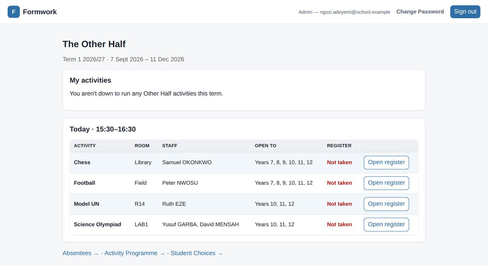

**Open register** lists the students who chose the activity. Mark them as for any register, or **Mark the rest present**. Marks go into normal attendance at the OH period, tagged with the activity. An activity with no marks 15 minutes after the OH start appears in Registers Not Done.

**One person takes each register.** While you have it open, nobody else can mark it. Once you save it, it is yours: the activity's other staff see it read-only, with who took it. Only you, the school office, the attendance officer and SMT can change it afterwards. It is let go when you save, leave the page or go 10 minutes without doing anything. A student who has a lesson in that period that day can't be marked here: the lesson's register wins.

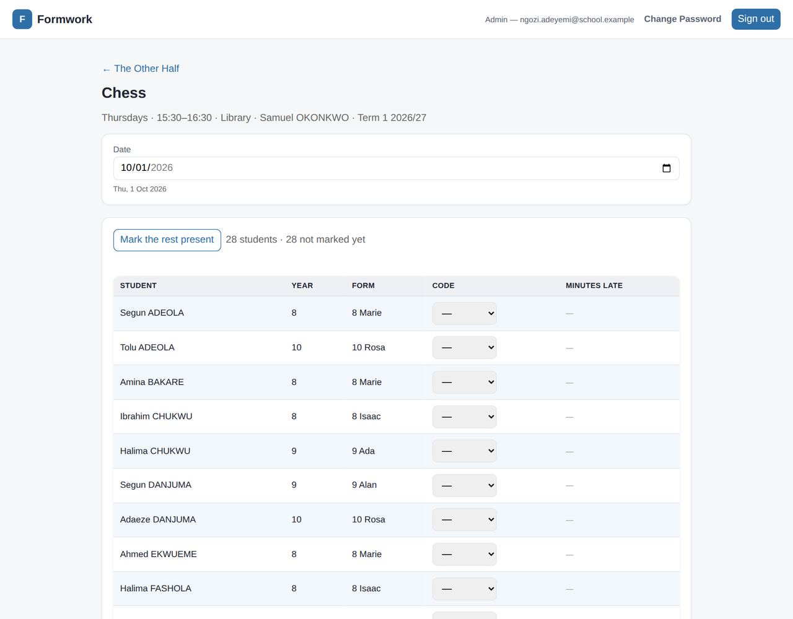

### The programme (/other-half/activities)

SMT, the OH coordinator and admins manage the programme.

1. Choose the **Term**. A new term can be started as a copy of another term's activities and staff (not choices) while it is empty.
2. **+ Add activity** on a weekday: name, description, room, staff (several can share), the year groups it is open to, and a capacity (blank for no limit).
3. Tick **Students can choose** to open choices, and optionally set **Choices close**.
4. **Retire** an activity to stop it being chosen; **Delete** is only possible while nobody has it chosen.

**Other Half Days** (/other-half/year-days, on the Timetable card) is a tick grid of which year groups have the Other Half on which days: Years 7–11 Monday to Thursday, Year 12 Monday and Thursday (they have science lessons in that period on Tuesday and Wednesday). An activity can only be opened to a year on its ticked days, and students can't choose or be placed on another day. A day can't be unticked while that year has activities or choices on it, or ticked while it has lessons in the OH period.

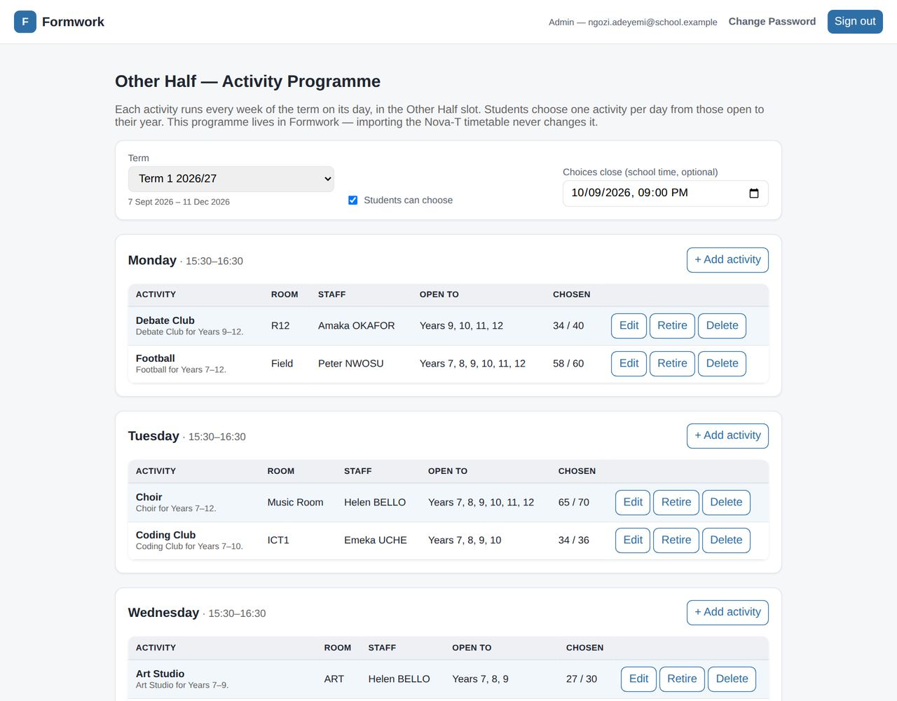

### Student choices

Students choose at /portal/other-half, and only when all of these hold: it is Evening Prep (19:00–21:00, Sunday to Friday), choices are open and not past the closing time, the activity is active and open to their year, and it isn't full. One choice per weekday; choosing again replaces it.

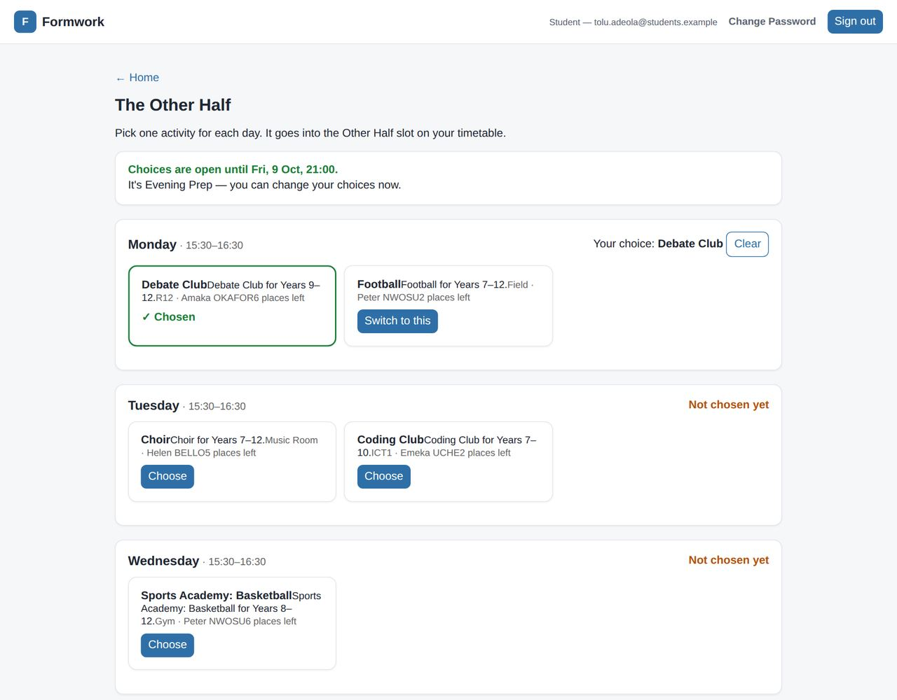

**Student Choices** (/other-half/choices) lets OH managers see each day's activities with numbers, find students without a choice, place or move any student at any time (with an "anyway?" warning if over capacity or outside the year groups), and **Download lists (CSV)**.

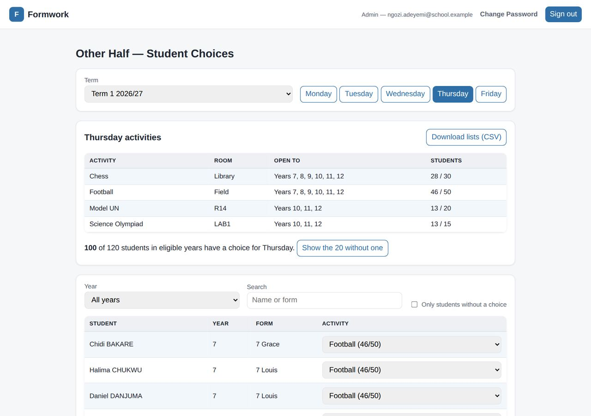

**Absentees** (/other-half/absentees) shows, for one day, students marked absent in OH (and whether they were in school earlier: find these first), students not yet marked, and students with no activity.

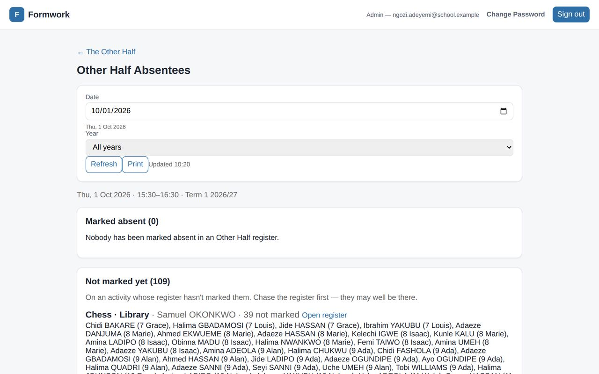

### Student groups (/groups)

SMT, pastoral staff, the school office and admins create and change groups; all staff can look them up. Groups are archived, never deleted.

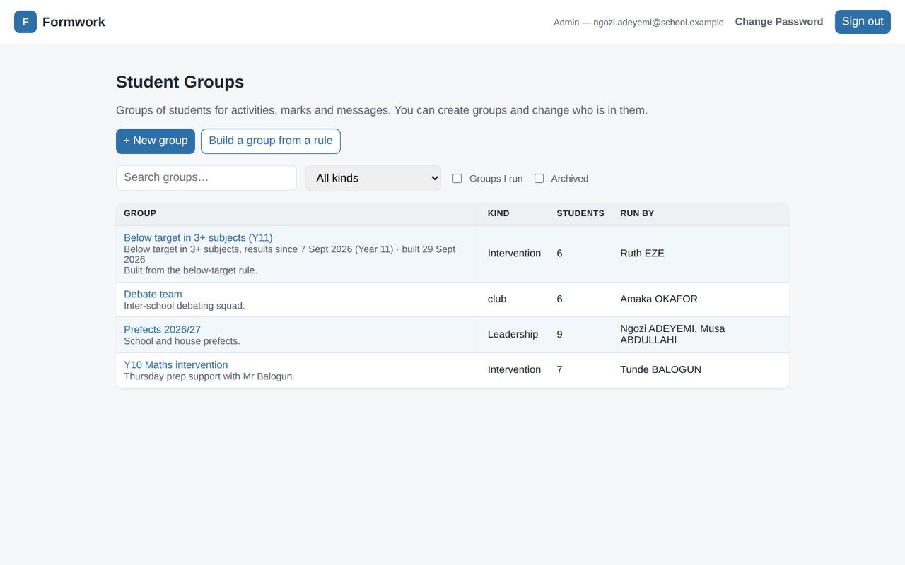

**Making a group.** Press **+ New group**, give a name, description and kind (club, leadership, intervention, Other Half and so on), and choose who can see it: staff only, the students in it, or the students and their parents. Add students by name or a whole year or form, and name the staff who run it.

**A group's page** has:

- **Message this group**: opens Send Message with the group chosen (to students, parents or both).
- **Run by**: the staff who run it; they can mark it but not change who is in it.
- **Mark sheets**: a title, date and grading system; marks are entered in a mark book. Group marks are never used in reports, transcripts or results.
- **The Other Half**: place every student in one activity for a day, and lock it until unlocked, until a date, or not at all. Students and parents see only "Placed by the school", never why.

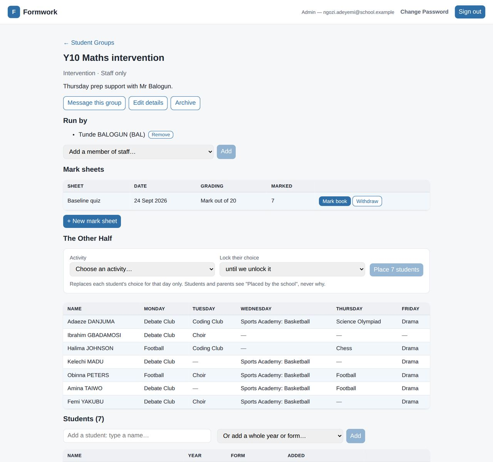

### Building a group from a rule (/groups/build)

Choose a rule and its settings, narrow by year, form and house, and press **Show students** to see who matches today and why. Untick anyone you don't want, then save. Rules: negative behaviour, positive behaviour, below target in several subjects, one subject (below a grade or below target), term exam average, and attendance.

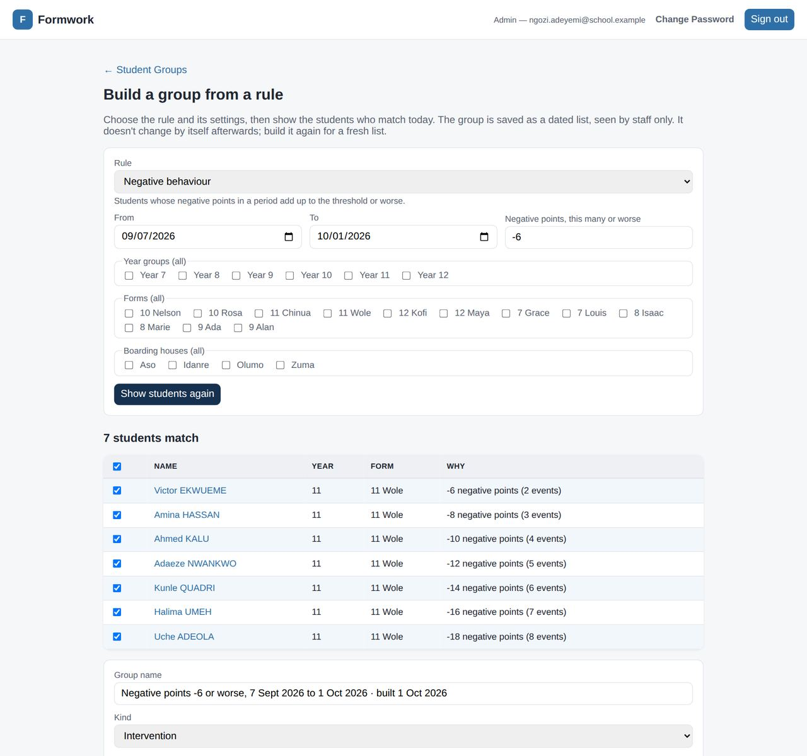

A built group records its rule and date, is always staff-only, and never changes by itself; **Build again** starts a fresh dated group. Every change to groups, their students and staff is logged in Change History.

### What students and parents see

The Groups tile on the portals shows a group's name, description, kind and who runs it, only for groups marked for them. They never see the other members, marks, archived groups or rule-built groups.

## 9. Calendar, messages and email

SMT own the calendar and terms. Messages go to Formwork inboxes, and to parents by email too; every email is sent from mis@abc.sch.ng with a Reply-To chosen by the kind of email.

### The calendar (/calendar)

Staff see the academic calendar of terms and events for the chosen **Academic year**. SMT and admins add, edit and delete events and terms; only admins delete a term (it also deletes that term's Other Half programme).

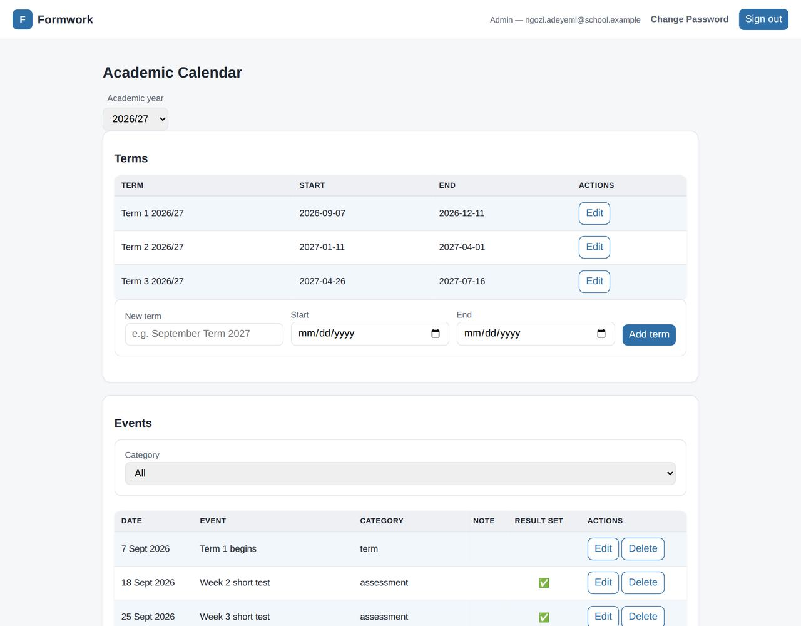

Each event has a date, name, category, an optional year-group note and a **result set** tick. Ticking result set makes the event available on Type In Marks (chapter 5); adding a report-period event also creates the report period. Parents see a read-only calendar without staff deadlines, and can subscribe to it on their phone (chapter 13).

To add a special result set, such as Year 12 mocks:

1. Under **Add event**, enter the date and name (e.g. "Y12 Mocks").
2. Choose the **One Year** category, then tick the year group(s) it is for, e.g. **Y12**. The Result set box is ticked for you.
3. Click **Add event**. The Result set column shows "Y12 only".

The date decides which week's column the set replaces on the Termly Grade Report. A date falls in the week that contains it, Monday to Sunday, so Friday 2 October is in the column for the week of Monday 28 September. Give the set a date in the week whose column it should take: dated Monday 5 October, Year 12 Mock 1 replaces Year 12's Wk3. To change an existing event, use **Edit**: choosing One Year shows the year ticks, and choosing another category makes it an ordinary event again.

### Sending a message (/comms/compose)

SMT, pastoral staff, the school office and admins can send messages.

1. **Send to**: a specific person, all students, year groups, forms, boarding houses, mentor groups, teaching classes, Other Half activities, sports houses, student groups, all staff or staff roles. Tick the groups you want.
2. For student targets, choose **Who gets it**: their parents (inbox and email), the students (inbox only), or both.
3. Press **Check recipient count**. It gives the real number and warns how many parents have no Formwork login yet and so won't get it.
4. Write the **Subject** and **Message** and press **Send message**.

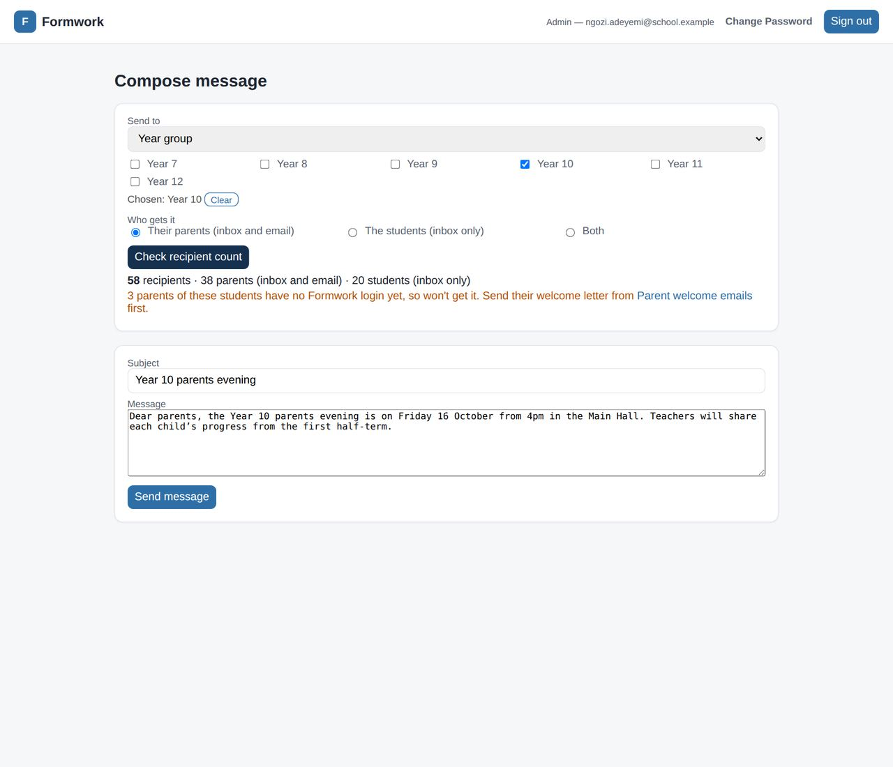

- A message to one person is emailed as well as put in their inbox.
- In a group message, parents are emailed too (unless parent emails are paused); students and staff get it in their inbox only.
- Group messages reach only active students and their parents.

### Sent Messages (/comms/history)

Every message sent, its recipients, whether it was emailed, and **Show read receipts**. Automatic notices (detentions and behaviour alerts) and the email log are listed too, with delivery status but never the body, because welcome emails contain passwords.

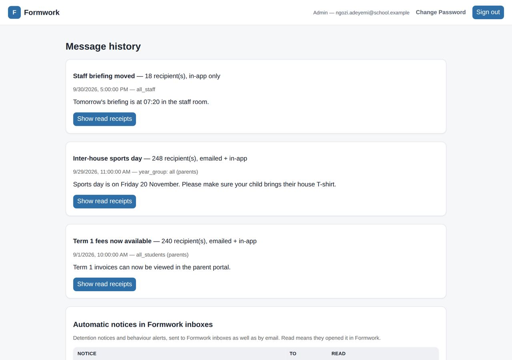

### Your inbox (/inbox)

Everyone (staff, students and parents) has an inbox with their own messages. Click a message to open it; the unread count shows on the Inbox tile.

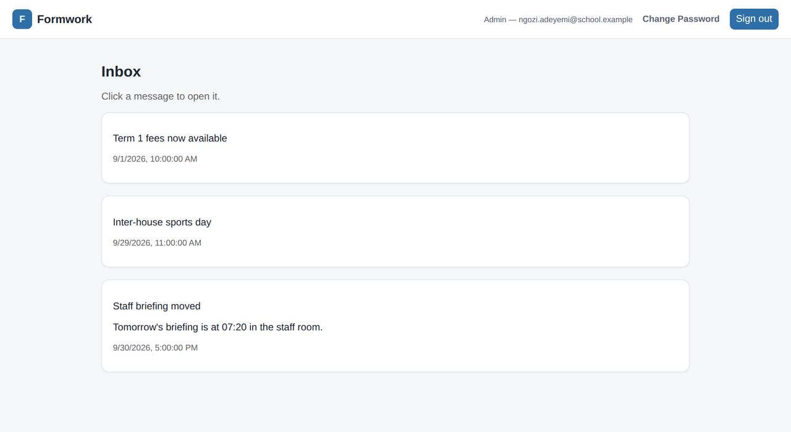

### Where replies go (/admin/email-replies)

Nobody reads mis@abc.sch.ng, so each kind of email carries a Reply-To. SMT and admins set who gets the reply for each kind: everyone in SMT, the sender, or listed addresses. Anything without its own setting uses "Anything else" (sro@). Changes are logged.

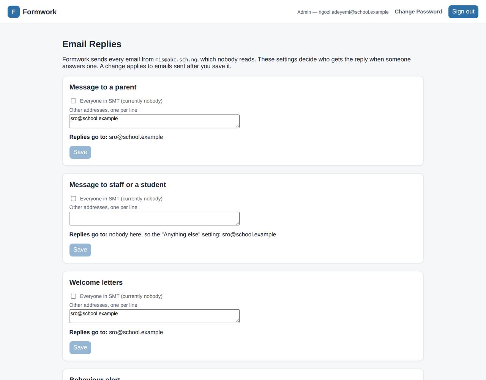

| Email | Replies go to (current setting) |
| --- | --- |
| Message to a parent | sro@ |
| Message to staff or a student | The member of staff who sent it |
| Welcome letters | sro@ |
| Behaviour alert | guardian.counselling@ |
| Detention notices | All SMT |
| Mark appeal (to the teacher, Head of Department in cc) | sro@ |
| Admissions letters | The sender |
| Anything else | sro@ |

**Pausing parent email.** One admin switch pauses every email to parents; inbox copies are still delivered. The school office can see whether it is paused. Email is sent at about 12 a minute and retried up to 6 times on failure.

## 10. Fees and bills

The bursar runs invoices, charges, payments and discounts. Prices change only when both the principal and the college secretary approve, and parents see a term's fees only once SMT publishes that term.

The bursar's home page has no top rows of tiles. Like everyone else's, it shows the card numbers and a card for every page the bursar's roles can open, so ticking a page for the bursar at Permissions makes its card appear.

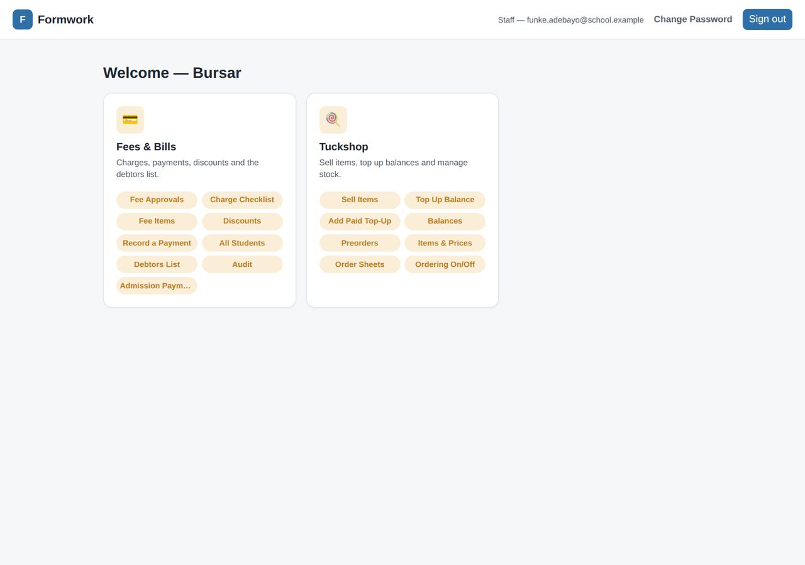

### How fees are built

Each student has an invoice per fee term, made of charge lines from the fee catalogue (tuition, boarding, activity, technology, medical, tuckshop and so on). An invoice's status is worked out automatically after every payment or charge: unpaid, partial or paid. Nobody can edit or delete a payment or invoice through the app, and "recorded by" is always the signed-in person.

### Recording a payment (/bursar/payments)

1. Choose the **Term** and search for the **Student**.
2. Check the invoice lines, total due, paid so far and balance. **Download PDF** gives the invoice.
3. Enter the **Amount**, **Method**, **Reference** and **Date paid**, and press **Record payment**. The payment history updates and the status is recalculated.

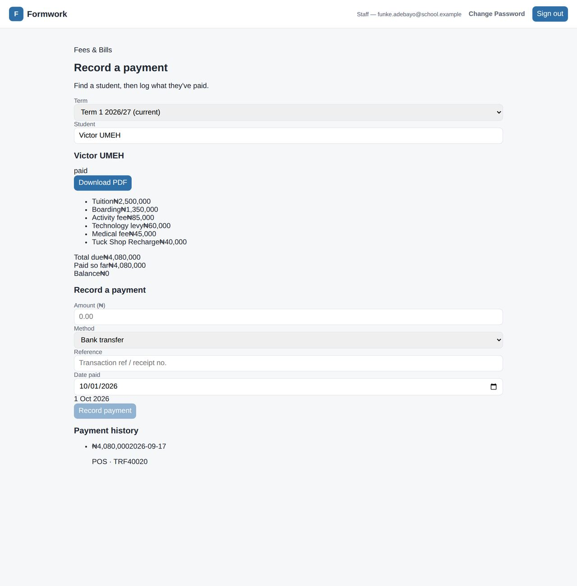

### Charging a group (/bursar/charge-checklist)

Pick one **Fee item** and **Term**, then tick students (filter by year or name; **Select all showing**). Anyone already charged for that item this term shows "Charged" and is skipped. Use the same amount for everyone, or a different amount per year group. Locked items (tuition, activity, technology, medical) fill in the approved price and can't be changed.

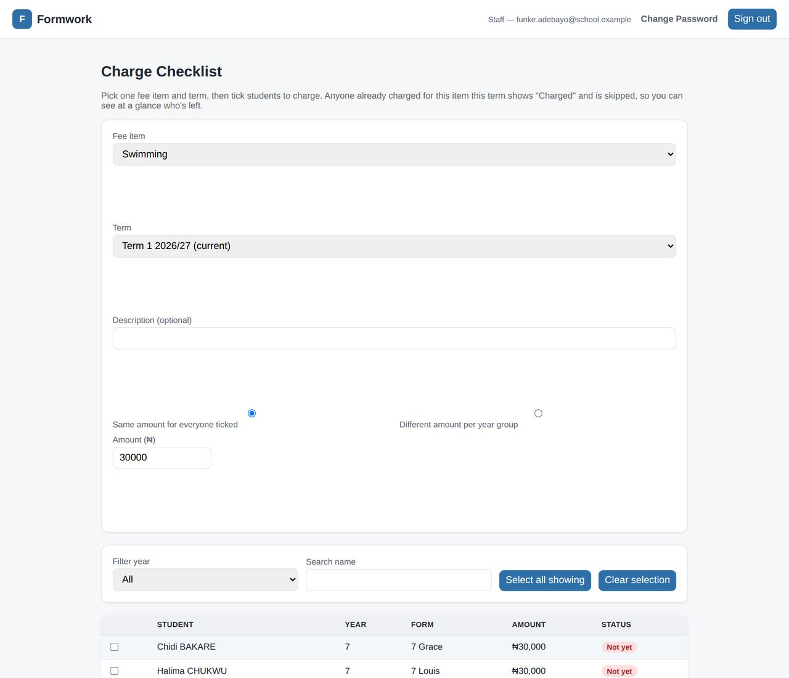

The last 100 charge batches are on **Audit** (/bursar/audit) with who made them, and a batch can be undone there.

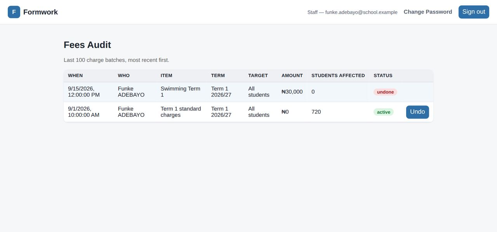

### Fee items and discounts

**Fee Items** (/bursar/fee-items) lists every item with its display name for parents, category, price and whether it is optional. Locked items show their approved price per year group. Prices can only be proposed here, never typed in directly.

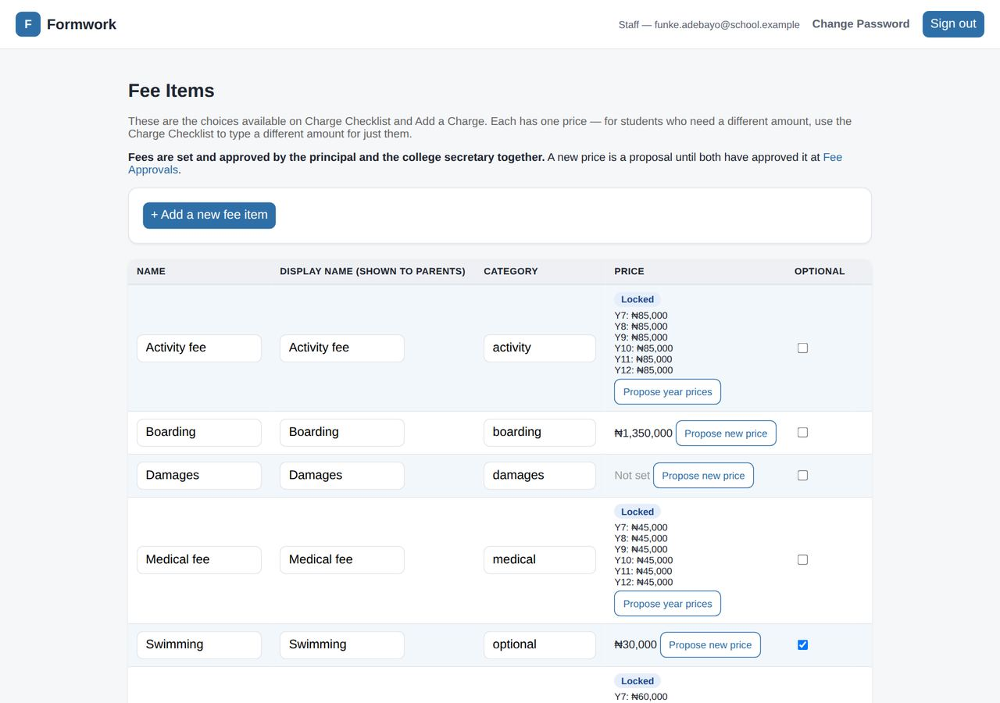

**Discounts** (/bursar/discounts): define discount types (fixed amount or percentage, and what they apply to), then assign one to a student for a term and apply it to their invoice. There are no payment plans or instalments.

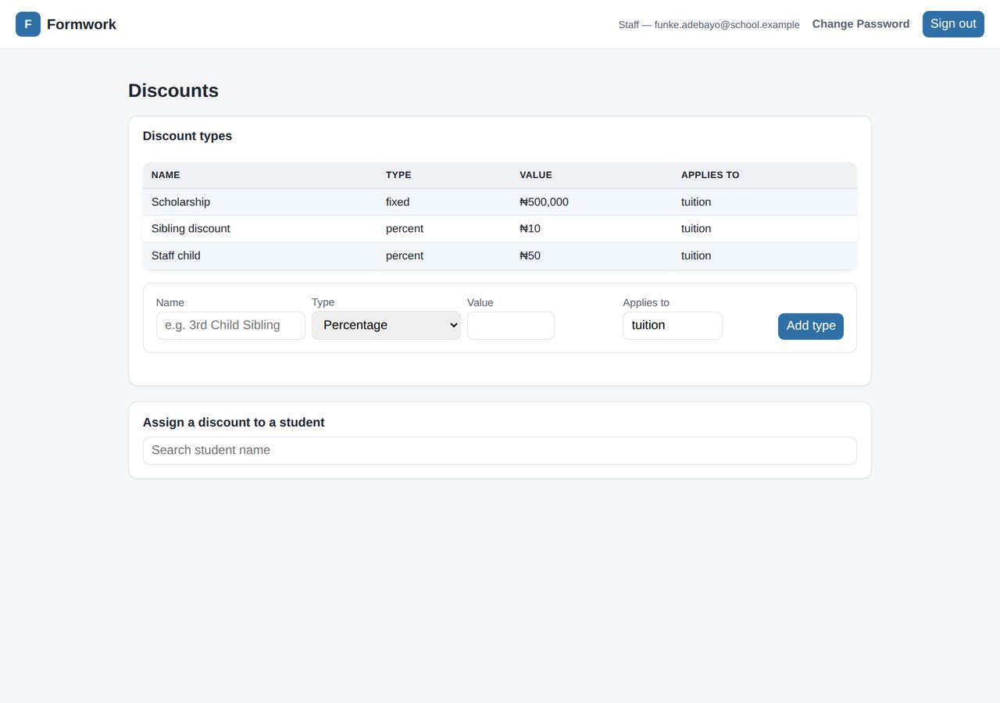

### Lists

- **All Students** (/bursar/fees-table): due, paid and balance for every active student this term, filtered by year, status and form, with CSV export.
- **Debtors List** (/bursar/debtors): students owing for a term with parent name, phone and email, sorted by balance, with CSV export.

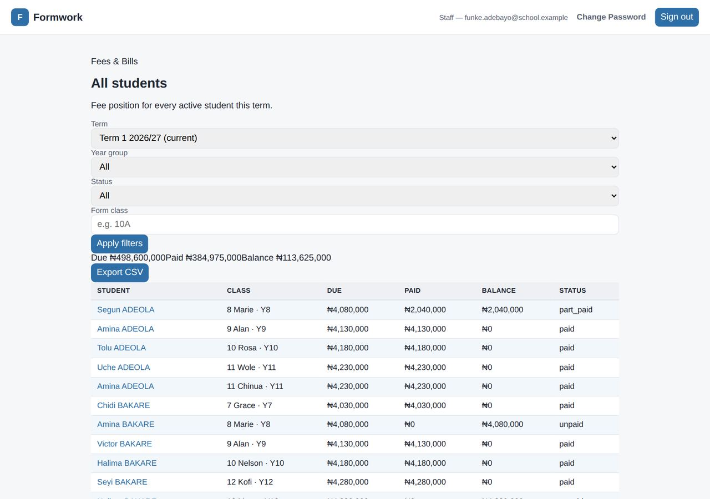

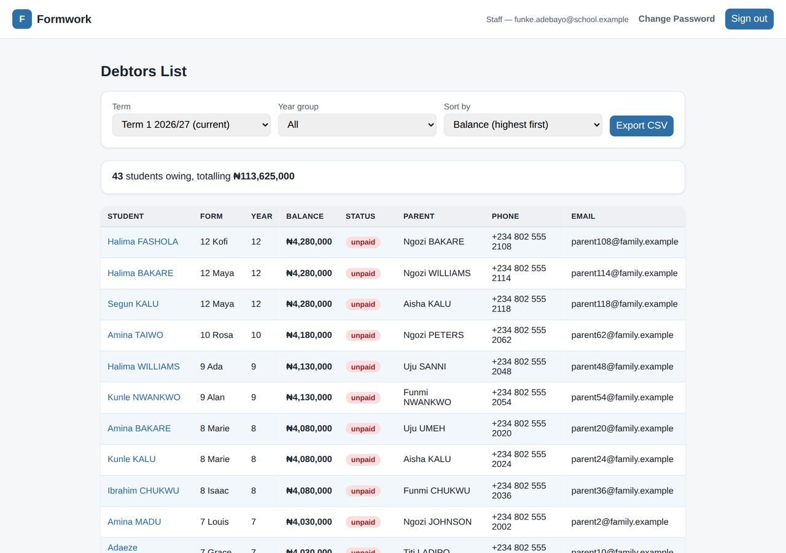

### Price approval (/bursar/fee-approvals)

No one can change a price directly. Fee item prices, year-group prices for locked items, and each year's admission form fee and deposit change only through an approved proposal.

1. The bursar, SMT, the principal, the college secretary, admins or Lookups holders **Propose** a change with a reason.
2. The **principal** (principal@) and the **college secretary** (cs@) each press **Approve**. They must be two different people; being an admin doesn't count.
3. Once both have approved, the price applies at once. Either approver can **Reject** with a reason; the proposer or an approver can **Cancel** while it is pending.

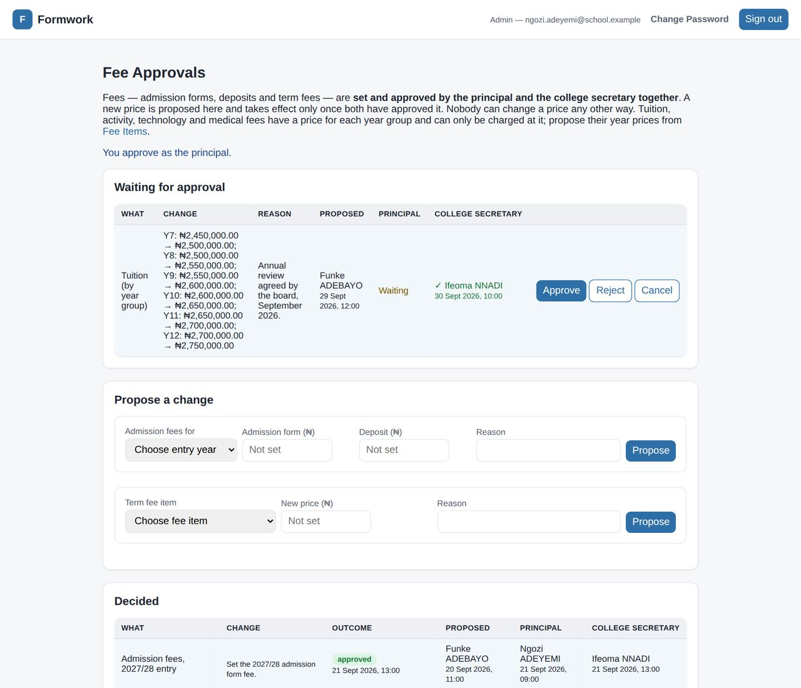

Proposals are never deleted and every step is logged in Change History. A charge for a locked item must equal the approved price for the student's year group, however it is added. Damages, tuckshop and discounts are not locked.

### SMT fees dashboard (/smt/fees-dashboard)

Expected, collected and outstanding for the term, counts of paid, partial and unpaid, and totals by year group and fee item. **Publish to parents** / **Hide from parents** decides whether parents can see that term's fees in the portal (SMT and admins).

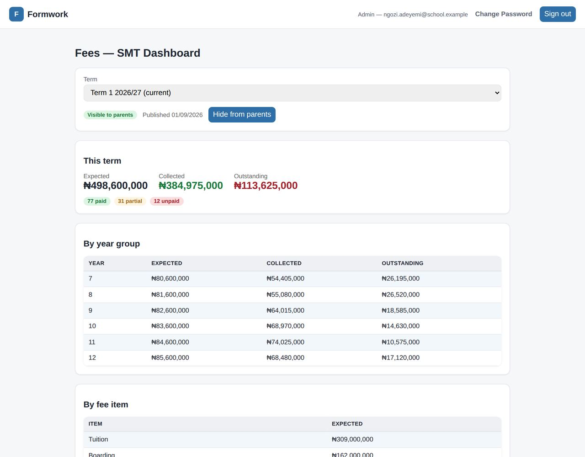

Fee changes are logged in Change History, which the bursar can't read: part of its purpose is checking fee changes.

## 11. Tuckshop

Students pre-order from their portal within fixed weekly windows, with at most 2 food items per tuckshop day, and are charged only when the order is handed out. A student's balance is their tuckshop charges on their fee invoice minus their purchases.

### Ordering windows

| Tuckshop day | Ordering opens | Ordering closes |
| --- | --- | --- |
| Wednesday | Monday 5:00pm | Tuesday 9:00am |
| Saturday | Wednesday 7:00pm | Thursday 11:00pm |

Tuckshop, bursar and admin staff can change the schedule and close ordering (for a holiday or stock-take) at **Ordering On/Off** (/tuckshop/ordering). Closing doesn't clear existing orders; it reopens by itself at midnight on the date chosen. **Special pre-order sessions** add a one-off window (for example a public holiday) with their own items and limits. To check at a glance whether students can order right now, look at the Tuckshop card on your home page: a green "Ordering open" or red "Ordering closed" badge, with when it next closes or opens.

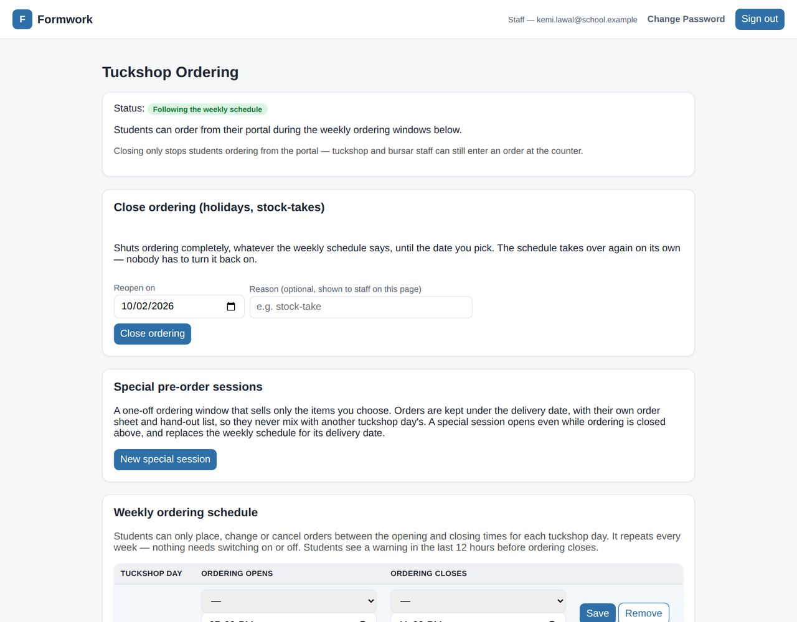

### How students order

On their portal's Tuckshop tile, a student sees their balance and the next tuckshop day. They choose quantities and press **Save** (or **Cancel**) while the window is open. In the last 12 hours a red warning says whether they have ordered.

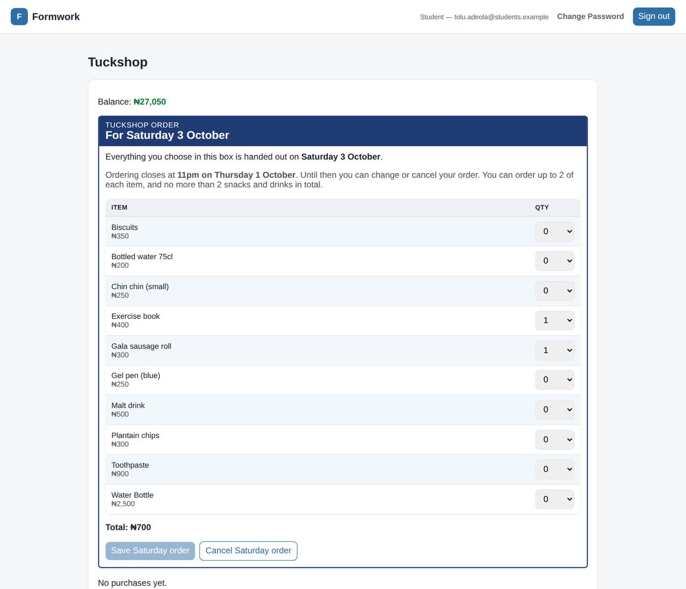

**Limits:** at most 2 of any one item, and at most 2 food items (drinks included) per tuckshop day, counting what has already been handed out. Non-food items (the Water Bottle, stationery, toiletries) have no total limit. Parents see balances and purchases but can't order.

### Before the tuckshop day

- **Preorders** (/tuckshop/preorders): every order waiting to be handed out.
- **Order Sheets** (/tuckshop/order-sheets): printable sheets per restaurant for a delivery date, with item totals for buying stock. They are marked PROVISIONAL until the window closes.

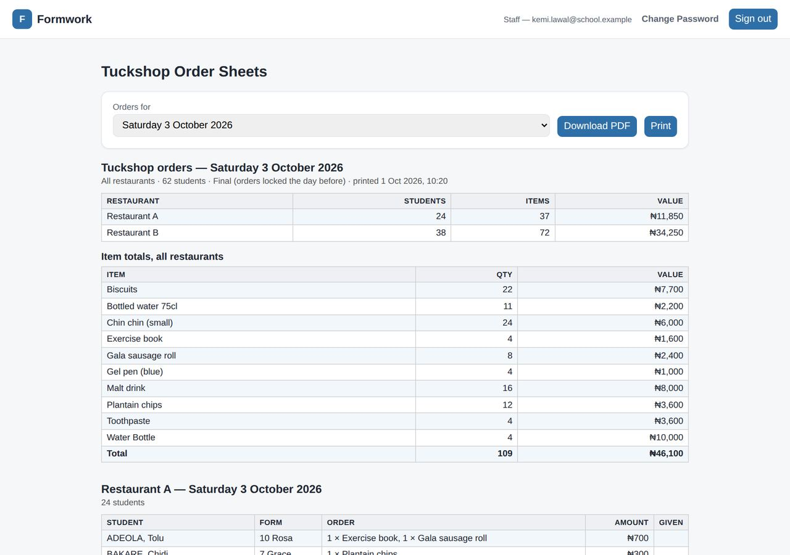

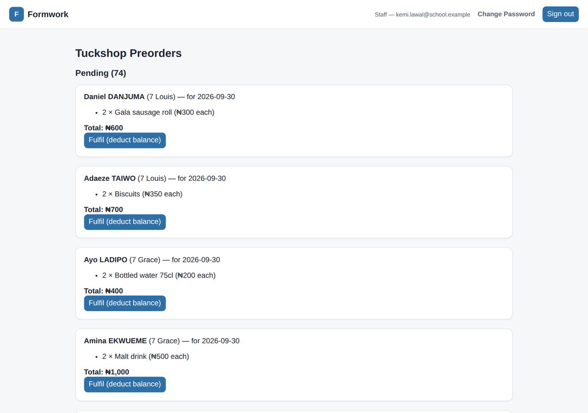

### Handing out (/tuckshop/hand-out)

Open to the tuckshop and tuckshop owner roles only; admins and the bursar can't use it.

1. Choose the day and the **Restaurant**.
2. Tap a student when their order has been given: this charges the order to their balance. Tap again to undo; the refund is exact.
3. If some items ran out, press **Edit** and record only what the student got; they pay just for that.
4. If a student doesn't come for their order, press **Not collected**. Nothing is charged. Tap the grey row to undo it before the list is saved.
5. When a restaurant is finished, press **Save and lock**. The list is frozen with numbers, value, who and when. Only the tuckshop owner can unlock it.

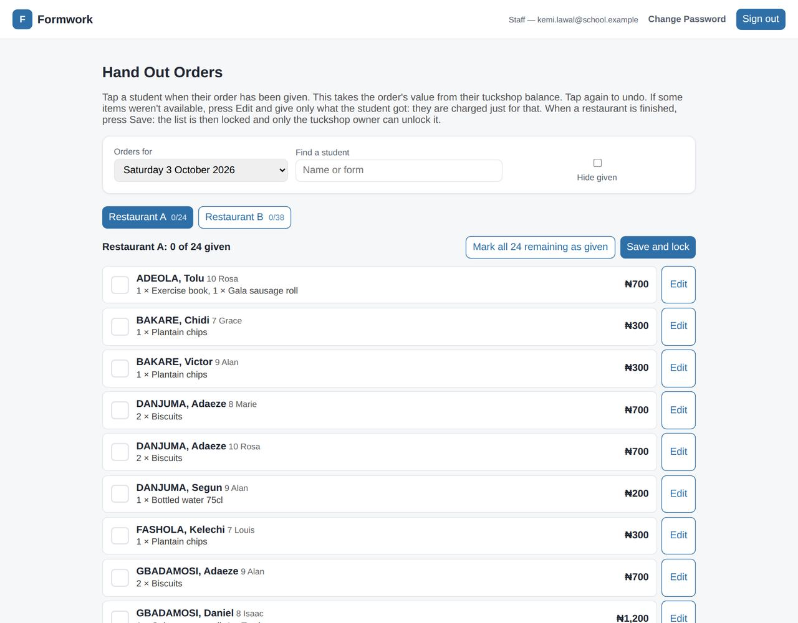

### Items, sales and balances

- **Items & Prices** (/tuckshop/items): add items, set prices, tick **Food / drink** and **Active**. Only active items can be ordered. The price charged is the price when handed out.
- **Sell Items** (/tuckshop/purchase): counter sales from a student's balance, with no limits and no window. Choose **A group** to sell one item to several students at once (below).
- **Top Up Balance** (/tuckshop/topup): enter a target balance (default ₦40,000) for one student, a form, a year or everyone; the difference is added to the fee invoice as a Tuck Shop Recharge.
- **Add Paid Top-Up** (/bursar/tuckshop-top-up, bursar only): after recording a payment, put all or part of it onto the student's balance, so no unpaid bill is created.
- **Balances** (/tuckshop/balances): every student's balance, with the school total. There is no balance check, so a balance can go negative.

**Selling one item to a group** (a class treat or a trip snack):

1. Open **Sell Items** and choose **A group**.
2. Choose the item and how many each student gets.
3. Choose **Form**, **Year group**, **Restaurant** or **Student group**, pick which one, and press **Load group**.
4. Tick each student who is getting the item; tapping anywhere on the row works. **Find a name** narrows the list, and **Tick all** / **Untick all** help with a whole form.
5. Press **Charge N ticked students** and check the total before pressing **OK**. Only the ticked students are charged; they then show **Charged** and can't be ticked again.

If a ticked student has left the school, nobody is charged and the page says so.

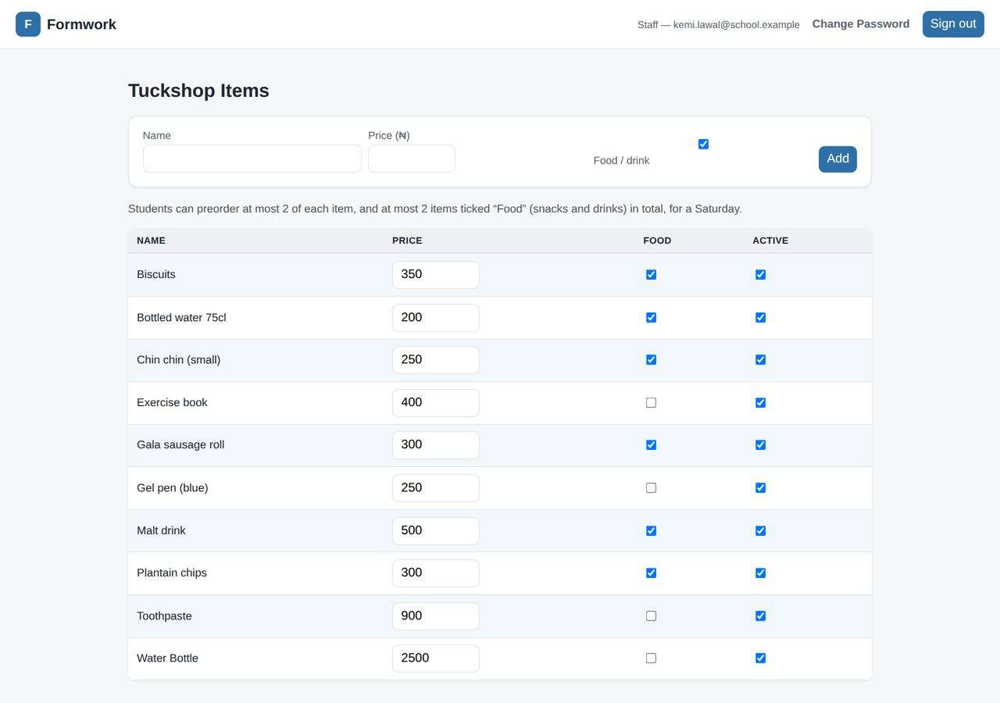

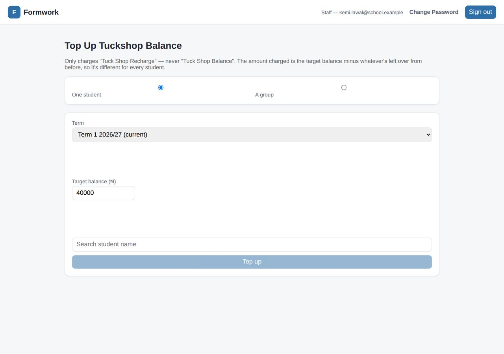

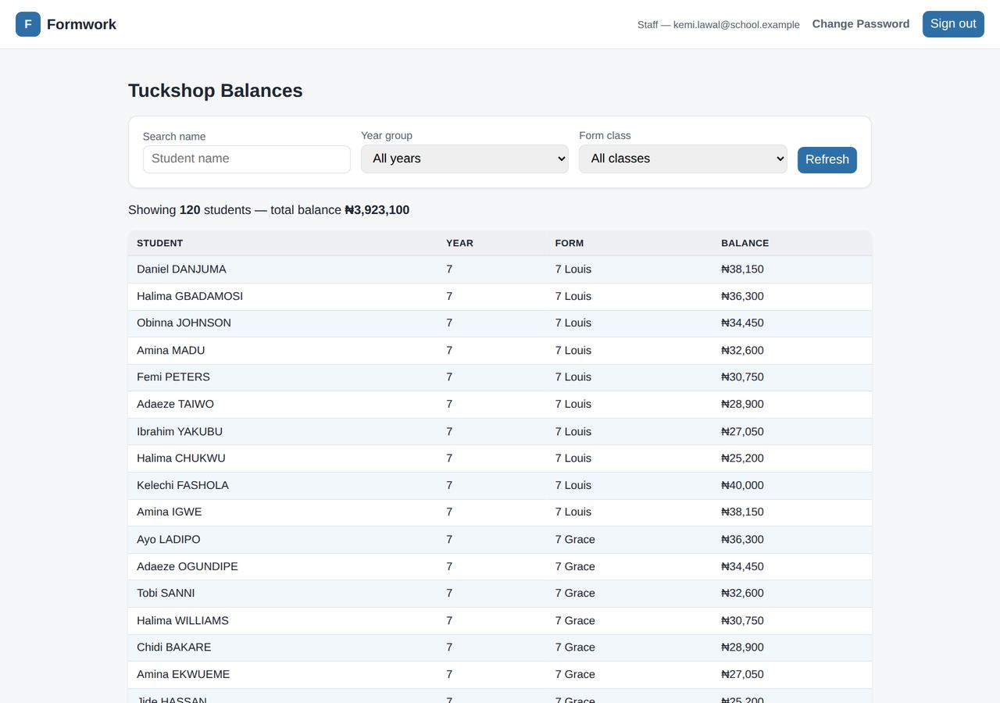

## 12. Admissions

Admissions tracks each applicant from enquiry to deposit paid. An applicant's stage only changes through Formwork's own actions, and each decision can produce a standard letter. Applicant data is open only to holders of the /admissions page (admissions, SMT and admins); the bursar sees names and payments only.

### The applicants list (/admissions)

Filter by **Entry year**, year group, status and name. The coloured buttons count applicants at each stage and filter the list. Each row shows the previous school, status, test average and application date.

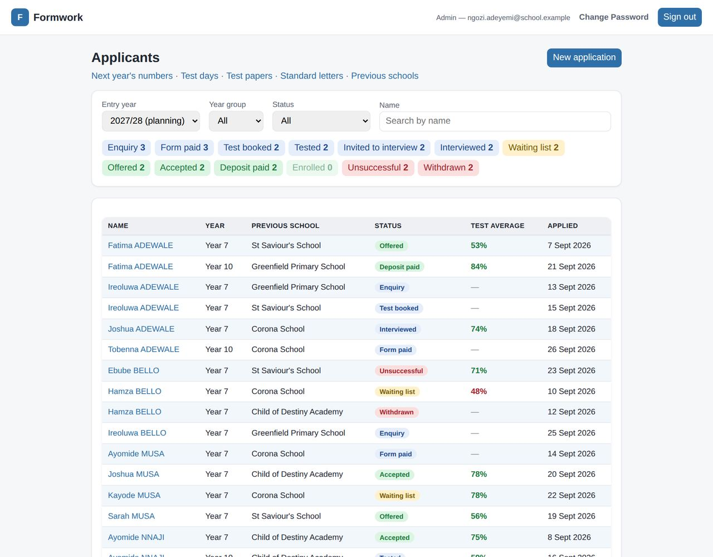

### A new application (/admissions/new)

Record the child (names, date of birth, gender, nationality, entry year and year group, previous school and class, a sibling at the school, how they heard of us, notes) and one or two contacts, one of them the main contact who receives letters. First and last name are required. A new application always starts as an enquiry; the page warns if the same name, date of birth and entry year already exist. Previous schools come from a shared list, merged at /admissions/schools. If the child's reading was tested when they applied, fill in the Reading age card: years and months, the date tested (today is filled in once you type an age) and the test used; the page shows the difference from the child's age. It can be added or changed later under Details on the applicant's page, and reaches the child's reading-age history once they are enrolled.

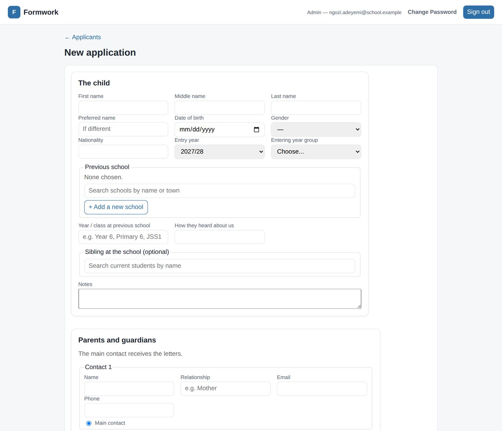

### Stages

| From | Can move to | How |
| --- | --- | --- |
| Enquiry | Form paid | The bursar records the form fee |
| Form paid | Test booked | Admissions books a test day |
| Test booked | Tested | Automatically, once English, Maths and CAT4 are entered |
| Tested | Invited to interview, Waiting list, Unsuccessful | Decision (an invitation needs a date and time) |
| Invited to interview | Interviewed | Automatically, once the interview is saved |
| Interviewed | Offered, Waiting list, Unsuccessful | Decision |
| Waiting list | Invited to interview, Offered, Unsuccessful | Decision |
| Offered | Accepted | Decision (family accepted) |
| Accepted | Deposit paid | The bursar records the deposit |

Any stage can move to **Withdrawn** with a reason. Unsuccessful and Withdrawn are final. Entry year can't change after the enquiry stage, nor the entry year group once a test is booked. Only an enquiry can be deleted.

### An applicant's page

The page holds the details, parents and guardians (up to four contacts), payments, the entrance test, the interview, the status and decision buttons, and every letter sent.

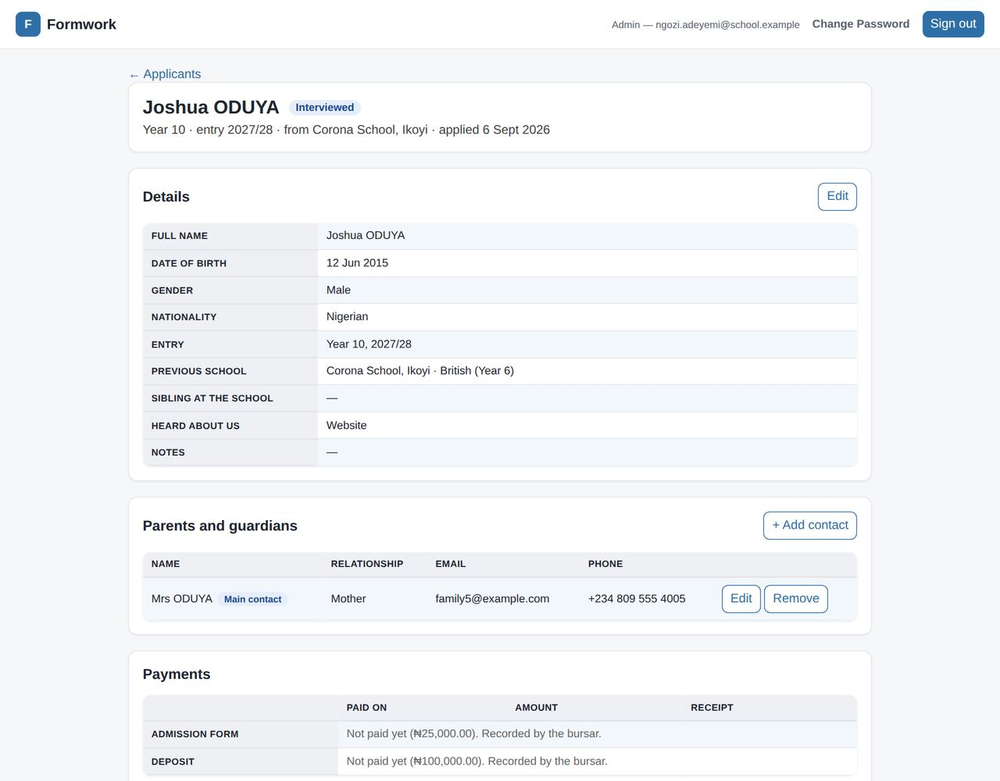

- **Details**: the child's record, including **Reading age at application** (the reading taken when they applied, its date and test, and the difference from their age). Press **Edit** to add or change it. The Interview section only appears once the child is invited to interview, so record an early reading here, not there.
- **Entrance test**: the booked test day, English and Maths scores (each 0 to the paper's maximum), worked out as percentages with the average against the pass mark (50% by default), and CAT4 SAS scores. The pass mark only guides; nothing blocks inviting a child below it.
- **Interview**: date, interviewer, reading age (years and months), reading test, interests, languages, strengths, concerns, recommendation and comments.
- **Status and decision**: only the moves allowed from the current stage are offered.

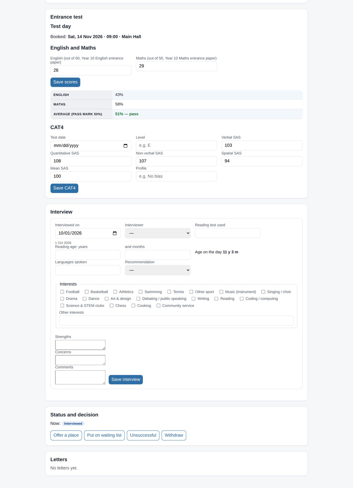

### Test days and papers

**Test Days** (/admissions/sessions): add a test day for an entry year (date, time, venue, notes), book applicants on (after the bursar has recorded the form fee), print a candidate sheet and enter scores in a grid.

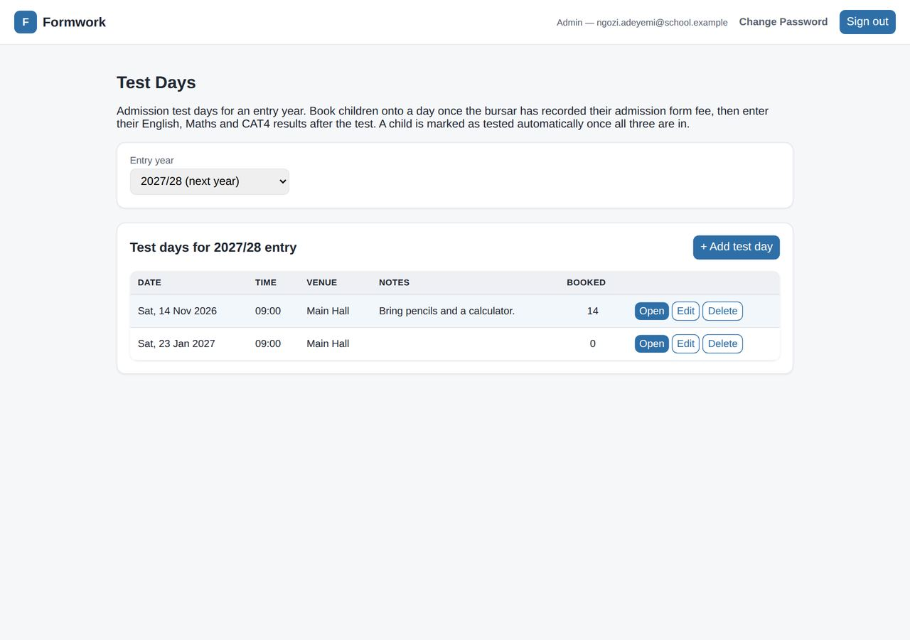

**Test Papers** (/admissions/papers): one English and one Maths paper per year group, each with its maximum mark. Changing a maximum after scores are in changes those percentages.

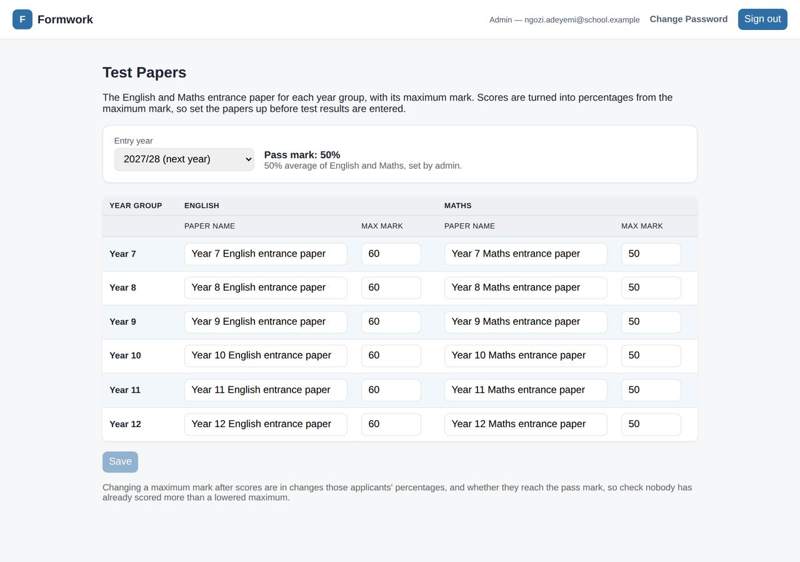

### Standard letters (/admissions/letters)

Seven letters: test date, invitation to interview, offer, and waiting-list and unsuccessful letters after the test and after the interview. Edit the subject and plain-text body; click a merge field (child's name, parent's name, year group, test and interview details, fee, deposit) to insert it. The stage move chooses the letter, which is saved against the applicant and, if **email** is ticked, emailed to the main contact with replies going to the sender. A PDF can be downloaded.

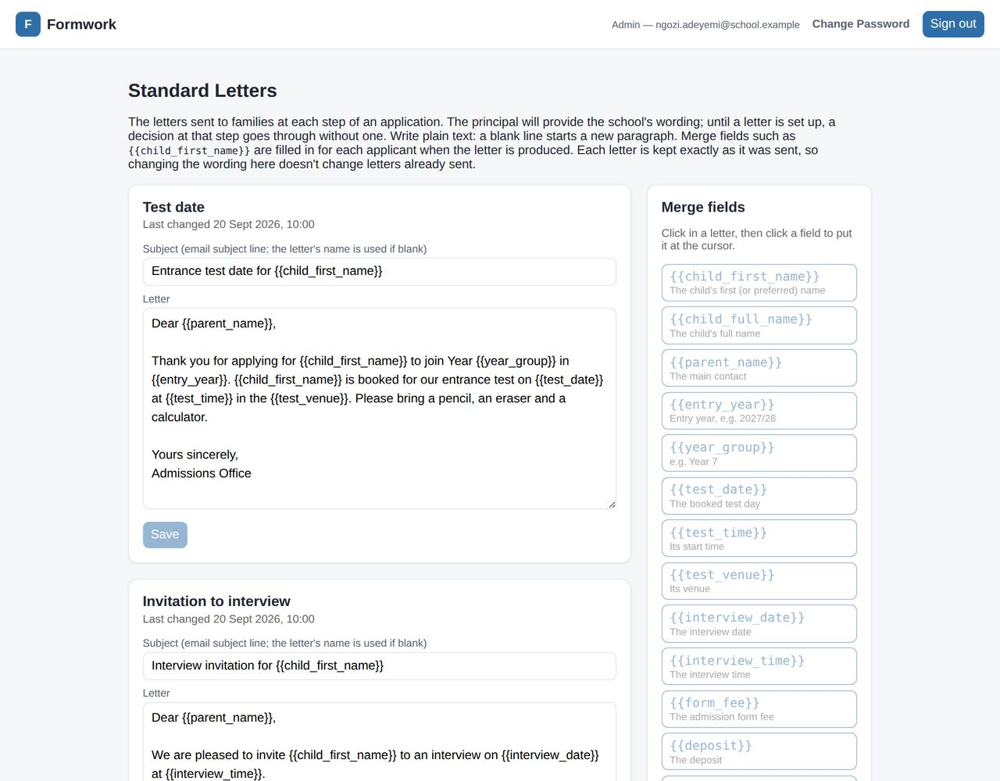

### Next Year's Numbers (/admissions/projections)

SMT set the **new places** for each year group, boys and girls separately (for 2027/28: 11 boys and 11 girls into Year 7). For each year the page shows places allowed, confirmed, still free, offers awaiting a reply, applicants still in process and predicted free places; students carried over from this year; and next year's total roll. Predictions count 100% of offers and 50% of applicants in process by default (both editable). Over-filled places show in red.

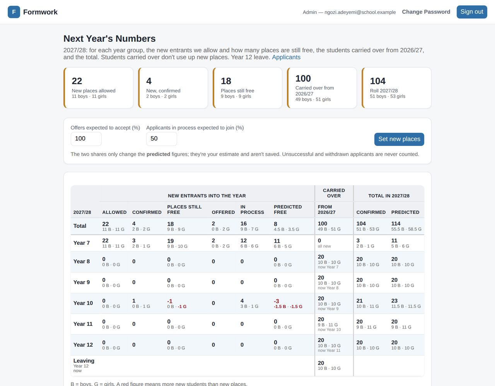

### Admission payments (bursar, /bursar/admission-forms)

The bursar sees each applicant's name, year, contact and status, and records the form fee (date and receipt number; the amount comes from the year) and the deposit. The year's form fee and deposit are changed only by two-person approval (chapter 10).

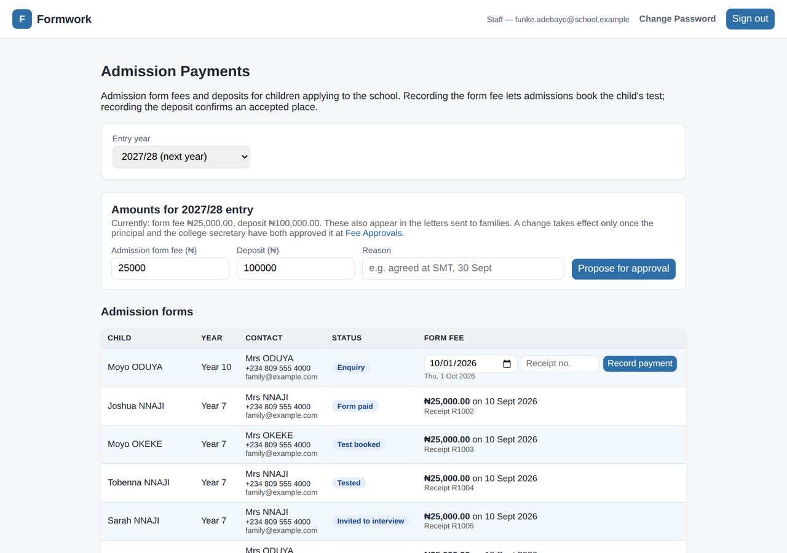

Not built yet: enrolling an accepted applicant as a student, removing old applicants' personal data, and sharing interests with the Other Half coordinator.

## 13. The student and parent portals

Students and parents see only their own information: a student their own record, a parent each child who is still at the school. This chapter is useful for staff answering questions from families, and as a guide to hand to them.

### What each portal shows

| What | Student portal | Parent portal (per child) |
| --- | --- | --- |
| Timetable, with the Other Half activity | Yes | Yes |
| Homework | Own classes' homework, files and released grades | No |
| Grades against targets, reports and transcripts | Yes | Yes |
| Behaviour | Own events; can appeal a negative one | Only events released to parents |
| Attendance | No | Yes, including today lesson by lesson |
| CAT4 / NGRT | No | Yes |
| Fees | No | Only for terms SMT has published |
| Tuckshop | Order, balance, purchases | Balance and purchases (can't order) |
| Other Half | Choose during Evening Prep | See the chosen activity |
| Groups | Groups shown to students | Groups shown to parents |
| Inbox | Yes | Yes |
| Mark appeals | Appeal own marks from the last 5 days (5 credits a year) | No |
| Lesson feedback | Give feedback on today's and yesterday's lessons | No |

### The student portal

After signing in, a student sees big tiles (in the order set at /admin/tile-order): Timetable, Homework (only students with homework switched on), The Other Half, Assessment, Behaviour, Tuckshop, Messages and Groups. **My portal** shows the same tiles with a summary on each.

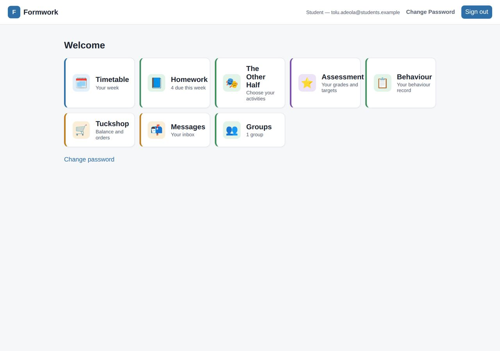

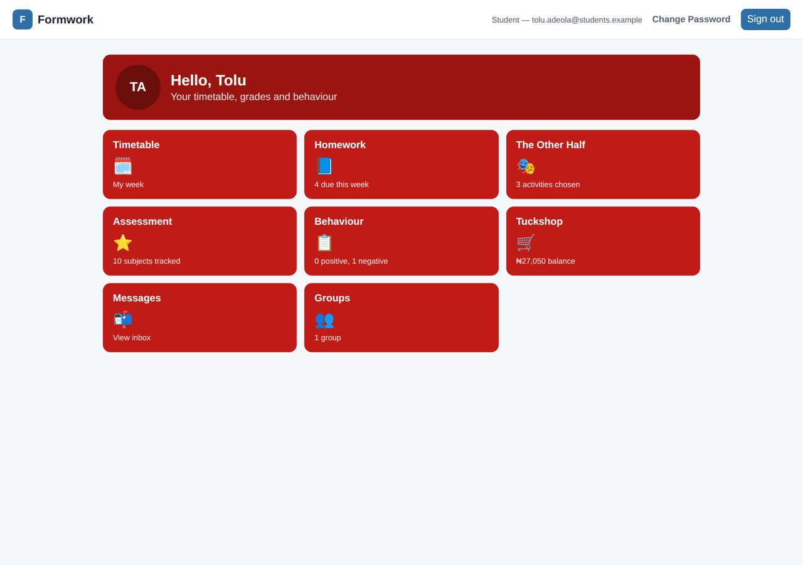

**Timetable** shows the week with teachers and rooms, the student's Other Half activity, and homework on the lesson it's due in; lessons that ended today or yesterday have a Give feedback button (chapter 5, Lesson feedback); a Maths lesson with a worksheet or card sort shows it, locked until the lesson starts, and a card sort opens on screen to do with a partner (chapter 4, Lesson worksheets). **Assessment** shows the latest grade in each subject beside the target (green above, amber on, red below), downloadable term test scores and transcripts, and documents published by the school. **Behaviour** lists their events; a negative one can be appealed once, with a reason. Under Assessment, Appeal a mark lists marks from the last 5 days that can be appealed (chapter 5, Mark appeals).

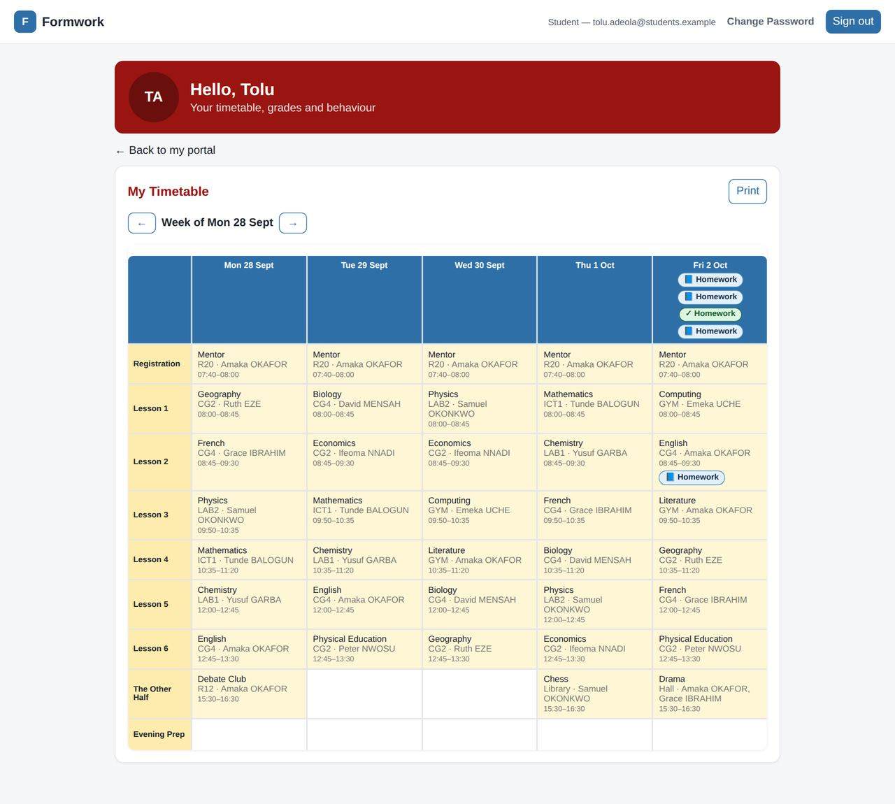

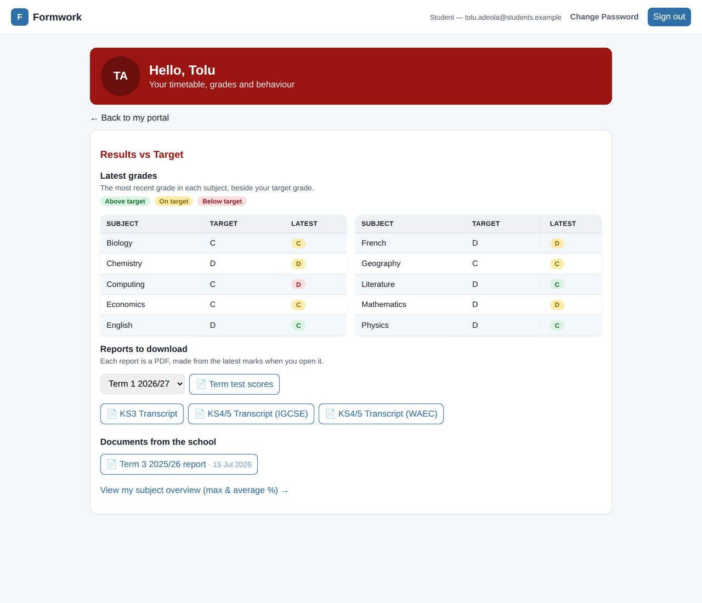

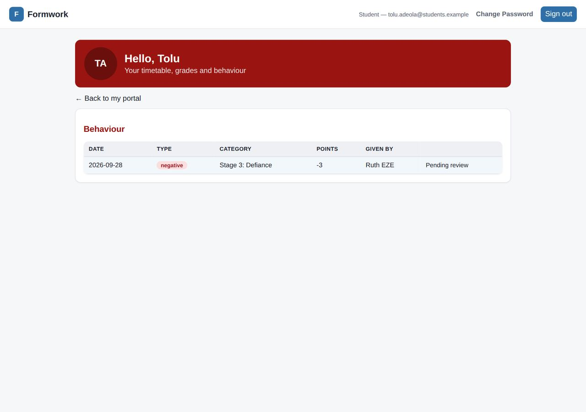

Homework (chapter 4), Other Half choices (chapter 8) and tuckshop ordering (chapter 11) are covered in their own chapters.

### The parent portal

Parents sign in with email and password and go straight to **My Children**. With more than one child, they pick a child first; **Switch child** goes back. Each child has tiles for Timetable, The Other Half, Assessment, Conduct (released behaviour), Attendance, Fees, Groups, School Calendar, Tuckshop and Messages.

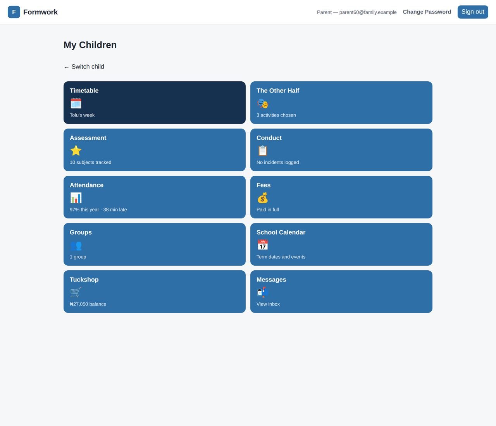

**Attendance** shows today, this week and this year, and today lesson by lesson. **Fees** shows the term's invoice lines, total, paid and amount due with a PDF download, only once SMT have published the term. Assessment shows each mark once it is the number of hours old set on Lookups (chapter 14), so a mark a child mentions may not be there yet. Tuckshop opens the child's balance and purchases on the same page.

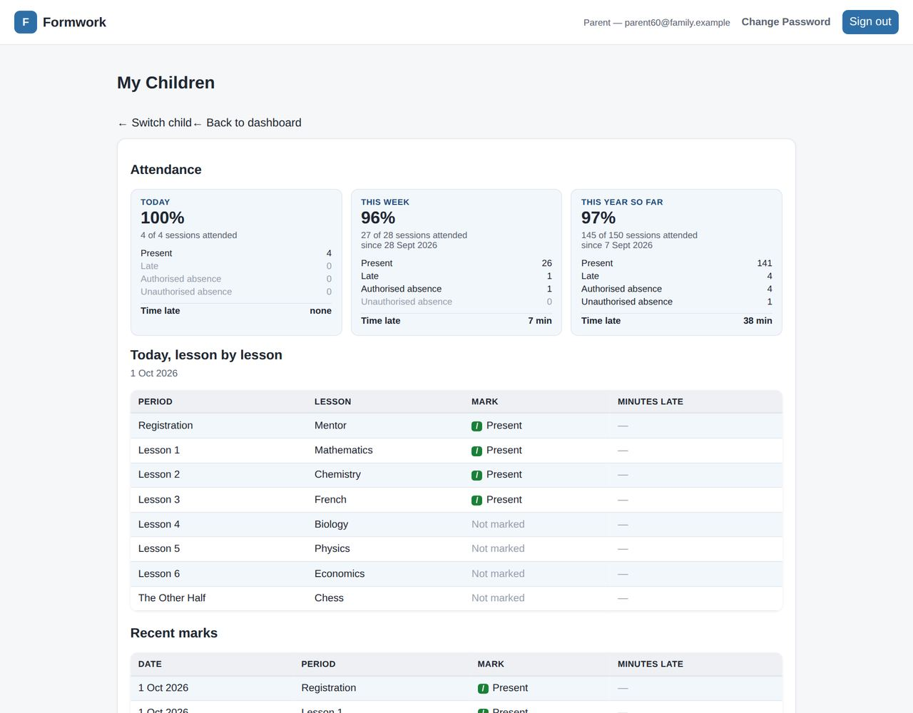

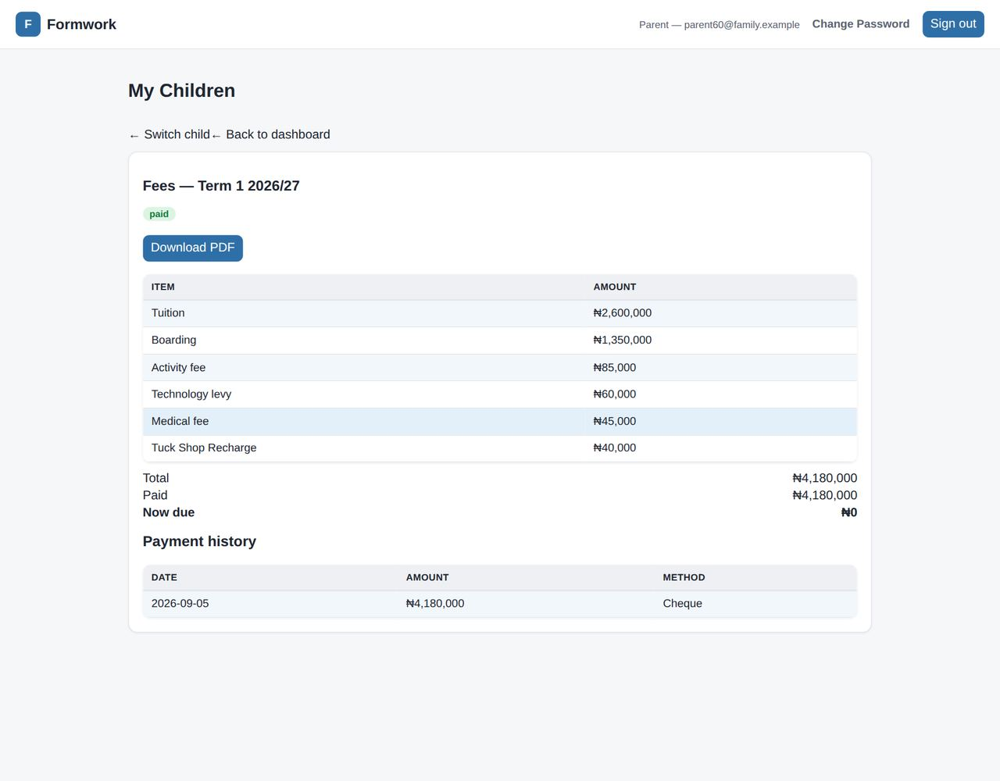

### The school calendar for parents

/parent-portal/calendar shows term dates and parent-facing events (no staff deadlines). **Subscribe** adds the school calendar to a phone or computer calendar (iPhone, Mac and Outlook, or Google), which then updates itself every few hours when events move. The link is private to that parent; **make a new link** stops the old one working. One-off copies of single events can also be saved.

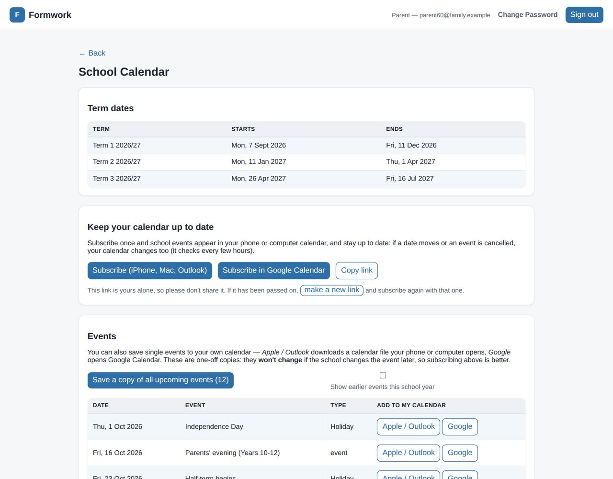

### Rules that protect families

- A parent sees a child only while that child is an active student. When a child leaves, their records drop out of the portal.
- Negative behaviour reaches parents only through the office or SMT review (chapter 7), and never names another student.
- Parents never see homework (except the grade on a written report), other members of a group, or which students were linked to a behaviour event.
- Admins, SMT and the school office can use **View as Parent** to see exactly what a parent sees.

## 14. Administration

Admins own setup, imports, permissions and backups; HR assigns roles; SMT, HR and admins keep the lookup lists. Most of these pages are on the Staff & Access, Timetable and Administration cards.

### Who can open which page (/admin/permissions)

Choose a role from the list at the top. Beside it you see what the role is for, how many pages it opens, how many kinds of record it can change and how many student fields it can edit. Then use the three tabs:

- **Pages**: tick the pages the role can open. Each section shows how many of its pages are ticked, and **Find a page** narrows the list. Changes save instantly. Admins open every page whatever is ticked.
- **What they can do**: for each kind of record (registers, behaviour events, results, payments and so on), whether the role can **View**, **Add**, **Edit** and **Delete** it. **Yes** means any record, **Own only** means only records tied to the person (their own classes, events they logged), and **No** means not at all. Click a row to see the names of the database rules that allow it. This is read from the database itself, so it is always current: tick a page and any access that depends on it changes straight away. Below the table, give the role Read or Edit on each student Core Data field.
- **Compare roles**: every page against every role in one grid, to check at a glance who can open what. Click a role's name to open it on the Pages tab.

On **Pages** and **What they can do**, each section is a branch: click its heading to open or close it. A closed heading says what is inside (how many pages are ticked; which records are seen or changed). **Open all** and **Close all** do every branch at once, and typing in the search box opens every branch that matches.

**Changing what a role can do.** Some records have tick boxes beside View, Add, Edit and Delete: certificates, certificate levels, the BMI table and grade boundaries, and (since 3 Oct 2026) behaviour, attendance, reports, results, homework, students and families, staff and HR, the tuckshop, The Other Half, student groups, admissions, fees (fee prices stay with the two approvers), the timetable, the calendar and next year's plan. Staff roles, page permissions and logins have no tick boxes, so a tick can never hand out admin powers. A record whose rows belong to someone (a teacher's own report comments, a checker's report period) keeps that rule whatever is ticked: the tick decides who sees or changes everyone's. Tick or untick a box and Formwork lists the people who would gain or lose that ability, by name, before it saves; press **OK** to go ahead. Every change is kept in Change History. Medical and sick-bay records show padlocks instead: only the nurse and the DSL can see them, and that can't be changed here.

A padlock (🔒) means the cell can't be changed here by anyone, admin included. These are the principal's own decisions: only the school office adds students; Grade History and Change History can't be edited; fee prices need the principal and the college secretary. Some things everyone signed in can read also have a padlock. Hover over the padlock to see why.

Records without tick boxes are still set in the database. A few actions (approving fee prices, admissions decisions, planned absences) go through their own checked steps, so they show as View only even for the people who can do them.

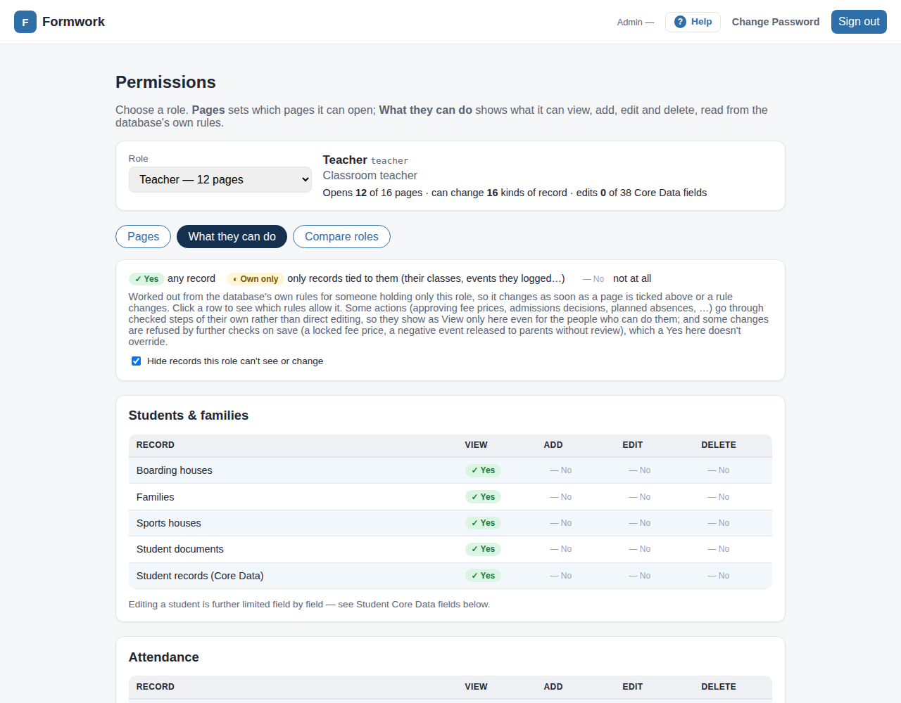

### Staff and roles (/staff/roles)

Add staff (name, code, email: a login is created automatically from the email) and give each person their roles with **+ Add role**. Some roles carry a scope: a houseparent's house, a Head of Department's department. HR and admins can assign any role except admin. Roles are listed in alphabetical order. Only the principal gives or removes DSL and Guidance; everyone else sees them with a padlock. Every change is logged in Change History. Staff logins are emailed from **Staff Logins** (/staff/welcome-emails); mentor groups are staffed at /staff/mentor-groups.

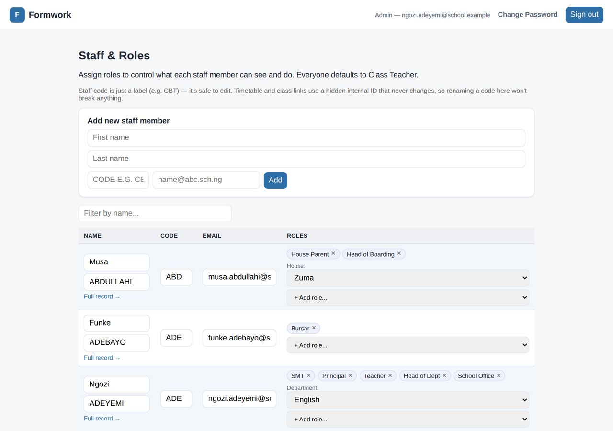

### Lookups (/admin/lookups)

The lists and settings the rest of Formwork uses: boarding houses, sports houses, behaviour categories with their points and a short description of when to use each (admins only; changing a category's points affects new events only, and to stop using a category that has been used, press Retire: it is no longer offered for new events, its old events keep it, and Bring back restores it), the behaviour thresholds and detention room and time, the Stage 5 guidance shown to staff when they log a serious event (under Detentions and serious events: start a line with • or - for a list, end a line with a colon for a heading, then press Save guidance), certificate levels, academic years, admission fee proposals, the mark appeal rules (days to appeal and credits a year, for each school year), and When parents see marks: how many hours (0 to 168) a new mark waits before parents can see it, counted from when it was first entered. 0 means parents see marks as soon as they are entered. Every section starts folded closed: click its title to open it. Thresholds must be negative whole numbers and apply to new events only. The DSL and the principal also see a Worry Box categories section (chapter 7, The Worry Box). Changes are logged.

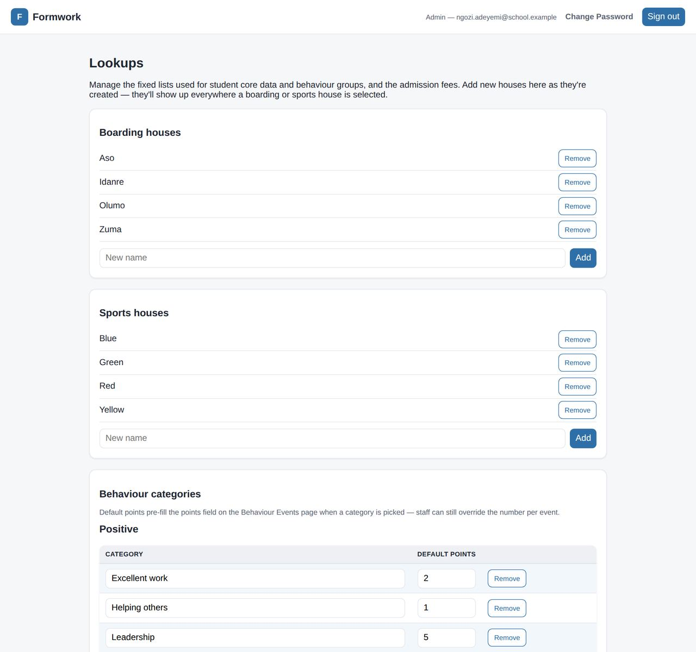

### Timetable setup

- **Bell Times** (/admin/bell-times): which sessions run each day and their times. Saving moves every lesson in that period; a session can't be removed while lessons use it. One date can also be booked to run on another weekday's times (chapter 3, The school day).
- **Import Nova-T** (/admin/import-classes): upload Nova-T's .DAT files. Every change is previewed before it's applied; classes missing from the file are offered for deletion. A lesson's subject comes only from the subject code in the group name; Other Half (Oh) and Sports Academy (Sa) groups are skipped.
- **Import Meetings** (/admin/import-staff-commitments): staff meetings and non-working periods, which block that person's slot.
- **Class Allocation** (/admin/block-allocation): choose a year and block, then tick which class each student is in. Open to admins, Heads of Department and pastoral staff. To see how students are doing while you place them, add a marks column: choose a result set and a subject (the block's own, another, or the average of all subjects). Up to four columns, percentages only; click a column heading to sort highest first.
- **Student Numbers** (/admin/student-numbers): boys, girls and unknown, counted six ways. The page opens on six choices: Year Groups, Mentor Groups (with a subtotal for each year), Restaurants, Boarding Houses (click a house to open its rooms; a Years column shows the year groups in each room, for example "Y9 (3), Y10 (1)"), Sports Houses (with their year groups) and Classes (by subject). Once one is open, the buttons at the top switch to another.

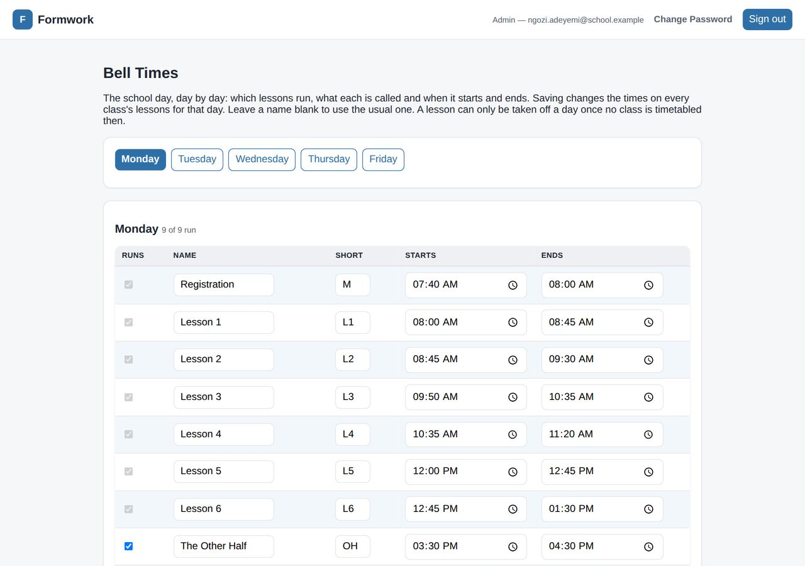

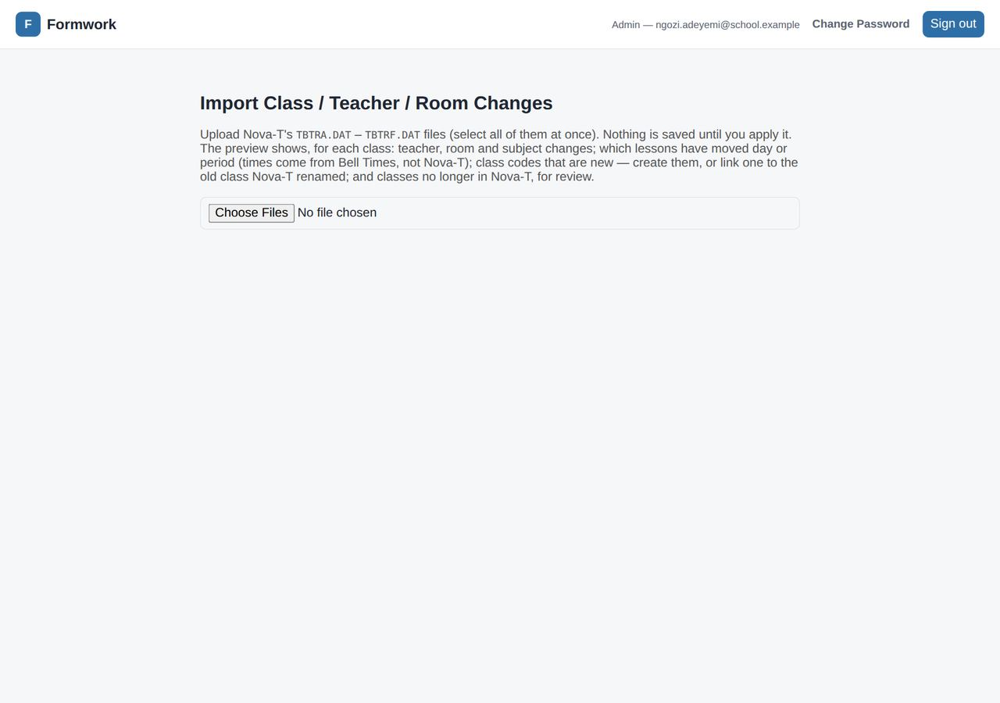

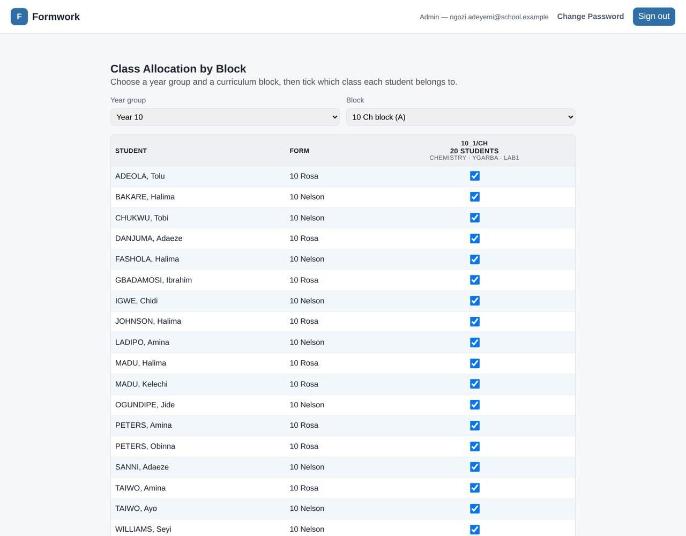

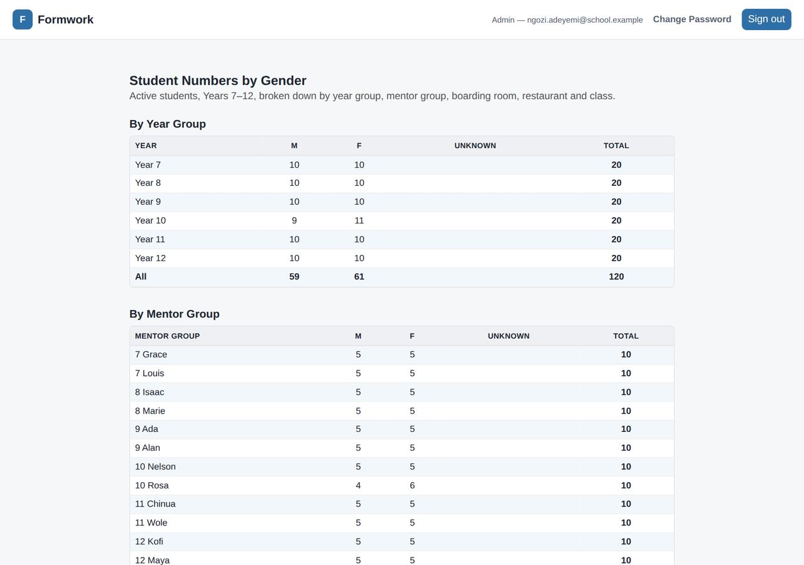

**Never import next year's Nova-T file on the normal import page**: next year's class codes are the same as this year's, so it would overwrite the live timetable. Use Next Year Setup.

### Next Year Setup (/admin/next-year, SMT and admins)

Next year is planned in separate tables that nothing live reads.

1. **Mentor structure**: next year's mentor groups and mentors. **Start from this year's groups** moves Year 7–11 groups up a year with their mentors. Then **Confirm the mentor structure** (it can be reopened).
2. **Nova-T timetable**: once the structure is confirmed, import next year's timetable into the plan.
3. **Planned classes**: next year's classes with subject, teacher, room, lessons and students.

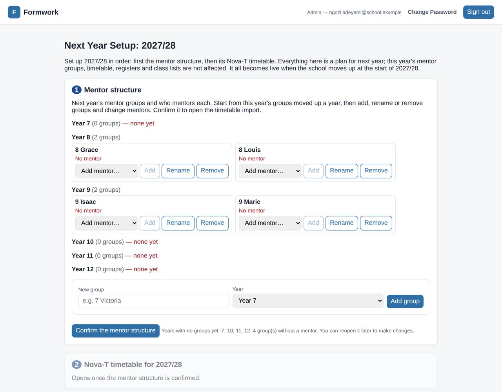

Not built yet: placing students into next year's classes, progression, subject choices and the automatic year switch.

### Subjects and grading

**Subject Settings** (/admin/subject-settings): display names, departments, key stages (which decide where a subject appears on transcripts), aliases for gradebook imports, and which subject's targets to borrow. Subject codes are kept in SQL, never edited here. Two ticks decide how Years 10–11 are graded and printed (the principal, 9 October 2026): WAEC only (Igbo, Government, Computer and GSM Repairs, Animal Husbandry, Fashion, Civics, Digital Technologies) gives the subject WAEC targets and WAEC boundaries copied from Year 12, and puts it in its own WAEC section on the Termly Grade Report; IGCSE only (Chinese, Spanish) puts it in an IGCSE-only section. A subject can't have both. Unticking WAEC only leaves the WAEC boundaries in place; set IGCSE ones on Grade Boundaries. Grade boundaries are in chapter 5.

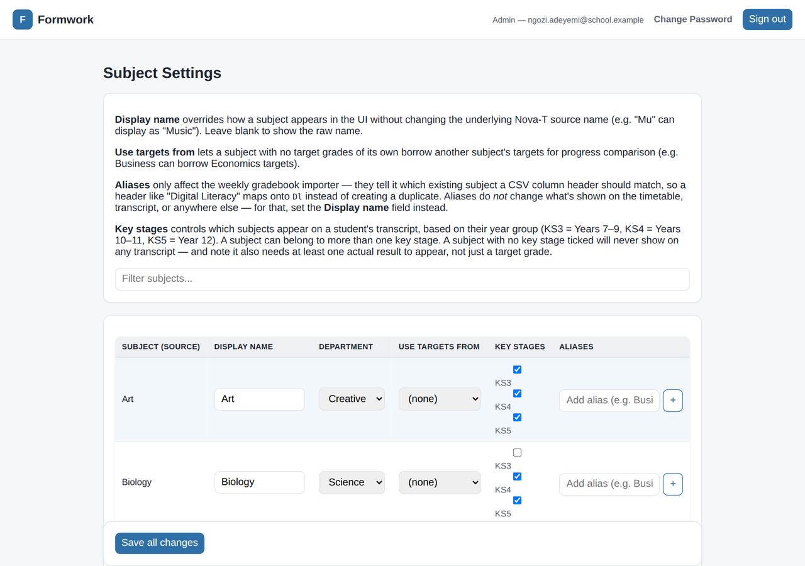

### Arrange Tiles (/admin/tile-order)

Drag tiles (or use the arrows) into order and **Save order**, for students' tiles and each row of the staff dashboard. The order is the same for everyone; people still only see tiles they have access to.

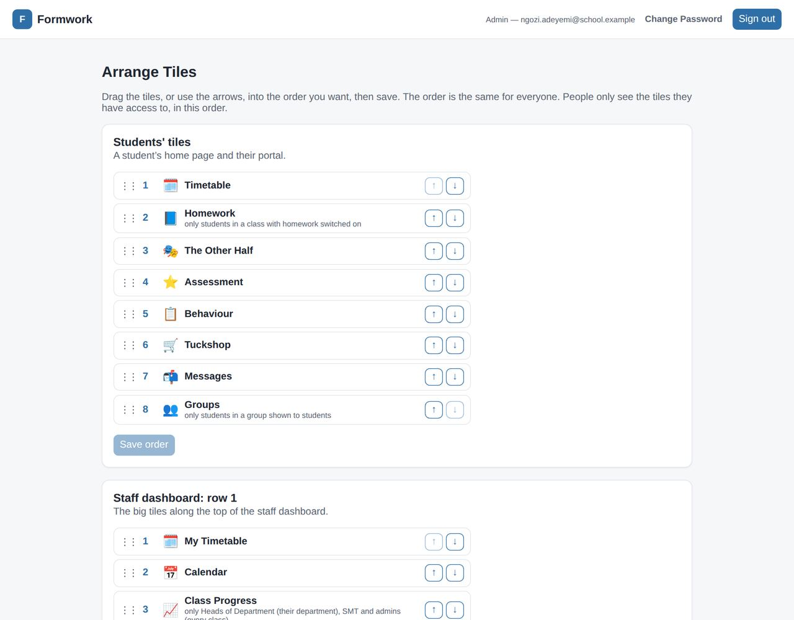

### Change History (/admin/change-history, SMT and admins)

The permanent log of sensitive changes: register changes and deletions, fees and prices, behaviour events, roles, permissions and logins, parent links, email settings, admissions, student groups, student records and the Reward Store. Each entry shows when, the area, the student, what changed (old → new) and who did it. Filter by dates, area, student, person and action, and download as CSV. Nobody can edit or delete an entry; changes made directly in the database show as "Principal (direct)". The bursar can't read it.

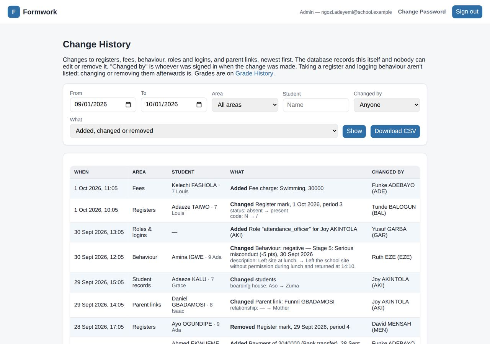

### Backups (/admin/backup, admins)

A full database backup runs every night. Admins can also run one before anything risky (a bulk import, the year-end rollover): it puts the system into backup mode for 1–60 minutes, when staff can still look things up but nothing can be saved. Recent backups can be downloaded through a 60-second link; keep a download only on a school-controlled device. Backups are kept 14 days (daily), 8 weeks (Sundays) and 12 months (1st of the month). Photos and uploaded documents are not included.

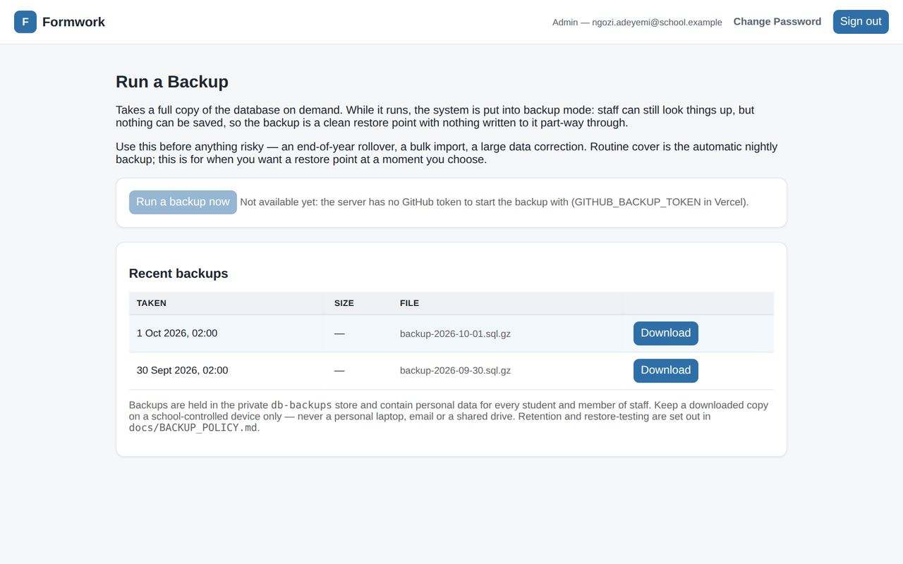

### Imports

| Import | Page | Who |
| --- | --- | --- |
| Students | /students/import | School office |
| Student photos | /students/photos/import | Admins |
| Parents | /parents/import | Admins |
| Staff emails | /staff/import-emails | Admins |
| Nova-T timetable and meetings | /admin/import-classes, /admin/import-staff-commitments | Admins |
| Student class lists | /admin/import-timetable | Admins |
| Target grades | /target-grades/import | Assessment managers, admins |
| CAT4 and NGRT | /assessments/import | Assessment managers, admins |
| Gradebook results | /results/import-gradebook | Assessment staff |

## Appendix

### A. Roles

| Role | Main powers |
| --- | --- |
| admin (an account setting) | Passes nearly every check: permissions, bell times, imports, backups. Cannot add students, approve fee prices, or use or unlock tuckshop Hand Out |
| smt | Calendar and terms, behaviour picture review, Change History, Grade History, email reply routes, publishing fees, messages, Other Half, Homework Monitor |
| hr | Staff HR records, register alerts, staff roles (any except admin) |
| pastoral | Appeals, detentions, editing behaviour events, class allocation, messages, student groups |
| houseparent | Their house's students by default; appeals, detentions, pastoral comments |
| head\_of\_boarding | Houseparent powers across all houses; counts as pastoral |
| teacher | Registers, results and homework for their classes, behaviour logging, subject comments, reading tests |
| mentor | Their mentor group; mentor comments |
| head\_of\_department | Class Progress and homework for their department; deleting their department's scores; class allocation |
| assessment\_manager | Any result, target, CAT4/NGRT; transcript grades; recording reading tests; Grade History; publishing documents |
| assessment\_user | Enter any result or target, but not delete |
| bursar | Fees, invoices, payments, discounts, admission payments; tuckshop admin (not Hand Out) |
| school\_office | Student records (all fields), adding students, parents and logins, welcome letters, register alerts, releasing behaviour with writing, messages, missed-lesson and Stage 5 collection pop-ups |
| attendance\_officer | Missed Lessons, the missed-lesson pop-up and Planned Absences |
| admissions | Admissions pages |
| tuckshop | Tuckshop pages, including Hand Out |
| tuckshop\_owner | As tuckshop, plus unlocking a saved hand-out list |
| nurse | The clinic and medical records: add, edit and delete (with the DSL, the only ones who can see them) |
| dsl | The Designated Safeguarding Lead: the clinic and medical records (add and edit, not delete), and marking sick-bay visits as safeguarding |
| other\_half | Manages Other Half activities and choices |
| principal, college\_secretary | Together approve every fee price change |

### B. Rules at a glance

| Area | Rule |
| --- | --- |
| Registers | Any staff can mark any register; no future dates; flagged 15 minutes after the start |
| Missed lessons | Seen in school, then absent without a reason (N or O) in a later or earlier lesson |
| Behaviour | Points come from the category; −5 needs an explanation and a confirmation tick; negative events reach parents only after review by the principal's PA or SMT; a Stage 5 returned to the teacher counts 0 until they change it |
| Detentions | Single event of −5, or a week (Sat–Fri) totalling −10; Friday in CG4 after lesson 7 |
| Behaviour alert | −5, or a week at −8: email to cs@, SMT and sro@ |
| Results | Percentages 0–100; grade from the subject's boundaries for the year; one score per set |
| Homework | Years 7–12; titles up to 10 characters; marks shown to students only when released |
| Other Half | Choose only during Evening Prep (19:00–21:00) while choices are open; one per weekday |
| Tuckshop | Order in the window; max 2 of any item and 2 food items per day; charged at hand-out |
| Fees | Prices change only with both the principal's and the college secretary's approval |
| Parents | See only children still at the school, and only published fees and released behaviour |
| Students | Only the school office can add a student; leaving removes them from classes and locks their login |
| Time and money | Every date and cut-off is Lagos time (WAT); all amounts are naira (₦) |

### C. Glossary

| Term | Meaning |
| --- | --- |
| Active student | A student whose status is active; leavers are left out of classes, messages, charges and choices |
| Block | A curriculum block from Nova-T; a student takes one class per ordinary block |
| CAT4 / NGRT | Cognitive Abilities Test and New Group Reading Test scores, imported from CoreSats |
| Change History | The permanent log of sensitive changes |
| EP | Evening Prep, 19:00–21:00 Sunday to Friday |
| Grade History | The permanent log of every grade entered, changed or deleted |
| KS3 / KS4 / KS5 | Years 7–9, 10–11 and 12 |
| Mentor group | A form group; its mentor writes the mentor report comment |
| Nova-T | The timetabling software the timetable is imported from |
| OH | The Other Half, the after-lessons activity programme |
| Report period | A reporting round with year groups and due dates |
| Restaurant | The dining group a student eats in; tuckshop orders are sorted by it |
| Result set | A calendar event marked as a result set; scores are entered against it |
| SRO | The school office (sro@abc.sch.ng) |
| UPN | Unique Pupil Number, used to match imports |
| Voided event | A behaviour event withdrawn on an upheld appeal |
| WAEC / IGCSE | The two grading scales: WAEC (A1–F9) for Year 12, IGCSE (A\*–U) for Years 7–11 |

### D. Getting help

- **Can't sign in, or a login is missing**: the school office (staff and students: an administrator).
- **A page is missing from your dashboard**: ask an administrator to check your roles and /admin/permissions.
- **Something is refused that should be allowed**: note the page, what you did and the message, and tell an administrator. Many refusals are deliberate rules listed in this manual.
- **Known issues** that are still open are listed in section 23 of the [Functional Specification](https://claude.ai/code/artifact/659cca3b-399b-425f-bb5f-8b23577d5714).
