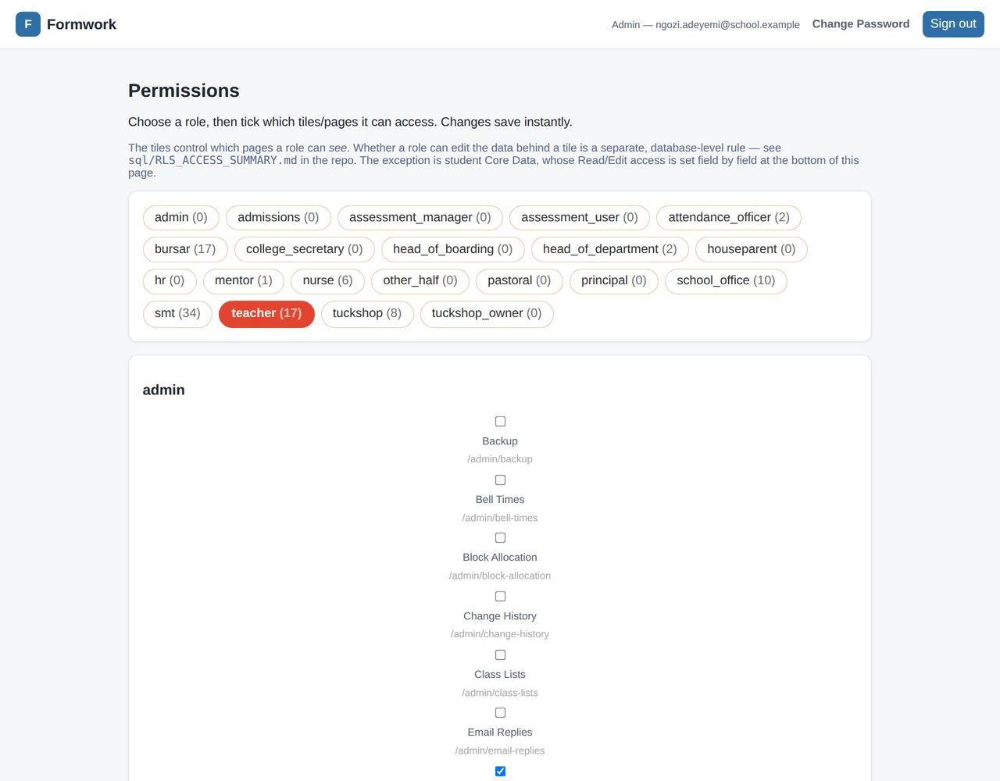

<!-- Snapshot of the living doc "Formwork — User Manual": https://claude.ai/code/artifact/419e765d-009a-414f-9da4-d81b2dd75894
     The living doc is the master; edit it there, not here. This file is re-exported
     whenever the doc is updated (see .claude/skills/update-docs/SKILL.md). Screenshots are
     in docs/manual-images/ and show invented demonstration data, not real students. -->

# Formwork — User Manual

Oct 1, 2026 · @Chris TERRY

## About this manual

This manual explains how to use every part of Formwork, the school's MIS at [misform.work](https://misform.work), as it stands on 1 October 2026. It is written for the people who use it every day: teachers, mentors, houseparents, the school office, the bursar, the tuckshop, admissions, SMT and administrators, and it ends with what students and parents see.

**How it is organised.** Each chapter covers one area of the school's work. It says who can use the pages, walks through the common tasks step by step, and lists the rules the system enforces so you know why something is refused. Where a page is only open to some roles, the chapter says so at the top.

**About the screenshots.** Every screenshot was taken from a copy of Formwork running on invented demonstration data. The students, staff and parents shown are not real, and no real pupil information appears in this manual. Your screen will show your own school's data and only the tiles your roles open, so it may look slightly different.

**Rules you can rely on.** Many rules are enforced by the database itself, not just by the page. If Formwork refuses something, such as a late register for a future date or a price change without two approvals, it is working as intended. The [Functional Specification](https://claude.ai/code/artifact/659cca3b-399b-425f-bb5f-8b23577d5714) lists every rule in full, and the [Product Requirements](https://claude.ai/code/artifact/d7ffd5d9-797b-4db0-b4b9-01f122498f7b) describe where the product is going.

**Two things to remember**

- Seeing a page does not mean you can change everything on it. Page access is set at /admin/permissions; what you can actually read or change is decided by the database.
- All dates and times are Lagos time (WAT), and all money is in naira (₦).

## 1. Getting started

Everyone signs in at misform.work. Staff and students use their school Google account; parents use email and password. What you see afterwards depends on who you are and which roles you hold.

### Signing in

1. Choose **Staff or student** or **Parent**.
2. Staff and students: press **Sign in with your school account** and pick your @abc.sch.ng Google account. You can also use **Sign in with a password instead**.
3. Parents: enter the email address the school holds and your password. Your first password is in the welcome letter (your oldest child's date of birth as DDMMYYYY), and you must choose a new one at first sign-in.

**If sign-in is refused.** Google only links to a login Formwork already made. If you see "not set up in Formwork yet", ask the school office or an administrator; nobody can create their own account. A student who leaves is signed out at once and cannot sign in again unless they return.

**Passwords.** Use **Change Password** at the top right at any time. A new password must be at least 8 characters. Forgotten passwords can be reset from the sign-in page.

### The staff dashboard

The home page has three layers. The order of the big tiles is set once for the whole school at /admin/tile-order.

| Row | Tiles | Who sees them |
| --- | --- | --- |
| Top row | My Timetable, Calendar, My Children, Class Progress | Everyone; My Children only for staff who are also parents; Class Progress for Heads of Department, SMT and admins |
| Second row | Log behaviour, Inbox (with unread count), Missed Lessons (with today's count), Homework Monitor | Log behaviour and Inbox for all staff; the others for those granted the page |
| Module cards | Students, Pastoral, Admissions, Clinic, Reports, Communication, Timetable, The Other Half, Assessment, Fees & Bills, Tuckshop, Staff & Access, Administration | Each card lists only the pages your roles open; a card with none is hidden |

A teacher with the mentor and Head of Department roles sees far fewer cards:

Hover over (or tab to) a link on a card to see a one-line description of the page. The numbers on the Students, Staff & Access and Pastoral cards (active students, staff, behaviour alerts in the last 7 days) are links to those pages.

### Roles and what they open

A member of staff can hold several roles. Each role opens pages (set by admins at /admin/permissions) and carries data permissions enforced by the database. The full list is in the appendix; the most common are:

- **teacher**: registers, results and homework for your classes, behaviour logging, subject report comments.
- **mentor**: your mentor group and its pastoral report comments.
- **head\_of\_department**: Class Progress for your department, deleting your department's scores, class allocation.
- **smt**: calendar, behaviour review, Change History, Grade History, publishing fees, messages, the Homework Monitor.
- **school\_office**: student and parent records, adding students, parent logins, register alerts, missed lessons.

Students and parents do not see this dashboard. Students get their own home page (chapter 13), and parents go straight to the parent portal.

### Working on a phone

Every page works on a phone. Tables scroll sideways where they are wide, and the tiles stack into one column.

## 2. Students

Every member of staff can read every student's record; what each role can change is granted field by field. Only the school office can add a new student.

### Finding a student (/students)

The Students page loads nothing until you ask, because the whole school with photos is slow.

1. Type two or more letters of a name: up to eight matching students appear as blue buttons under the search box. Choose one to open their profile.
2. Or set **Year group**, **Form class** and **Status** and press **Load students** to see a group as cards (or switch to **List**).

Each card shows the student's net behaviour points and their latest weekly average.

Houseparents see their own house by default; those with school-wide jobs get a **Whole school** switch. This is a display filter only.

### The student profile

A profile opens on a grid of tiles. Each tile opens one part of the record.

| Tile | What it holds |
| --- | --- |
| Core Data | Names, date of birth, year, form, house, room, restaurant, contact and identity fields. **Full view** shows every field; **Edit** changes the ones your role may edit |
| Medical | The clinic record (nurse and admins only) |
| Parents / Guardians | Linked parents, their relationship to this child, phone and email; the office can create a parent login here |
| Siblings | Brothers and sisters found through shared parents (staff only) |
| Groups | Student groups the student belongs to |
| Timetable | The student's week, with their Other Half activity |
| Curriculum Blocks | Which class the student is in for each block |
| Attendance | Today, this week and this year: sessions, present, late, authorised and unauthorised absence, minutes late |
| Behaviour | Every event, who logged it, appeals and detentions |
| Target Grades / Results | Targets per subject and scores per result set |
| CAT4 / NGRT | Imported test scores |
| Reports & Documents | Published reports, transcripts and score sheets, and the transcript download |

### Editing a record

Press **Edit** on Core Data. Only the fields your role is allowed to change are editable (set per role at /admin/permissions). The school office has all of them. A change to a field you weren't granted is refused by the database.

Rules worth knowing:

- Gender is required and is Male or Female.
- A student's form must be a real mentor group; their mentor group follows it.
- Names are tidied on save: spaces at the ends and double spaces are removed.
- Marking a student as anything other than active (for example, left) removes them from all their classes and blocks their login. Attendance, behaviour and results are kept.
- Every change to a student record is logged in Change History.

### Adding a student (school office only)

1. Go to **Students → + Add a new student** (/students/new). The UPN is generated automatically.
2. Fill in first and last name, date of birth, gender, year group and form. Admission date defaults to today; the six-digit admission number is issued automatically.
3. Save, then add parents, house and other details from the profile.

Holding admin is not enough to add a student; the school\_office role is needed. Bulk loads use /students/import.

### Parents and leavers

- The school office manages parent records at /parents and links them to students from the student's Parents tile. Each link records the relationship (Mother, Father, Other).
- Parents only see children who are still active. A leaver's records drop out of the parent portal automatically, though the link is kept.
- Admins, SMT and the office can use **View as Parent** (/parents/view-as) to see exactly what a parent sees.

## 3. Timetables and registers

Registers are taken lesson by lesson. Any lesson whose register is not taken 15 minutes after it starts is flagged, and students who drop out of a lesson after being seen in school raise an alert.

### The school day

There are nine sessions: Registration (M), Lessons 1–6 (L1–L6), The Other Half (OH) and Evening Prep (EP). Bell times are set per weekday at /admin/bell-times (admins). The timetable itself comes from Nova-T and is imported by admins (chapter 14); a single lesson can have its own teacher or room, different from its class.

### My Timetable (/staff/timetable)

Your week: lessons, mentor registration, Other Half activities and meetings. Click a lesson to open its register. If you have overdue registers today, a banner appears above the timetable. Staff with the right access can pick another person from **Viewing timetable for**.

### Taking a register (/attendance)

1. Open the register from your timetable, or choose **Date**, **Period** and **Class / group** on the Attendance page.
2. Everyone starts as Present. Change the **Code** for anyone who is late or absent. Use **Mark all present** to reset the list.
3. For a late mark, enter the minutes late (0–600). While the lesson is running the box suggests the minutes since it started.
4. Save. Saving again overwrites the earlier marks.

On the register:

- **Today so far** shows each student's other marks today as coloured badges (M, L1–L6, OH, EP).
- **Show last grades** reveals each student's most recent grade in the subject. It is hidden by default so it is not on the class's screen.
- **Log behaviour for this class** opens behaviour logging with the class already chosen.
- For Year 10 and 11 classes, the **Homework** panel shows what is due and links to each mark book (chapter 4).

| Code | Meaning | Counts as |
| --- | --- | --- |
| / or \\ | Present | Present |
| L | Late (with minutes) | Late |
| I, M, C | Illness, medical appointment, other authorised | Authorised absence |
| N | No reason yet | Unauthorised absence |
| O | Unauthorised absence | Unauthorised absence |

**Rules.** Any member of staff can mark any register (the school's decision). You cannot save a register for a future date; past dates ask for confirmation. Taking a register is not logged, but every later change or deletion of a mark is kept permanently in Change History.

### Registers Not Done (/pastoral/registers-not-done)

Lists every lesson today that started more than 15 minutes ago and has no marks, with the lesson's own teacher. It stays listed for the rest of the day until the register is taken. Open to pastoral staff, houseparents, SMT and admins.

Every 15 minutes, outstanding registers are also copied into **Register Alerts** (/admin/register-alerts) for HR, the school office and admins. An alert stays even if the register is taken later, until someone ticks **Resolved**.

### Missed Lessons (/pastoral/missed-lessons)

Lists every student who was marked present or late at some point in the day but absent without a reason (codes N and O) in another lesson. For each missed lesson it shows where the student should have been, with whom, and who marked them absent. Authorised absences never count. Today's list refreshes every minute; choose another **Day** to look back.

Open to SMT, pastoral staff, the school office, the attendance officer and admins. A tile on the dashboard's second row shows today's count.

### The missed-lesson pop-up

Staff whose role is granted **Missed-lesson pop-ups** (the school office and the attendance officer) get a full-screen alert on whatever Formwork page is open as soon as a student goes missing: a period started at least 15 minutes ago and a student seen earlier is marked absent without a reason.

- **Seen: dealing with it** (with an optional note) clears the alert from every screen and records who saw it.
- **Hide for 2 minutes** hides it on your screen only; a new alert still appears at once.
- Correcting the mark (present, late or an authorised absence) clears the alert by itself.

The browser tab flashes and, once you have clicked on the page, a beep sounds for each new alert.

### Attendance summaries

Each student's profile shows today, this week and this academic year: sessions, present, late, authorised and unauthorised absence, and total minutes late. Parents see their own children's attendance in the parent portal, including today lesson by lesson; students do not see attendance.

### Printing

/admin/print-timetables prints every active student's timetable in a year group, eight to an A4 page. /admin/class-lists prints rosters by year, subject or class.

## 4. Homework

Teachers set homework for a class with a deadline and a grading system, and record a grade for each student. Homework is switched on for every Year 10 and 11 teaching class (not mentor groups or Prep). Grades feed the end-of-term written report only, never transcripts, result sets or targets.

### Who can do what

| Who | Sees what was set, with files | Sees grades |
| --- | --- | --- |
| The class's teachers (class teacher or teacher of any lesson), the Head of Department, admins | Yes, and can set, edit and mark | Yes |
| A student's current subject teacher, for that student's marks in the subject from any class | Yes | Yes |
| SMT | Yes | Yes |
| Other staff (mentors, pastoral, assessment managers) | Yes | No |
| Students | Their own classes' homework this school year | Their own, once the teacher releases marks |
| Parents | No | Only the Homework grade on a published written report |

### Your classes (/homework)

Your own classes appear as buttons under **My classes**. **Other classes** lists other switched-on classes in your subjects (view only) and any class you manage as Head of Department or admin. Choosing a class lists its homework: due date, title, grading system, how many are marked, whether marks are released and how many students ticked it done.

### Setting homework

Press **Set homework**, on /homework or in the Homework panel of a class register.

1. **Title**: at most 10 characters, so it fits the mark sheet (e.g. "Ex 4B"). Put the detail in the instructions.
2. **Instructions**: plain text. Links starting https:// become clickable for students.
3. **Due**: pick one of the class's coming lessons, or a date and "end of the day".
4. **Files and links**: PDF, Word, PowerPoint, Excel, images, text or CSV up to 20 MB each, and https:// links. Files are private and open through a link that lasts ten minutes.
5. **Graded as**: Mark out of …, Percentage, A\*–U, 9–1, WAEC, Effort 1–4, Complete / Incomplete, or Not graded.
6. Press **Set homework**. Students see it straight away on their timetable and Homework page.

Once any grade is recorded, the grading system can't be changed and the homework can't be deleted, only withdrawn.

### Marking (the mark book)

Press **Mark book** beside a piece of homework. Enter a mark (or grade), or choose **Not handed in** or **Excused**. For marks, the grade is worked out from the subject's grade boundaries for the year group and shown beside the number (11 out of 14 is 79%, a B). Students who ticked the work done show "ticked done" under their name.

Students see nothing until you press **Release marks**; **Hide marks again** takes them back. A student who joined the class after the due date is left out unless they already have a mark.

### The mark sheet

**Mark sheet** shows a class's marks between two dates (this term by default): one column per homework, each student's average of number-marked homework with its grade, how many were marked and how many not handed in. **Download CSV** exports it.

### Student view

**Student view** draws the class's week of homework exactly as its students see it, as a student who has ticked nothing and has no grades. Use it to check what students will see.

### How students see homework

Students see homework on their timetable (on the lesson it is due in) and on a Homework page laid out by day. Colour shows where each piece stands: red for overdue or not handed in, amber for due today, green for ticked done, purple for graded, blue for due later. A student can tick **Done** as their own note; it is not a hand-in.

### Homework Monitor (SMT)

The **Homework Monitor** tile (/homework/monitor) shows homework as students see it, for a chosen week:

- **For a year group**: every class's homework due that week on the students' cards, a subject filter, and a table of each subject's classes with which have nothing due.
- **For one student** (choose from **Show**): their timetable with homework on the lesson it's due in, their Homework cards, their own Done ticks and their released grades.

Nothing can be changed from the Monitor.

### Homework in reports

When writing the end-of-term report, teachers see each student's average of the term's number-marked homework (from any class), its grade, and counts of marked and not handed in. The Homework judgement is pre-filled from the average (80%+ Excellent, 60–79 Good, 40–59 Satisfactory, under 40 Needs Improvement) and can be changed. The printed report shows the grade only (for example "Homework: B"), never the percentage.

Not built yet: students handing work in online, and notifications when homework is set or marks are released.

## 5. Assessment, results and targets

Teachers enter percentage scores for their own classes against result sets. Each score is graded from the subject's boundaries for the year group and compared with the student's target. Every grade change is logged permanently.

### Result sets

A result set is a calendar event with the "result set" box ticked (SMT and admins manage the calendar, chapter 9). Weekly short tests, Teacher Assessment weeks and end-of-term exams are all result sets. End-of-term exams are one set per year group per term ("Y10 Term 1 Exam"); Year 12 has Terms 1 and 2 only, as Term 3 is WAEC. Only the current school year's sets can be picked for entry.

### Entering results (/results/enter)

1. Choose your **Class** and the **Result Set**, and check the **Result Type** (Short Test, Teacher Assessment or Exam Grade).
2. Type a percentage (0–100) for each student. The grade appears as you type, worked out from the boundaries for that subject and year group, and is saved with the score.
3. Scores save as you go. **Delete** removes a score (see below).

- A teacher can enter scores only for students in their own classes, in that class's subject. Assessment managers, assessment users and admins can enter any score.
- There is one score per student, per subject, per result set.
- Later changes to the boundaries do not regrade scores already saved.
- Deleting a score is allowed to the class teacher, the Head of Department for their department's subjects, and assessment managers and admins (also from the Results tab of a student's profile). Assessment users can't delete.

**Find missing grades by class** (/results/missing) lists, class by class, who has no mark in a chosen set. A subject is expected only if someone in that year group has a mark for it.

### Browsing results (/results)

Recent results with each student's grade, target and a coloured **vs target** label: green above, amber on, red below. Grades are never compared across IGCSE and WAEC.

### Class Progress (/classes/progress)

Each class's average grade against the average target of the same students, sorted worst first, with counts above / on / below target. Pick a result set, or leave it on **Most recent result**. Heads of Department see their department's classes, SMT and admins every class, and a plain teacher only the classes they teach. It is a top-row dashboard tile for Heads of Department, SMT and admins.

### Other analysis

- **Top 10** (/results/top-ten) ranks students in a result set by average percentage, per year or overall, and prints a page per year.
- **Review Results** (/results/subject-overview) charts one student's scores in each subject against the cohort average.
- **Target coverage** (/target-grades/coverage) lists students missing a target.

### Grade boundaries (/admin/grade-boundaries)

Grade cut-offs are set per subject and per year group (7–12). Years 7–11 use IGCSE (A\*–U); Year 12 uses WAEC (A1–F9). Choose the subject and year, edit the minimum and maximum score for each grade, or **Remove** a band. Any member of staff can edit boundaries (the school's decision); changes are not logged.

### Targets, CAT4 and NGRT

- One target grade per student per subject, on the IGCSE or WAEC scale, imported at /target-grades/import. Assessment managers and admins set and delete targets; assessment users set but can't delete.
- A subject with no target of its own can borrow one from a related subject (for example Further Maths from Maths), set in /admin/subject-settings.
- CAT4 and NGRT scores are imported from CoreSats at /assessments/import, matched by UPN. Staff and parents can read them; students can't.

### Grade History (/assessments/grade-history)

Every score, target and transcript grade entered, changed or deleted, with the old and new grade and who did it, taken from the sign-in, never from the page. Nobody can edit or delete the log. Filter by dates, student, person, grade type and action, and download as CSV. SMT, assessment managers and admins can read it; homework and group marks are hidden unless chosen, and only SMT and admins can see those.

## 6. Reports and documents

Written reports are built only from checked comments. Each report round is a report period with due dates; comments go from draft to submitted to checked, and the finished PDFs are published to the student and parent portals.

### The reporting cycle

1. **Set up the period** (admins, SMT, assessment managers): /reports/periods.
2. **Teachers write subject comments** and **mentors, houseparents and SMT write pastoral comments**, saving drafts and submitting by the comments-due date.
3. **Checkers approve or send back** each comment by the checking-due date.
4. **Generate and publish** the reports (admins): /reports/generate.

### Report periods (/reports/periods)

Give the period a name and term, the **comments due** and **checking due** dates, the year groups covered and, optionally, a "joined on or after" date for checking new students. **Checkers** assigns the staff who check the period. Adding a report-period event on the calendar also creates the period.

### Writing subject comments (/reports/write-subject-comments)

Choose the **Report Period** and one of your **Classes**. For each student you see the last weeks' grades coloured against target, the year's best, lowest and average, the trend, and this term's homework summary.

1. Set **Effort**, **Presentation of work** and **Homework** (Excellent, Good, Satisfactory, Needs Improvement). Homework is pre-filled from the term's homework average where there are marks; you can change it.
2. Write the comment, or press **Generate draft** to have the AI suggest 2–3 sentences using only the facts on the page. Always read and edit a draft.
3. **Save Draft** to keep editing, or **Submit** when ready. You can only edit a draft; once submitted it waits for the checker.

### Writing pastoral comments (/reports/write-pastoral-comments)

Choose the period and, if you hold more than one pastoral role, which comment you are writing (Mentor, Houseparent or SMT). Each student shows their behaviour points this year, their best and weakest subjects against target, and the effort, presentation and homework judgements subject teachers gave. Write 3–4 sentences or generate a draft, then save or submit.

### Checking (/reports/check)

Choose the period to see comments submitted for checking. **Run AI check** flags spelling, tone and contradictions with the student's data (up to 60 at a time), so clean comments can be approved quickly. For each comment you can edit the text, **Approve** it, or write a note and **Send back** to the teacher.

Checkers assigned to the period, SMT and admins can check. Only checked comments are printed.

### Generating reports (/reports/generate)

1. Choose the **Document type**: the written report, the Termly Grade Report, Term Test Scores, or a KS3 or KS4/5 transcript.
2. Choose the **Report period** (or term).
3. **Preview one student first** and **Download preview** to check the layout.
4. **Generate & Publish** builds the document for every active student in the period's year groups and publishes it. Students and parents can then download it; a new copy replaces the old one.

What goes in:

- **Written report**: checked comments only, English, then Maths, then the rest A–Z, then the Mentor, Houseparent and SMT comments. A student with no checked comments is skipped. The Homework line shows the grade only.
- **Termly Grade Report and Term Test Scores**: a subject appears only if it is on the grade report and tagged for the student's key stage; unassessed subjects show grey.
- **Transcripts**: KS3 (Years 7–9, IGCSE) and KS4/5 (Years 10–12, IGCSE and WAEC versions; Year 12 always WAEC), built from the end-of-term exam result sets.

### Uploading documents (/reports/documents)

Publish PDFs made outside Formwork (for example mock results) to a group of students. Give the title parents will see, choose students and year group, and choose the files. Name each file after its student ("Ada Okafor.pdf") or include the UPN, and Formwork matches it. Documents for leavers are staff-only.

## 7. Behaviour, pastoral care and the clinic

Any member of staff can log behaviour. Points come only from the category, serious events need an explanation and a review before parents see them, and detentions are booked automatically.

### Logging behaviour (/behaviour)

Use the **Log behaviour** tile on the dashboard, or **Log behaviour for this class** on a register.

1. **Log for**: one student, or a group chosen by class, house, room, restaurant or year.
2. Choose the **Date**, **Positive** or **Negative**, and the **Category**. Points come from the category (−1 to −5, +1 to +5); you can't type them.
3. Add a comment. For a serious event (−5 or worse: Stage 5, Bullying, Academic dishonesty) an **Explanation** is required: say what happened in your own words and don't name any other student.
4. On a serious event you can **+ Add a witness, someone involved or a target**, found by name, year and house. These links are staff-only and carry no points.
5. Positive events can have one picture. Negative events can't.
6. Press **Log event**.

**Behaviour Log** (/behaviour/log) searches and filters past events by student, type, category and dates; **View / edit** opens an event. **Behaviour alerts** (/behaviour/alerts) lists events of −3 or worse in the last 7 days; houseparents see their own house.

**Editing.** The teacher who logged an event, pastoral staff, houseparents, the head of boarding, SMT, the school office and admins can change its comment and category (a negative stays negative); detentions are recalculated. Only admins can delete an event. All changes are kept in Change History.

### What parents see: Behaviour Review (/behaviour/review)

- Positive events are always visible to parents.
- Negative events are hidden until reviewed. −1 to −4 events without a picture never go to parents.
- −5 events without a picture: the school office or an admin checks the text and sends it.
- Events with a picture: SMT or an admin sends the text with the picture, the text alone, or declines.

The reviewer ticks the confirmation that the text follows protocol, names no other student and is in good English, then presses **Send text** (or **Don't send yet**). An explanation that names a linked student is refused, with the word to reword.

### Alerts and detentions

The rules below are the current settings; anyone with the Lookups page can change them (chapter 14).

| Rule | Current setting | What happens |
| --- | --- | --- |
| Single-event detention | −5 | Books a Friday detention and sends the behaviour alert email |
| Weekly detention | −10 in a Saturday–Friday week | Books one detention for that Friday (positive points don't offset) |
| Weekly alert | −8 in a week | Emails cs@, copied to SMT and sro@; replies go to guardian.counselling@ |
| Detention room and time | CG4, after lesson 7 | Shown on every detention notice |

**Detentions** (/detention) lists this week's Friday detention with the events behind each one. Staff can't add or delete detentions by hand; they mark each as Scheduled, Attended, Missed or Cancelled, and can print the list. The student (not the parent) gets an email and inbox notice when it is booked and a reminder at 7:30pm on Thursday.

### Appeals (/appeals)

A student can appeal their own negative event once, from their portal; parents can't appeal. Pastoral staff, houseparents, the head of boarding, SMT and admins decide appeals with a note. **Uphold** voids the event (points to 0, the original kept), hides it from the portals, cancels its detention (and the weekly one if the week no longer reaches −10), and tells the student. **Reject** leaves it standing.

### Certificates (/certificates)

Certificates are awarded at cumulative points milestones (currently Bronze 100, Silver 200, Gold 500). The page lists students ready for each level: **Print certificate**, or **Mark awarded (no print)**. Each student gets each level once.

### Boarding and mentors

- Houseparents' student and behaviour pages open on their own house; those with school-wide jobs get a **Whole school** switch.
- The head of boarding has houseparent powers across all houses and counts as pastoral for detentions, appeals and editing events.
- A mentor's students are those in their mentor group. Mentor groups are staffed at /staff/mentor-groups.
- **Birthdays** (/pastoral/birthdays) lists the next 7 days. Today's names are also shown to staff and students after sign-in, never to parents.

### The clinic (nurse and admins only)

The clinic holds each student's medical profile and consents, conditions, growth and BMI, sick-bay visits, immunisations and termly resumption screenings. Only the nurse role and admins can see any of it; teachers, pastoral staff and parents have no access.

- **Sick Bay Today** (/clinic): today's visits, follow-ups outstanding, parents not yet told and jabs overdue.
- **Sick Bay Log** (/clinic/visits): record a visit (reason, temperature, treatment, medication and dose, outcome, parent told, follow-up).
- **Height & Weight** (/clinic/measurements), **Resumption Check** (/clinic/screenings) and **Immunisations** (/clinic/immunisations).

### Staff records (HR)

/staff/records holds each staff member's profile, appointment, police clearance, training, warnings, and absence and lateness. HR and SMT can read; only HR and admins can edit. A filter shows staff whose police clearance is missing, expired or due.

## 8. The Other Half and student groups

The Other Half (OH) is the after-lessons activity programme, run entirely in Formwork: students choose one activity per weekday, only during Evening Prep. Student groups gather students for clubs, prefects, interventions, marks and messages.

### Running an activity (all staff)

**My Other Half** (/other-half) shows the activities you run this term and today's activities with whether each register has been taken.

**Open register** lists the students who chose the activity. Mark them as for any register, or **Mark the rest present**. Marks go into normal attendance at the OH period, tagged with the activity. An activity with no marks 15 minutes after the OH start appears in Registers Not Done.

### The programme (/other-half/activities)

SMT, the OH coordinator and admins manage the programme.

1. Choose the **Term**. A new term can be started as a copy of another term's activities and staff (not choices) while it is empty.
2. **+ Add activity** on a weekday: name, description, room, staff (several can share), the year groups it is open to, and a capacity (blank for no limit).
3. Tick **Students can choose** to open choices, and optionally set **Choices close**.
4. **Retire** an activity to stop it being chosen; **Delete** is only possible while nobody has it chosen.

### Student choices

Students choose at /portal/other-half, and only when all of these hold: it is Evening Prep (19:00–21:00 Mon–Fri), choices are open and not past the closing time, the activity is active and open to their year, and it isn't full. One choice per weekday; choosing again replaces it.

**Student Choices** (/other-half/choices) lets OH managers see each day's activities with numbers, find students without a choice, place or move any student at any time (with an "anyway?" warning if over capacity or outside the year groups), and **Download lists (CSV)**.

**Absentees** (/other-half/absentees) shows, for one day, students marked absent in OH (and whether they were in school earlier: find these first), students not yet marked, and students with no activity.

### Student groups (/groups)

SMT, pastoral staff, the school office and admins create and change groups; all staff can look them up. Groups are archived, never deleted.

**Making a group.** Press **+ New group**, give a name, description and kind (club, leadership, intervention, Other Half and so on), and choose who can see it: staff only, the students in it, or the students and their parents. Add students by name or a whole year or form, and name the staff who run it.

**A group's page** has:

- **Message this group**: opens Send Message with the group chosen (to students, parents or both).
- **Run by**: the staff who run it; they can mark it but not change who is in it.
- **Mark sheets**: a title, date and grading system; marks are entered in a mark book. Group marks are never used in reports, transcripts or results.
- **The Other Half**: place every student in one activity for a day, and lock it until unlocked, until a date, or not at all. Students and parents see only "Placed by the school", never why.

### Building a group from a rule (/groups/build)

Choose a rule and its settings, narrow by year, form and house, and press **Show students** to see who matches today and why. Untick anyone you don't want, then save. Rules: negative behaviour, positive behaviour, below target in several subjects, one subject (below a grade or below target), term exam average, and attendance.

A built group records its rule and date, is always staff-only, and never changes by itself; **Build again** starts a fresh dated group. Every change to groups, their students and staff is logged in Change History.

### What students and parents see

The Groups tile on the portals shows a group's name, description, kind and who runs it, only for groups marked for them. They never see the other members, marks, archived groups or rule-built groups.

## 9. Calendar, messages and email

SMT own the calendar and terms. Messages go to Formwork inboxes, and to parents by email too; every email is sent from mis@abc.sch.ng with a Reply-To chosen by the kind of email.

### The calendar (/calendar)

Staff see the academic calendar of terms and events for the chosen **Academic year**. SMT and admins add, edit and delete events and terms; only admins delete a term (it also deletes that term's Other Half programme).

Each event has a date, name, category, an optional year-group note and a **result set** tick. Ticking result set makes the event available on Enter Results (chapter 5); adding a report-period event also creates the report period. Parents see a read-only calendar without staff deadlines, and can subscribe to it on their phone (chapter 13).

### Sending a message (/comms/compose)

SMT, pastoral staff, the school office and admins can send messages.

1. **Send to**: a specific person, all students, year groups, forms, boarding houses, mentor groups, teaching classes, Other Half activities, sports houses, student groups, all staff or staff roles. Tick the groups you want.
2. For student targets, choose **Who gets it**: their parents (inbox and email), the students (inbox only), or both.
3. Press **Check recipient count**. It gives the real number and warns how many parents have no Formwork login yet and so won't get it.
4. Write the **Subject** and **Message** and press **Send message**.

- A message to one person is emailed as well as put in their inbox.
- In a group message, parents are emailed too (unless parent emails are paused); students and staff get it in their inbox only.
- Group messages reach only active students and their parents.

### Sent Messages (/comms/history)

Every message sent, its recipients, whether it was emailed, and **Show read receipts**. Automatic notices (detentions and behaviour alerts) and the email log are listed too, with delivery status but never the body, because welcome emails contain passwords.

### Your inbox (/inbox)

Everyone (staff, students and parents) has an inbox with their own messages. Click a message to open it; the unread count shows on the Inbox tile.

### Where replies go (/admin/email-replies)

Nobody reads mis@abc.sch.ng, so each kind of email carries a Reply-To. SMT and admins set who gets the reply for each kind: everyone in SMT, the sender, or listed addresses. Anything without its own setting uses "Anything else" (sro@). Changes are logged.

| Email | Replies go to (current setting) |
| --- | --- |
| Message to a parent | sro@ |
| Message to staff or a student | The member of staff who sent it |
| Welcome letters | sro@ |
| Behaviour alert | guardian.counselling@ |
| Detention notices | All SMT |
| Admissions letters | The sender |
| Anything else | sro@ |

**Pausing parent email.** One admin switch pauses every email to parents; inbox copies are still delivered. The school office can see whether it is paused. Email is sent at about 12 a minute and retried up to 6 times on failure.

## 10. Fees and bills

The bursar runs invoices, charges, payments and discounts. Prices change only when both the principal and the college secretary approve, and parents see a term's fees only once SMT publishes that term.

The bursar's home page shows only the Fees & Bills and Tuckshop cards.

### How fees are built

Each student has an invoice per fee term, made of charge lines from the fee catalogue (tuition, boarding, activity, technology, medical, tuckshop and so on). An invoice's status is worked out automatically after every payment or charge: unpaid, partial or paid. Nobody can edit or delete a payment or invoice through the app, and "recorded by" is always the signed-in person.

### Recording a payment (/bursar/payments)

1. Choose the **Term** and search for the **Student**.
2. Check the invoice lines, total due, paid so far and balance. **Download PDF** gives the invoice.
3. Enter the **Amount**, **Method**, **Reference** and **Date paid**, and press **Record payment**. The payment history updates and the status is recalculated.

### Charging a group (/bursar/charge-checklist)

Pick one **Fee item** and **Term**, then tick students (filter by year or name; **Select all showing**). Anyone already charged for that item this term shows "Charged" and is skipped. Use the same amount for everyone, or a different amount per year group. Locked items (tuition, activity, technology, medical) fill in the approved price and can't be changed.

The last 100 charge batches are on **Audit** (/bursar/audit) with who made them, and a batch can be undone there.

### Fee items and discounts

**Fee Items** (/bursar/fee-items) lists every item with its display name for parents, category, price and whether it is optional. Locked items show their approved price per year group. Prices can only be proposed here, never typed in directly.

**Discounts** (/bursar/discounts): define discount types (fixed amount or percentage, and what they apply to), then assign one to a student for a term and apply it to their invoice. There are no payment plans or instalments.

### Lists

- **All Students** (/bursar/fees-table): due, paid and balance for every active student this term, filtered by year, status and form, with CSV export.
- **Debtors List** (/bursar/debtors): students owing for a term with parent name, phone and email, sorted by balance, with CSV export.

### Price approval (/bursar/fee-approvals)

No one can change a price directly. Fee item prices, year-group prices for locked items, and each year's admission form fee and deposit change only through an approved proposal.

1. The bursar, SMT, the principal, the college secretary, admins or Lookups holders **Propose** a change with a reason.
2. The **principal** (principal@) and the **college secretary** (cs@) each press **Approve**. They must be two different people; being an admin doesn't count.
3. Once both have approved, the price applies at once. Either approver can **Reject** with a reason; the proposer or an approver can **Cancel** while it is pending.

Proposals are never deleted and every step is logged in Change History. A charge for a locked item must equal the approved price for the student's year group, however it is added. Damages, tuckshop and discounts are not locked.

### SMT fees dashboard (/smt/fees-dashboard)

Expected, collected and outstanding for the term, counts of paid, partial and unpaid, and totals by year group and fee item. **Publish to parents** / **Hide from parents** decides whether parents can see that term's fees in the portal (SMT and admins).

Fee changes are logged in Change History, which the bursar can't read: part of its purpose is checking fee changes.

## 11. Tuckshop

Students pre-order from their portal within fixed weekly windows, with at most 2 food items per tuckshop day, and are charged only when the order is handed out. A student's balance is their tuckshop charges on their fee invoice minus their purchases.

### Ordering windows

| Tuckshop day | Ordering opens | Ordering closes |
| --- | --- | --- |
| Wednesday | Monday 5:00pm | Tuesday 9:00am |
| Saturday | Wednesday 7:00pm | Thursday 11:00pm |

Tuckshop, bursar and admin staff can change the schedule and close ordering (for a holiday or stock-take) at **Ordering On/Off** (/tuckshop/ordering). Closing doesn't clear existing orders; it reopens by itself at midnight on the date chosen. **Special pre-order sessions** add a one-off window (for example a public holiday) with their own items and limits.

### How students order

On their portal's Tuckshop tile, a student sees their balance and the next tuckshop day. They choose quantities and press **Save** (or **Cancel**) while the window is open. In the last 12 hours a red warning says whether they have ordered.

**Limits:** at most 2 of any one item, and at most 2 food items (drinks included) per tuckshop day, counting what has already been handed out. Non-food items (the Water Bottle, stationery, toiletries) have no total limit. Parents see balances and purchases but can't order.

### Before the tuckshop day

- **Preorders** (/tuckshop/preorders): every order waiting to be handed out.
- **Order Sheets** (/tuckshop/order-sheets): printable sheets per restaurant for a delivery date, with item totals for buying stock. They are marked PROVISIONAL until the window closes.

### Handing out (/tuckshop/hand-out)

Open to the tuckshop and tuckshop owner roles only; admins and the bursar can't use it.

1. Choose the day and the **Restaurant**.
2. Tap a student when their order has been given: this charges the order to their balance. Tap again to undo; the refund is exact.
3. If some items ran out, press **Edit** and record only what the student got; they pay just for that.
4. When a restaurant is finished, press **Save and lock**. The list is frozen with numbers, value, who and when. Only the tuckshop owner can unlock it.

### Items, sales and balances

- **Items & Prices** (/tuckshop/items): add items, set prices, tick **Food / drink** and **Active**. Only active items can be ordered. The price charged is the price when handed out.
- **Sell Items** (/tuckshop/purchase): counter sales from a student's balance, with no limits and no window.
- **Top Up Balance** (/tuckshop/topup): enter a target balance (default ₦40,000) for one student, a form, a year or everyone; the difference is added to the fee invoice as a Tuck Shop Recharge.
- **Add Paid Top-Up** (/bursar/tuckshop-top-up, bursar only): after recording a payment, put all or part of it onto the student's balance, so no unpaid bill is created.
- **Balances** (/tuckshop/balances): every student's balance, with the school total. There is no balance check, so a balance can go negative.

## 12. Admissions

Admissions tracks each applicant from enquiry to deposit paid. An applicant's stage only changes through Formwork's own actions, and each decision can produce a standard letter. Applicant data is open only to holders of the /admissions page (admissions, SMT and admins); the bursar sees names and payments only.

### The applicants list (/admissions)

Filter by **Entry year**, year group, status and name. The coloured buttons count applicants at each stage and filter the list. Each row shows the previous school, status, test average and application date.

### A new application (/admissions/new)

Record the child (names, date of birth, gender, nationality, entry year and year group, previous school and class, a sibling at the school, how they heard of us, notes) and one or two contacts, one of them the main contact who receives letters. First and last name are required. A new application always starts as an enquiry; the page warns if the same name, date of birth and entry year already exist. Previous schools come from a shared list, merged at /admissions/schools.

### Stages

| From | Can move to | How |
| --- | --- | --- |
| Enquiry | Form paid | The bursar records the form fee |
| Form paid | Test booked | Admissions books a test day |
| Test booked | Tested | Automatically, once English, Maths and CAT4 are entered |
| Tested | Invited to interview, Waiting list, Unsuccessful | Decision (an invitation needs a date and time) |
| Invited to interview | Interviewed | Automatically, once the interview is saved |
| Interviewed | Offered, Waiting list, Unsuccessful | Decision |
| Waiting list | Invited to interview, Offered, Unsuccessful | Decision |
| Offered | Accepted | Decision (family accepted) |
| Accepted | Deposit paid | The bursar records the deposit |

Any stage can move to **Withdrawn** with a reason. Unsuccessful and Withdrawn are final. Entry year can't change after the enquiry stage, nor the entry year group once a test is booked. Only an enquiry can be deleted.

### An applicant's page

The page holds the details, parents and guardians (up to four contacts), payments, the entrance test, the interview, the status and decision buttons, and every letter sent.

- **Entrance test**: the booked test day, English and Maths scores (each 0 to the paper's maximum), worked out as percentages with the average against the pass mark (50% by default), and CAT4 SAS scores. The pass mark only guides; nothing blocks inviting a child below it.
- **Interview**: date, interviewer, reading age (years and months), reading test, interests, languages, strengths, concerns, recommendation and comments.
- **Status and decision**: only the moves allowed from the current stage are offered.

### Test days and papers

**Test Days** (/admissions/sessions): add a test day for an entry year (date, time, venue, notes), book applicants on (after the bursar has recorded the form fee), print a candidate sheet and enter scores in a grid.

**Test Papers** (/admissions/papers): one English and one Maths paper per year group, each with its maximum mark. Changing a maximum after scores are in changes those percentages.

### Standard letters (/admissions/letters)

Seven letters: test date, invitation to interview, offer, and waiting-list and unsuccessful letters after the test and after the interview. Edit the subject and plain-text body; click a merge field (child's name, parent's name, year group, test and interview details, fee, deposit) to insert it. The stage move chooses the letter, which is saved against the applicant and, if **email** is ticked, emailed to the main contact with replies going to the sender. A PDF can be downloaded.

### Next Year's Numbers (/admissions/projections)

SMT set the **new places** for each year group, boys and girls separately (for 2027/28: 11 boys and 11 girls into Year 7). For each year the page shows places allowed, confirmed, still free, offers awaiting a reply, applicants still in process and predicted free places; students carried over from this year; and next year's total roll. Predictions count 100% of offers and 50% of applicants in process by default (both editable). Over-filled places show in red.

### Admission payments (bursar, /bursar/admission-forms)

The bursar sees each applicant's name, year, contact and status, and records the form fee (date and receipt number; the amount comes from the year) and the deposit. The year's form fee and deposit are changed only by two-person approval (chapter 10).

Not built yet: enrolling an accepted applicant as a student, removing old applicants' personal data, and sharing interests with the Other Half coordinator.

## 13. The student and parent portals

Students and parents see only their own information: a student their own record, a parent each child who is still at the school. This chapter is useful for staff answering questions from families, and as a guide to hand to them.

### What each portal shows

| What | Student portal | Parent portal (per child) |
| --- | --- | --- |
| Timetable, with the Other Half activity | Yes | Yes |
| Homework (Years 10–11) | Own classes' homework, files and released grades | No |
| Grades against targets, reports and transcripts | Yes | Yes |
| Behaviour | Own events; can appeal a negative one | Only events released to parents |
| Attendance | No | Yes, including today lesson by lesson |
| CAT4 / NGRT | No | Yes |
| Fees | No | Only for terms SMT has published |
| Tuckshop | Order, balance, purchases | Balance and purchases (can't order) |
| Other Half | Choose during Evening Prep | See the chosen activity |
| Groups | Groups shown to students | Groups shown to parents |
| Inbox | Yes | Yes |

### The student portal

After signing in, a student sees big tiles (in the order set at /admin/tile-order): Timetable, Homework (only students with homework switched on), The Other Half, Assessment, Behaviour, Tuckshop, Messages and Groups. **My portal** shows the same tiles with a summary on each.

**Timetable** shows the week with teachers and rooms, the student's Other Half activity, and homework on the lesson it's due in. **Assessment** shows the latest grade in each subject beside the target (green above, amber on, red below), downloadable term test scores and transcripts, and documents published by the school. **Behaviour** lists their events; a negative one can be appealed once, with a reason.

Homework (chapter 4), Other Half choices (chapter 8) and tuckshop ordering (chapter 11) are covered in their own chapters.

### The parent portal

Parents sign in with email and password and go straight to **My Children**. With more than one child, they pick a child first; **Switch child** goes back. Each child has tiles for Timetable, The Other Half, Assessment, Conduct (released behaviour), Attendance, Fees, Groups, School Calendar, Tuckshop and Messages.

**Attendance** shows today, this week and this year, and today lesson by lesson. **Fees** shows the term's invoice lines, total, paid and amount due with a PDF download, only once SMT have published the term.

### The school calendar for parents

/parent-portal/calendar shows term dates and parent-facing events (no staff deadlines). **Subscribe** adds the school calendar to a phone or computer calendar (iPhone, Mac and Outlook, or Google), which then updates itself every few hours when events move. The link is private to that parent; **make a new link** stops the old one working. One-off copies of single events can also be saved.

### Rules that protect families

- A parent sees a child only while that child is an active student. When a child leaves, their records drop out of the portal.
- Negative behaviour reaches parents only through the office or SMT review (chapter 7), and never names another student.
- Parents never see homework (except the grade on a written report), other members of a group, or which students were linked to a behaviour event.
- Admins, SMT and the school office can use **View as Parent** to see exactly what a parent sees.

## 14. Administration

Admins own setup, imports, permissions and backups; HR assigns roles; SMT, HR and admins keep the lookup lists. Most of these pages are on the Staff & Access, Timetable and Administration cards.

### Who can open which page (/admin/permissions)

Choose a role (the number shows how many pages it opens), then tick the pages it can open. Changes save instantly. At the bottom, each role can be given Read or Edit on each student field. Remember that page access only decides what is shown; what someone can actually read or change is enforced by the database.

### Staff and roles (/staff/roles)

Add staff (name, code, email: a login is created automatically from the email) and give each person their roles with **+ Add role**. Some roles carry a scope: a houseparent's house, a Head of Department's department. HR and admins can assign any role except admin. Every change is logged in Change History. Staff logins are emailed from **Staff Logins** (/staff/welcome-emails); mentor groups are staffed at /staff/mentor-groups.

### Lookups (/admin/lookups)

The lists and settings the rest of Formwork uses: boarding houses, sports houses, behaviour categories and their points (admins only), the behaviour thresholds and detention room and time, certificate levels, academic years, and admission fee proposals. Thresholds must be negative whole numbers and apply to new events only. Changes are logged.

### Timetable setup

- **Bell Times** (/admin/bell-times): which sessions run each day and their times. Saving moves every lesson in that period; a session can't be removed while lessons use it.
- **Import Nova-T** (/admin/import-classes): upload Nova-T's .DAT files. Every change is previewed before it's applied; classes missing from the file are offered for deletion. A lesson's subject comes only from the subject code in the group name; Other Half (Oh) and Sports Academy (Sa) groups are skipped.
- **Import Meetings** (/admin/import-staff-commitments): staff meetings and non-working periods, which block that person's slot.
- **Class Allocation** (/admin/block-allocation): choose a year and block, then tick which class each student is in. Open to admins, Heads of Department and pastoral staff.
- **Student Numbers** (/admin/student-numbers): boys, girls and unknown by year, mentor group, house and room, restaurant and class.

**Never import next year's Nova-T file on the normal import page**: next year's class codes are the same as this year's, so it would overwrite the live timetable. Use Next Year Setup.

### Next Year Setup (/admin/next-year, SMT and admins)

Next year is planned in separate tables that nothing live reads.

1. **Mentor structure**: next year's mentor groups and mentors. **Start from this year's groups** moves Year 7–11 groups up a year with their mentors. Then **Confirm the mentor structure** (it can be reopened).
2. **Nova-T timetable**: once the structure is confirmed, import next year's timetable into the plan.
3. **Planned classes**: next year's classes with subject, teacher, room, lessons and students.

Not built yet: placing students into next year's classes, progression, subject choices and the automatic year switch.

### Subjects and grading

**Subject Settings** (/admin/subject-settings): display names, departments, key stages (which decide where a subject appears on transcripts), aliases for gradebook imports, and which subject's targets to borrow. Subject codes are kept in SQL, never edited here. Grade boundaries are in chapter 5.

### Arrange Tiles (/admin/tile-order)

Drag tiles (or use the arrows) into order and **Save order**, for students' tiles and each row of the staff dashboard. The order is the same for everyone; people still only see tiles they have access to.

### Change History (/admin/change-history, SMT and admins)

The permanent log of sensitive changes: register changes and deletions, fees and prices, behaviour events, roles, permissions and logins, parent links, email settings, admissions, student groups and student records. Each entry shows when, the area, the student, what changed (old → new) and who did it. Filter by dates, area, student, person and action, and download as CSV. Nobody can edit or delete an entry; changes made directly in the database show as "Principal (direct)". The bursar can't read it.

### Backups (/admin/backup, admins)

A full database backup runs every night. Admins can also run one before anything risky (a bulk import, the year-end rollover): it puts the system into backup mode for 1–60 minutes, when staff can still look things up but nothing can be saved. Recent backups can be downloaded through a 60-second link; keep a download only on a school-controlled device. Backups are kept 14 days (daily), 8 weeks (Sundays) and 12 months (1st of the month). Photos and uploaded documents are not included.

### Imports

| Import | Page | Who |
| --- | --- | --- |
| Students | /students/import | School office |
| Student photos | /students/photos/import | Admins |
| Parents | /parents/import | Admins |
| Staff emails | /staff/import-emails | Admins |
| Nova-T timetable and meetings | /admin/import-classes, /admin/import-staff-commitments | Admins |
| Student class lists | /admin/import-timetable | Admins |
| Target grades | /target-grades/import | Assessment managers, admins |
| CAT4 and NGRT | /assessments/import | Assessment managers, admins |
| Gradebook results | /results/import-gradebook | Assessment staff |

## Appendix

### A. Roles

| Role | Main powers |
| --- | --- |
| admin (an account setting) | Passes nearly every check: permissions, bell times, imports, backups. Cannot add students, approve fee prices, or use or unlock tuckshop Hand Out |
| smt | Calendar and terms, behaviour picture review, Change History, Grade History, email reply routes, publishing fees, messages, Other Half, Homework Monitor |
| hr | Staff HR records, register alerts, staff roles (any except admin) |
| pastoral | Appeals, detentions, editing behaviour events, class allocation, messages, student groups |
| houseparent | Their house's students by default; appeals, detentions, pastoral comments |
| head\_of\_boarding | Houseparent powers across all houses; counts as pastoral |
| teacher | Registers, results and homework for their classes, behaviour logging, subject comments |
| mentor | Their mentor group; mentor comments |
| head\_of\_department | Class Progress and homework for their department; deleting their department's scores; class allocation |
| assessment\_manager | Any result, target, CAT4/NGRT; transcript grades; Grade History; publishing documents |
| assessment\_user | Enter any result or target, but not delete |
| bursar | Fees, invoices, payments, discounts, admission payments; tuckshop admin (not Hand Out) |
| school\_office | Student records (all fields), adding students, parents and logins, welcome letters, register alerts, releasing −5 behaviour, messages, missed-lesson pop-ups |
| attendance\_officer | Missed Lessons and the missed-lesson pop-up |
| admissions | Admissions pages |
| tuckshop | Tuckshop pages, including Hand Out |
| tuckshop\_owner | As tuckshop, plus unlocking a saved hand-out list |
| nurse | The clinic and medical records (with admins, the only ones who can see them) |
| other\_half | Manages Other Half activities and choices |
| principal, college\_secretary | Together approve every fee price change |

### B. Rules at a glance

| Area | Rule |
| --- | --- |
| Registers | Any staff can mark any register; no future dates; flagged 15 minutes after the start |
| Missed lessons | Seen in school, then absent without a reason (N or O) in a later or earlier lesson |
| Behaviour | Points come from the category; −5 needs an explanation; negative events reach parents only after review |
| Detentions | Single event of −5, or a week (Sat–Fri) totalling −10; Friday in CG4 after lesson 7 |
| Behaviour alert | −5, or a week at −8: email to cs@, SMT and sro@ |
| Results | Percentages 0–100; grade from the subject's boundaries for the year; one score per set |
| Homework | Years 10–11; titles up to 10 characters; marks shown to students only when released |
| Other Half | Choose only during Evening Prep (19:00–21:00) while choices are open; one per weekday |
| Tuckshop | Order in the window; max 2 of any item and 2 food items per day; charged at hand-out |
| Fees | Prices change only with both the principal's and the college secretary's approval |
| Parents | See only children still at the school, and only published fees and released behaviour |
| Students | Only the school office can add a student; leaving removes them from classes and locks their login |
| Time and money | Every date and cut-off is Lagos time (WAT); all amounts are naira (₦) |

### C. Glossary

| Term | Meaning |
| --- | --- |
| Active student | A student whose status is active; leavers are left out of classes, messages, charges and choices |
| Block | A curriculum block from Nova-T; a student takes one class per ordinary block |
| CAT4 / NGRT | Cognitive Abilities Test and New Group Reading Test scores, imported from CoreSats |
| Change History | The permanent log of sensitive changes |
| EP | Evening Prep, 19:00–21:00 on weekdays |
| Grade History | The permanent log of every grade entered, changed or deleted |
| KS3 / KS4 / KS5 | Years 7–9, 10–11 and 12 |
| Mentor group | A form group; its mentor writes the mentor report comment |
| Nova-T | The timetabling software the timetable is imported from |
| OH | The Other Half, the after-lessons activity programme |
| Report period | A reporting round with year groups and due dates |
| Restaurant | The dining group a student eats in; tuckshop orders are sorted by it |
| Result set | A calendar event marked as a result set; scores are entered against it |
| SRO | The school office (sro@abc.sch.ng) |
| UPN | Unique Pupil Number, used to match imports |
| Voided event | A behaviour event withdrawn on an upheld appeal |
| WAEC / IGCSE | The two grading scales: WAEC (A1–F9) for Year 12, IGCSE (A\*–U) for Years 7–11 |

### D. Getting help

- **Can't sign in, or a login is missing**: the school office (staff and students: an administrator).
- **A page is missing from your dashboard**: ask an administrator to check your roles and /admin/permissions.
- **Something is refused that should be allowed**: note the page, what you did and the message, and tell an administrator. Many refusals are deliberate rules listed in this manual.
- **Known issues** that are still open are listed in section 23 of the [Functional Specification](https://claude.ai/code/artifact/659cca3b-399b-425f-bb5f-8b23577d5714).
